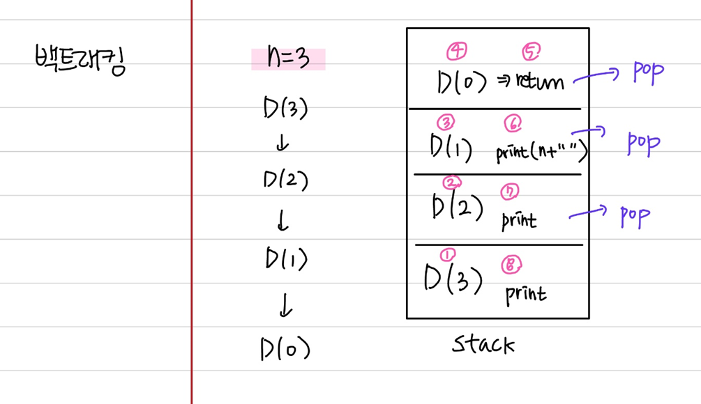
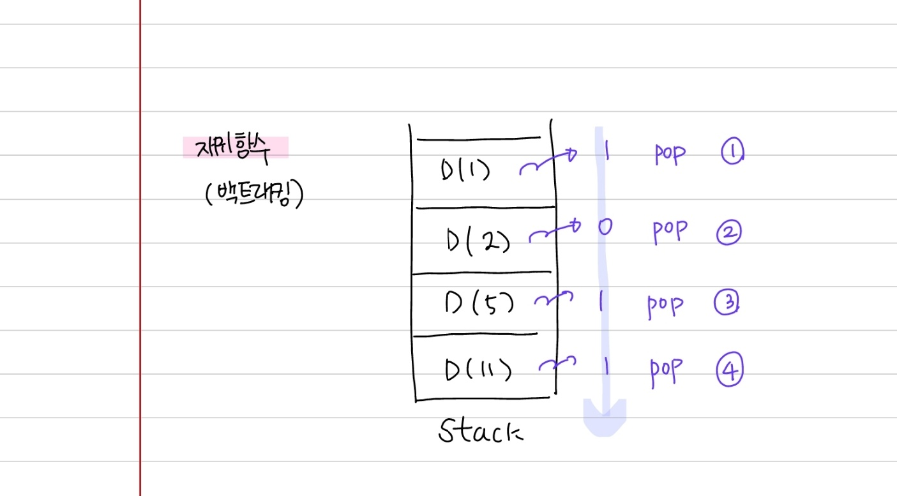
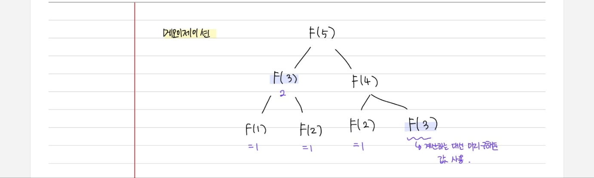
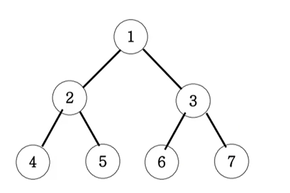
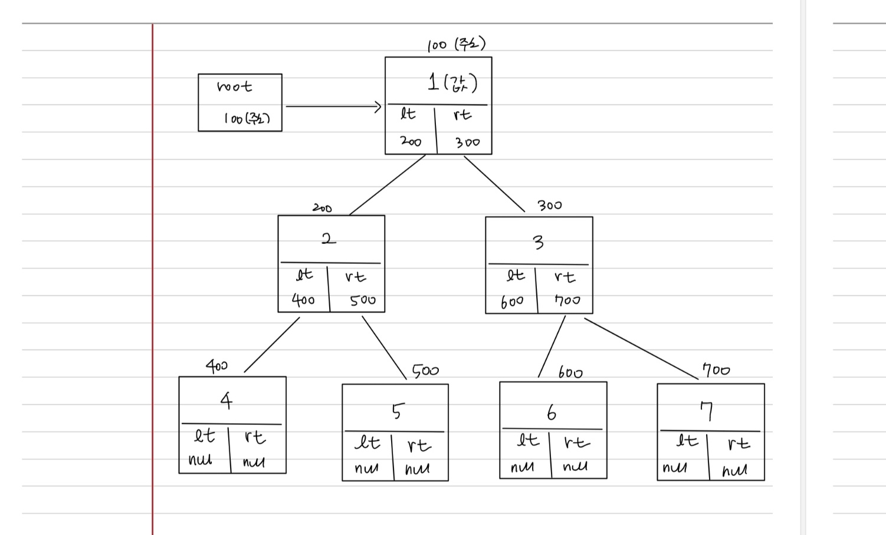
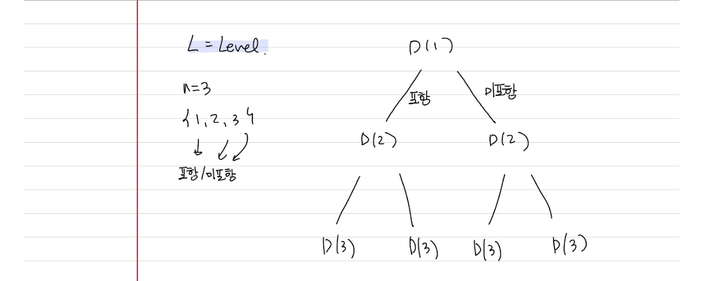
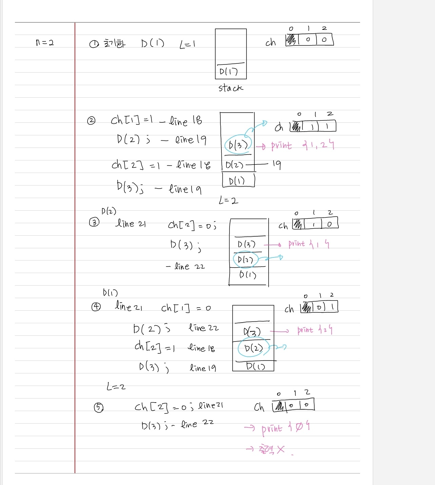
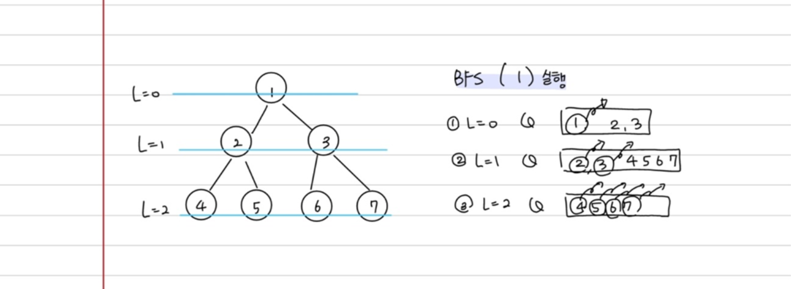
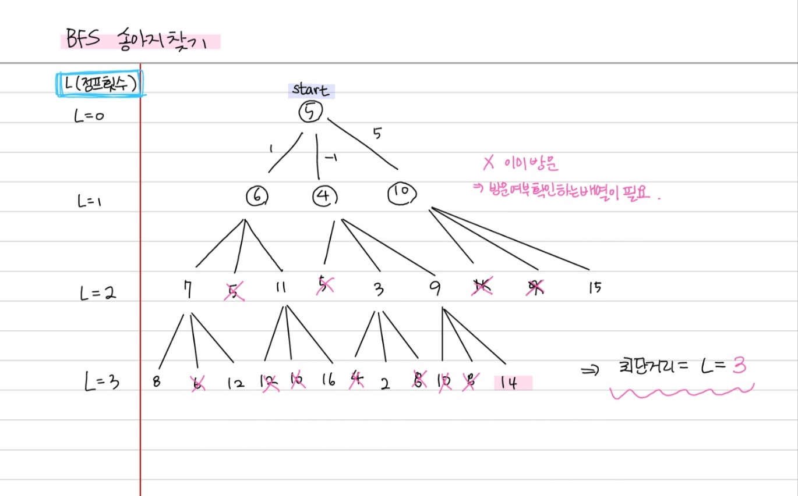
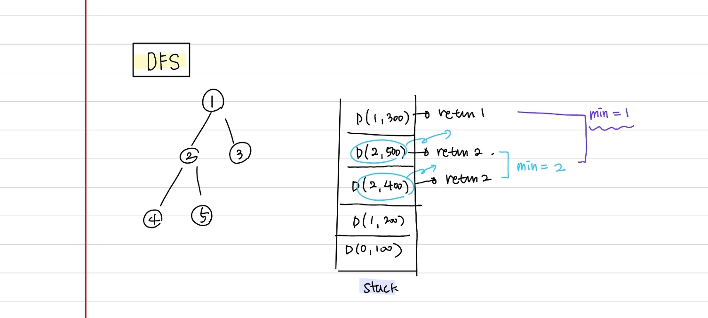

# Recursive Function

- 자신이 자기 자신을 호출하는 함수
- 재귀함수는 stack frame을 사용한다



# Recursive Binary



# Fibonacci

> 메모이제이션(Memoization)
> 미리 계산된 값을 저장하고 다음 번 똑같은 조건을 계산하게 될 때 값을 참조하게 설계하는 방법

```java
  public int DFS2(int n) {
    if (fibo2[n] > 0) return fibo2[n]; // 중요: 메모이제이션 사용 > 이미 구해진 값을 미리 return!
    if (n == 1) {
      return fibo2[n] = 1;
    } else if (n == 2) {
      return fibo2[n] = 1;
    } else return fibo2[n] = DFS2(n - 1) + DFS2(n - 2);
  }
```



# 이진트리 순회 (깊이 우선 탐색 DFS)



### 종류

- 전위순회: 부모 -> 왼쪽자식 -> 오른쪽 자식
  - 1, 2, 4, 5, 3, 6, 7
- 중위순회: 왼쪽자식 -> 부모 -> 오른쪽 자식
  - 4, 2, 5, 1, 6, 3, 7
- 후위순회 : 왼쪽자식 -> 오른쪽 자식 -> 부모
  - 4, 5, 2, 6, 7, 3, 1



# 부분집합 구하기





# 이진트리 순회 (넓이 우선 탐색: 레벨 탐색 BFS)


- 레벨 순서대로 탐색
- 최단경로
- queue 사용
- 1, 2, 3, 4, 5, 6, 7
- 루트로부터 간선 1만에 갈 수 있는 노드 모두 방문 -> 루트로부터 간선 2만에 갈 수 있는 노드 모두 방문 -> ...



# BFS 송아지 찾기



# DFS Tree 말단 노드까지의 가장 짧은 경로


