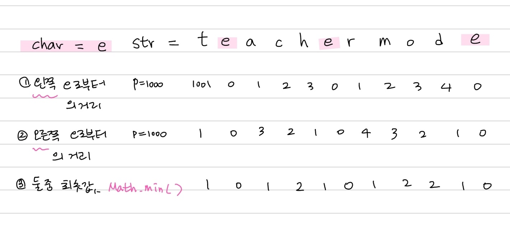

# 핵심 내용

## 문자 및 문자열 조작 기본

### Character 클래스 활용

- 대소문자 확인 및 변환: `Character.isLowerCase(char), Character.toUpperCase(char), Character.toLowerCase(char)`
- 알파벳 및 숫자 여부 확인: `Character.isAlphabetic(char c), Character.isDigit(char)`
- 아스키 코드

  - 대문자: 65~90, 소문자: 97~122, 숫자: 48~57.
  - 소문자에서 32를 빼면 대문자가 됨.

## 문자열 및 문자 조작 메서드

### 문자열 메서드

- str.indexOf(char): 문자열 str에서 문자 char가 처음 나오는 인덱스 반환 (없으면 -1).
- str.substring(start, end): 문자열 str의 [start, end) 범위 슬라이싱.
- str.substring(start): 문자열 str의 [start ~ 범위 슬라이싱.
- str.replaceAll([정규표현식], "치환할 문자"): 정규표현식을 사용하여 문자열 치환.
- str.charAt(idx): idx 위치의 char 추출
- str.replace("A","B") : 문자열 내 모든 일치하는 A 문자열을 B로 대체
- str.replaceAll([regex], str): 정규표현식에 일치하는 모든 문자열을 str로 대체

## 문자 및 문자열 변환

### 2진수 -> 10진수

- Integer.parseInt(binaryString, 2);
- Integer.valueOf(binaryStirng, 2);

### 10진수 -> 2진수

- Integer.toBinaryString(int 십진수);
- Integer.toString(int 십진수, 진법(ex 2));

### char 형 변환

- 숫자 -> char 변환: 단순 (char) 캐스팅.
- char 배열 -> String 변환: String.valueOf(char[] charArray).

### Scanner 사용

- char 입력 받기: scanner.next().charAt(0)
- 한 줄 전체 스캔: scanner.nextLine()
- int 입력 받기: scanner.nextInt();

## 문자열 조작 권장 사항

### StringBuilder와 StringBuffer

- StringBuilder 사용 권장: 가변성, 효율성 측면에서 유리. 멀티 스레드 환경에서는 StringBuffer 사용 (스레드 안전).

## 기타

- 🥰 문자 뒤집는 로직 🥰

  

- 가장 짧은 문자 거리 찾는 로직
  
