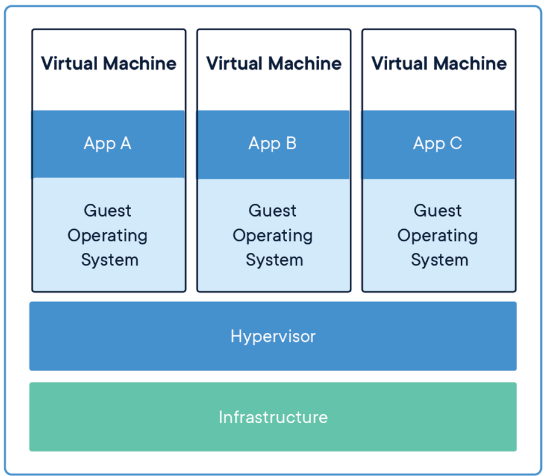
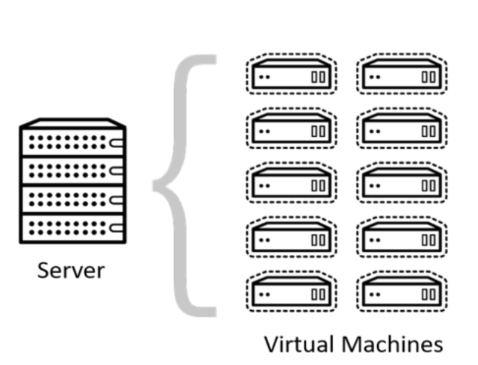

# 클라우드 - 가상머신 (vm)

> 클라우드를 이해하기 앞서, 클라우드의 기반 기술인 가상 머신에 대해 알아보자

- 클라우드 위에서 제공되는 서비스 예시
  - 구글docs, microsoft 365

### 1. 전통적 배포 방식

- 물리적인 컴퓨터 한 대에 하나의 OS를 깔고 여러 가지 프로그램을 설치 => 계정을 나눠 여러 사용자가 이용할 수 있지만 어떤 프로그램을 설치 시 다른 앱에 영향을 미침

ex)

- CPU, RAM, SSD를 가진 컴퓨터에 특정 OS (window, mac) 설치. 그 위해 word, LOL 등의 프로그램 설치
- 컴퓨터 한 대에 계정을 추가 (admin, zinna, ...)
- 하지만 계정을 추가해서 admin에 lol을 설치해도 zinna 계정에 반영이 된다. 하나의 OS위에 설치하기 때문.

### 2. 가상화 배포 방식

- 가상머신을 기반으로 배포하는 것.

  > 가상머신 = 컴퓨터의 하드웨어를 소프트웨어적으로 구현한 것

- 계정을 나누는 것이 아니라 한 대의 컴퓨터를 가지고 여러 개의 OS를 구동할 수 있게 되며, CPU, RAM등을 물리적으로 갈아끼는 것이 아니라 설정만으로 이를 수행할 수 있게 됨

- infrastructure 위에 **하이퍼바이저**라는 중간 계층이 존재하고, 그 위해 각각 OS를 가진 가상 머신을 여러 개 구축하여 독립적 수행 가능. 각 앱은 각 vm마다 os마다 존재
- 각 가상머신마다 다른 RAM, CPU, MEMORY 지정 가능

> 하이퍼바이저: 하나의 시스템 상에서 가상 컴퓨터를 여러 개 구동할 수 있게 해주는 중간 게층

- 클라우드(cloud)는 이러한 가상화라는 기술 덕분에 한 대의 하드웨어로 여러 명의 사용자들에게 독립적으로 클라우드 서비스 가능
  

- 다만 OS 공유가 안되기 때문에 가상 머신마다 OS를 설치해줘야 한다는 단점 존재
