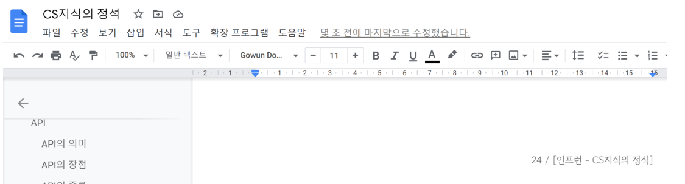

# 클라우드 - IaaS, PaaS, SaaS

> IaaS = Infrastructure as a Service (이아스 혹은 아이아스)
> PaaS = Platform as a Service (파스)
> SaaS = Software as a Service (싸스)

### 1. IaaS (이아스, 아이아스)

- 빈방
- 인프라형 클라우드 서비스
- 클라우드가 단지 인프라만 제공
- node.js, MongoDB, Spring등을 개발자가 직접 설치해야 함.
- 특정 서비스에 종속되지 않음
- 하드웨어와 그에 맞는 OS를 제공받는다 (컴퓨터라고 생각하면 된다)

ex) AWS의 EC2, NCP 등

### 2. PaaS (파스)

- 빌트인 방
- 플랫폼 형 클라우드 서비스
- 클라우드가 플랫폼을 제공
- Node.js, DB, Spring 등이 설치되어 있으며 그저 클릭을 통해 해당 서비스를 이용 가능.
- 모니터링, CI/CD가 제공됨
- 웹 개발자에게 웹 어플리케이션 개발 외에 다른 호스팅, 네트워크 등을 고민하지 않고 개발에 전념할 수 있게 해준다.
  ex) heroku : 자유롭게 클릭 몇번으로 여러가지 서비스 설치가 가능

### 3. SaaS (싸스)

- 서비스형 클라우드 서비스
- 완전한 서비스를 클라우드 서비스로부터 제공받아 사용

ex) 구글 DOCS, microsoft 365

- 구글 docs의 경우 클라우드를 통해 다른 컴퓨터에서도 쉽게 작업, 다른 사람과의 실시간 공유 작업이 가능하다

### 4. IaaS VS PaaS ⭐

|             | IaaS | PaaS |
| ----------- | ---- | ---- |
| 유연성      | 높음 | 낮음 |
| 이식성      | 높음 | 낮음 |
| 운영비 효율 | 낮음 | 높음 |

> 이식성 높다 = 하나의 서버에서 다른 서버에서의 이동(migration)이 쉽다

- PaaS는 mysql, redis 등이 플랫폼에 종속적이기 때문에 이식성이 낮음. 대신 클릭만으로 설치 및 모니터링 로깅 CI/CD 비용을 아낄 수 있다
