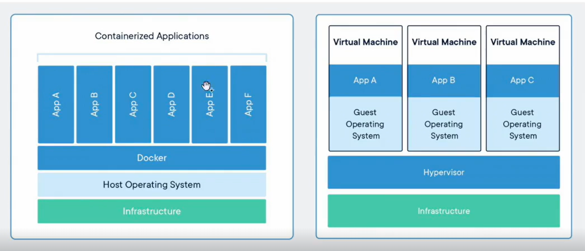
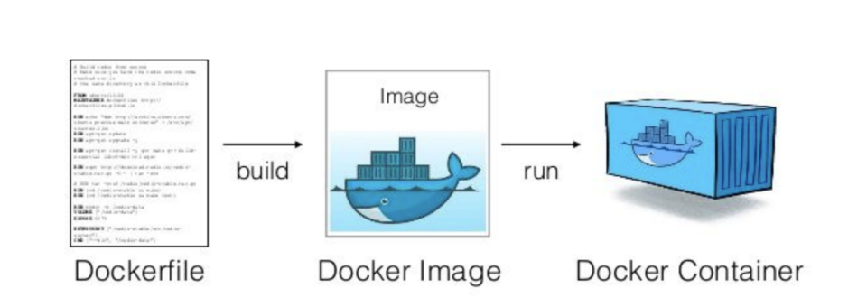

# 클라우드 - 컨테이너와 도커

### 1. 컨테이너

> 애플리케이션이 한 컴퓨팅 환경에서 다른 컴퓨팅 환경으로 빠르고 안정적으로 실행되도록 코드와 모든 종속성을 패키징하는 소프트웨어의 표준 단위

- 코딩을 할 때 가장 어려운거 환경 설정

  - node.js, java ver, library 설치...
  - db insert, 스크립트 구동...

- 이러한 환경 설정들을 패키징하여 컨테이너라는 상자에 담음

- 컨테이너는 OS를 공유하기 때문에 빠르고, 경량화되어 있으며 격리성(앱간 영향 없음)도 good. 하지만 OS에 문제가 발생 시 다른 앱에도 영향. OS를 컨테이너마다 설치해줄 필요가 없다

- 좌: 컨테이너 / 우: vm
  

### 2. 도커

> 컨테이너 배포에 필요한 거의 모든 기능을 제공하는 플랫폼

- 도커를 활용하면 laaS와 PaaS의 장점을 모두 가지고 있음
  - 이식성, 종속성, 운영 효율성이 모두 높음
- 한 컴퓨터 환경에서 패키징 해서 다른 컴퓨터 환경으로 넘길 수 있으며, docker pull 등 간단한 명령으로 설치 과정이 간단하여 운영 효울성도 good

### 3. 도커가 컨테이너를 만드는 과정

> 애플리케이션 구동에 필요한 환경 설정 관련 절차를 도커 파일에 작성하고 그 후 빌드를 하면 도커 이미지가 생성됨. 도커 이미지를 실행시키면 도커 컨테이너가 만들어짐. 도커 컨테이너가 실행 시 프로그램, 데이터 등이 실제 컴퓨터 자원 위에서 돌아가게 된다.

1. 도커파일

- 패키지, 환경변수 설정 등을 기록한 파일. 이를 빌드해서 도커 이미지로 변환
  ex) node.js java 설치, 파일 복사, db insert 등

2. 도커 이미지

- 컨테이너 실행에 필요한 파일과 설정값, 데이터 등을 포함한 "상태"이며 불변. 하나의 이미지에서 여러 개의 컨테이너를 생성할 수 있으며 컨테이너의 상태와는 무관하게 이미지는 그대로 존재

3. 도커 컨테이너

- 컨테이너가 실행되면 도커 이미지에 설정된 프로그램, 데이터 등이 실제 컴퓨팅 자원(CPU, RAM, SSD) 과 연결됨

### 4. 도커의 활용사례

- 도커 컨테이너를 기반으로 클라우드에 컨테이너 배포 방식으로 서비스가 많이 운영되고 있다
- 구글이 매주 20억개의 앱을 도커 컨테이너 기반 하에 운영함
