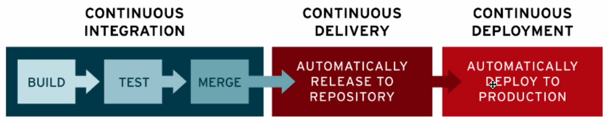

# CI/ CD (Continuous Integration and Continuous Delivery & Deployment)

> 개발자가 코드를 짠 뒤 해야하는 일? 지속적으로 코드를 합치고 코드를 배포해야 함

### 1. 왜 필요할까?

- 혼자가 아닌 여러 명의 개발자가 코드를 합치고 배포를 계속해서 시스템 없이 수동으로 한다면 아래와 같은 일 발생

  - 로컬 서버 - 개발 (dev) 서버 - 운영 서버
    - dev 서버에 누가 배포했나요? 이거 로컬에서(제 환경에서) pull 받았더니 안되는데요?
    - 이 함수 테스트 안하고 배포했나요? 에러나요

=> 이런 문제를 해결하기 위해 등장한 개념이 CI/CD

### 2. 파이프라인

- 코드 구축부터 시작해서 배포까지의 일련의 과정들을 CI/CD 파이프라인이라고 한다

- 파이프라인은 총 3단계로 구성

- continuous integration: 코드를 빌드하고 테스트하고 합침
- continuous delivery: 해당 레포지토리에 자동으로 릴리즈
- continuous deployment: 프로덕션 즉 실제 서비스에 배포

- 코드 배포까지의 과정이 체계적이며 테스트가 강제된다. 파이프라인 자체에 테스트가 있기 때문에 테스트 코드를 작성하지 않으면 코드를 머지하지 못하게 할 수 있음

#### 빌드

- 대표적인 예: **webpack**
  여러 모듈들을 정적 자산으로 빌드해준다
- `.vue`라는 개발환경에서 사용하는 확장자는 웹 브라우저에서 사용할 수 없음 `num run build` 명령어를 통해 .vue 파일을 .html, .css, .js 파일로 변경해줄 수 있음 -> 화면 표출 가능

#### 테스트

- 단위테스트: 함수 등 작은 단위를 테스팅
- 통합 테스트: 모듈을 통합할 때 테스트
- 엔드투엔드테스트: 사용자가 서비스를 사용하는 상황을 가정해서 테스트. 사용자 시나리오에 기반한 테스트
- 보안 테스트: 공격자가 서비스 공격 시 이를 막아주는지 확인하는 테스트

- 대표적인 테스트를 위한 프레임워크: mocha (모카)

### 머지

- git이나 svn을 이용해 코드를 합침. 요즘은 그냥 git을 사용

- **충돌을 최소화**해야 한다
- 조금 더 작은 단위로 충돌이 일어나게 하는 것이 중요하다. 작은 이슈Issue 단위로 나눠서 커밋 후 머지 (너무 아토믹한 단위는 X)
- 만일 충돌 시에는 화면 공유하면서 합의하에 충돌을 해결
- delivery = 테스트 및 빌드된 소프트웨어를 공유 레포지터리에 릴리스하는 것. 언제든지 제품 또는 서비스로 릴리스 될 수 있는 상태를 유지하는 것이 목표

### 배포

- deployment = 모든 코드 변경 사항이 자동으로 프로덕션 환경에 배포되는 것
- 사용자를 위한 서비스를 배포하는 것 뿐만 아니라, QA 엔지니어나 관리자 페이지를 위한 배포, 데이터 엔지니어가 데이터 웨어하우스로부터 데이터를 가공해서(의미 있는 데이터로 만들어서) 백앤드 개발자를 위한 배포

### 툴 (CI/CD 종류)

- github action, Jenkins, circle ci가 유명
- heroku(헤로쿠)
