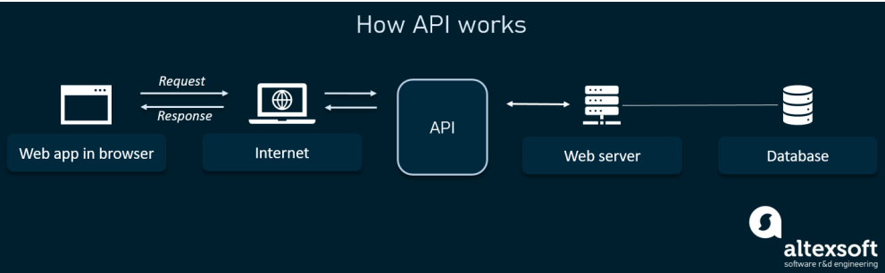

# API

> Application Programming Interface

### 1. API의 개념

- 둘 이상의 컴퓨터 프로그램이 서로 통신하는 방법
- 컴퓨터 사이에 데이터를 교환하는데 있어서 중간에 있는 중계 계층

ex) 프로토콜(HTTP/HTTPS), 메서드(GET,POST), 데이터타입(JSON, XML) 등이 정의된 중계 계증

### 2. 인터페이스

- 정의: 서로 다른 두 개의 시스템, 장치 사이에서 정보나 신호를 주고 받는 경우의 접점이나 경계면
- 해당 컴퓨터의 내부 서버가 어떻게 구현되어 있는지는 상관 없이 인터페이스를 통해 통신이 가능

ex) 삼성 갤럭시 UI
ex) 네이버 웹툰

- 네이버 웹툰의 서버나 database가 어떻게 구현되어 있는지는 모르지만, User Interface(UI)를 통해 웹툰을 볼 수 있다.

### 3. API의 작동 방식

- 사용자가 브라우저를 통하여 서버에 요청을 하게 되면, API가 중계계층 역할을 하며 요청을 처리. 직접 서버의 데이터베이스에 접근하는 것을 방지

### 4. API의 장점

1. 제공자는 서비스의 중요한 부분을 드러내지 않아도 된다.
   ex) DB설계 구조나 드러내고 싶지 않은 데이터베이스의 테이블 정보, 서버의 상수값 등을 드러내지 않을 수 있음

2. 사용자는 해당 서비스가 어떻게 구현되었는지 알 필요 없이 필요한 정보만을 받을 수 있음

3. Open API를 통해 앱 개발 프로세스를 단순화시키고 시간과 비용을 절약할 수 있다
   ex) 네이버 아이디로 로그인

4. 내부 프로세스가 수정되었을 때 API를 매번 수정하는 것이 아닌 API가 수정 안되도록 만들 수 있다
   => 내부 DB, 서버의 로직이 변경되어도 매번 사용자가 앱을 업데이트하는 (귀찮은)일은 줄어들 수 있다
   ex) DB 튜닝 -> 내부적 update good. API 덕분에 사용자에게 알려줄 필요가 없다.

5. 제공자는 데이터를 한 곳에 모을 수 있다.

ex) yes24 페이지 2개 존재 - 검색 페이지 / 베스트셀러 리스트 페이지
issue: 두 페이지에서 사용자들이 클릭한 이벤트를 모아서 db에 넣어주세요
각 페이지에서 사용자가 클릭 이벤트 시 API로 호출하게 해서 각 이벤트들을 db에 저장할 수 있음. (API 하나만으로 데이터 모을 수 있음)

### 5. API의 종류

| 종류    | 설명                                                                                                                                                                             |
| ------- | -------------------------------------------------------------------------------------------------------------------------------------------------------------------------------- |
| private | 내부 서버들끼리 통신할 때 사용. 주로 해시키를 하드코딩해놓고 이를 기반으로 서버와 서버간의 통신. 대표적 해시 키 (SHA256 해시 알고리즘) . 해시키를 HTTP 헤더에 담아서 요청을 보냄 |
| public  | 모든 사람이 사용가능. 많은 트래픽을 방지하기 위해 하루 !요청수의 제한!, 계정 당 몇개 등으로 관리 ex) 네이버 아이디로 로그인                                                      |
