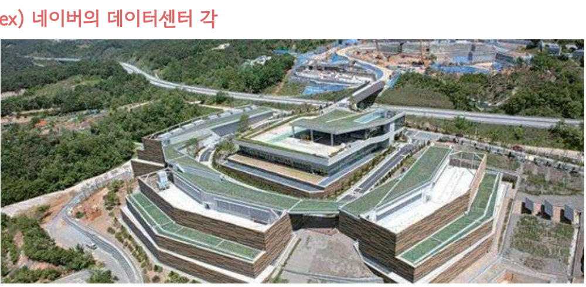

# 클라우드 - 오프프레미스(off-premise)와 온프레미스(on-premise)

### 1. 오프프레미스 (off-premise) 방식

- 내가 아닌 다른 회사의 공급자가 호스팅하고 인터넷을 통해 사용자에게 제공되는 인프라, 플랫폼 또는 소프트웨어
- 자체 인프라나 하드웨어 설치 없이도 애플리케이션과 리소스를 쉽고 싸게 이용 가능
- 클라우드는 오프프레미스 방식!

ex) AWS, 네이버 클라우드 플랫폼

### 2. 온프레미스 (on-premise) 방식

- 기업이나 개인이 자체 시설에서 보유하고 직접 유지 관리하는 프라이빗 데이터 센터(IDC)

- 네트워크 선 까는 것부터 시작해서 서버, 데이터베이스 설치 등을 하는 것

ex) 네이버의 데이터센터 (IDC) **각**

- 네이버의 데이터센터는 춘천에 존재. '프리쿨링'을 통한 전기 절약 가능.
  > 프리쿨링 = 서버실 온도를 조절하기 위한 냉각수를 전기가 아닌 외부 찬 공기를 이용해 만드는 방식
