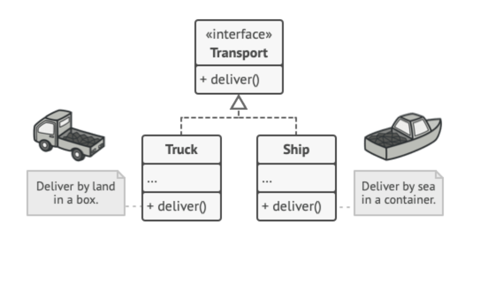

# 팩토리 패턴

> 상속 관계에 있는 두 클래스에서 상위 클래스가 중요한 뼈대를 결정하고, 하위 클래스에서 객체 생성에 대한 구체적인 내용을 결정하는 패턴

- 상위 클래스에서는 객체 생성 방식에 대해 알 필요가 없어져 유연성을 갖게 되며 객체 생성 로직은 하위 클래스에서만 관리되기 때문에 유지보수성이 증가(특정 객체 생성 로직을 바꿔야 하는 상황이 올때 상위 클래스까지 수정할 필요가 없음)



ex) 바리스타 공장 (커피 팩토리)
우유 레시피 라떼 레시피 아메리카노 레시피,,,,
바리스타 공장이라는 상위 클래스는 어떤 품목들을 취급할 건지만 알고 있고 각 품목들의 생성 방법은 하위 클래스에서 관리
상위 클래스에서는 실행만 시킴

```java
public enum CoffeeType {
    LATTE,
    ESPRESSO
}

abstract class Coffee {
    protected String name;

    public String getName() {
        return name;
    }
}

class Latte extends Coffee {
    public Latte() {
        name = "latte";
    }
}

class Espresso extends Coffee {
    public Espresso() {
        name = "Espresso";
    }
}

class CoffeeFactory {
    public static Coffee createCoffee(CoffeeType type) {
        switch (type) {
            case LATTE:
                return new Latte();
            case ESPRESSO:
                return new Espresso();
            default:
                throw new IllegalArgumentException("Invalid coffee type: " + type);
        }
    }
}

public class Main {
    public static void main(String[] args) {
        Coffee coffee = CoffeeFactory.createCoffee(CoffeeType.LATTE);
        System.out.println(coffee.getName());
    }
}
```
