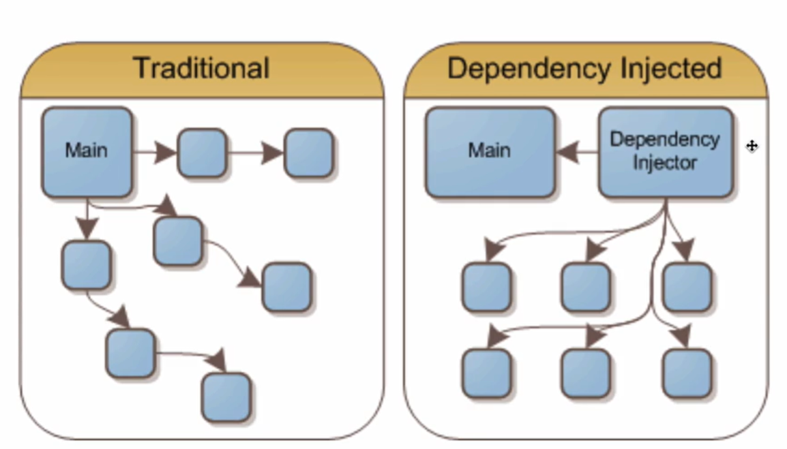
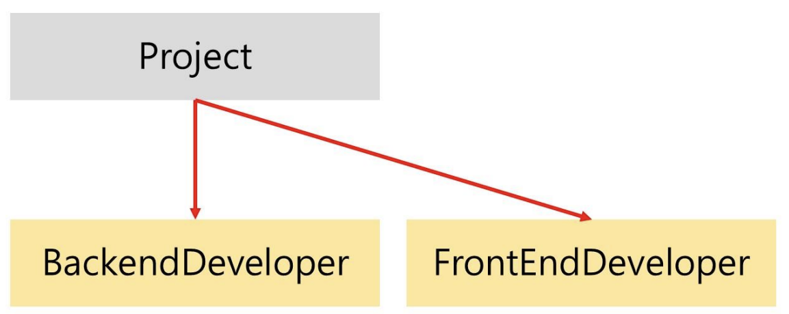
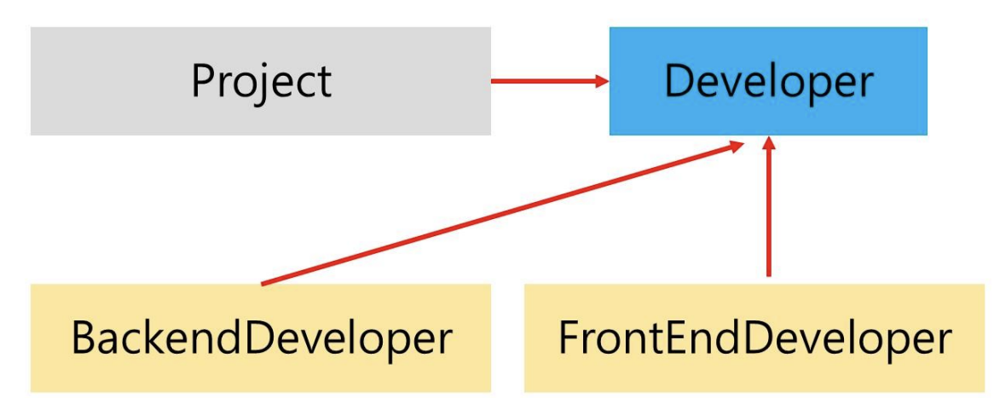

# 의존성 주입과 의존관계역전원칙 (DI & DIP)

> DI = Dependency Injection
> DIP Dependency Inversion Principle

### 1. DI

> 의존성 주입이란, 메인 모듈이 직접 다른 하위 모듈에 대한 의존성을 주기보다는 중간에 의존성 주입자(dependency injector)가 이 부분을 가로채 메인 모듈이 '간접적으로' 의존성을 주입하는 방식



- 이를 통해 메인 모듈과 하위 모듈간의 의존성을 조금 더 느슨하게 만들 수 있으며, 모듈을 쉽게 교체 가능한 구조로 만듦

#### 의존한다. 라는 의미

- A가 B에 의존한다 = B가 변하면 A에 영향을 미친다 = A -> B

- 예시> class A는 class B에 의존함. B의 go()함수가 went()로 수정되면, A도 수정이 필요하다.

```java
import java.util.*;

class B {
    public void go() {
        System.out.println("B의 go()함수");
    }
}

class A {
    public void go() {
        new B().go();
    }
}

public class main {
    public static void main(String args[]) {
        new A().go();
    }
}
```

### 2 - 1. Project 클래스의 DI를 적용하지 않은 사례

- class Project
  - class BackendDeveloper
  - class FrontendDeveloper

=> Project 클래스는 BackendDeveloper와 FrontendDeveloper에 의존



```java
import java.util.*;

class BackendDeveloper {
    public void writeJava() {
        System.out.println("자바가 좋아 인터네셔널~");
    }
}

class FrontEndDeveloper {
    public void writeJavascript() {

        System.out.println("자바스크립트가 좋아 인터네셔널~");
    }
}

public class Project {
    private final BackendDeveloper backendDeveloper;
    private final FrontEndDeveloper frontEndDeveloper;

    public Project(BackendDeveloper backendDeveloper, FrontEndDeveloper frontEndDeveloper) {
        this.backendDeveloper = backendDeveloper;
        this.frontEndDeveloper = frontEndDeveloper;
    }

    public void implement() {
        backendDeveloper.writeJava();
        frontEndDeveloper.writeJavascript();
    }

    public static void main(String args[]) {
        Project a = new Project(new BackendDeveloper(), new FrontEndDeveloper());
        a.implement();
    }
}

// 자바가 좋아 인터네셔널~
// 자바스크립트가 좋아 인터네셔널~
```

### 2 - 2. Project 클래스의 DI를 적용한 사례

- 위의 Project class 예시에 DI(의존성 주입)을 적용해보자 ( = DIP 의존 관계 역전 원칙을 적용해보자)
  

- Developer라는 인터페이스 덕분에 BackendDeveloper와 FrontendDeveloper에 Project가 의존적이지 않음.
  ex) writeJava 메소드 명이 writewriteJava로 바뀌어도, Project 클래스 내의 함수를 변경시킬 필요가 없어짐

- 대신 BackendDeveloper와 FrontendDeveloper는 Developer에 의존적
- Project 역시 Developer에 의존적

- 여러 명의 개발자를 추가할 수도 있으며, 백앤드 프론트 말고 다른 개발자 등으로 교체도 쉽게 할 수 있는 구조

- 또한 의존적인 화살표가 역전됨 (DI를 하게 되면 의존관계역전원칙이 적용된다)

```java
interface Developer {
    void develop();
}

class BackendDeveloper implements Developer {
    @Override
    public void develop() {
        writeJava();
    }

    public void writeJava() {
        System.out.println("자바가 좋아~ 새삥새삥");
    }
}

class FrontendDeveloper implements Developer {
    @Override
    public void develop() {
        writeJavascript();
    }

    public void writeJavascript() {
        System.out.println("자바스크립트가 좋아~ 새삥새삥");
    }
}

public class Project {
    private final List<Developer> developers;

    public Project(List<Developer> developers) {
        this.developers = developers;
    }

    public void implement() {
        developers.forEach(Developer::develop);
    }

    public static void main(String args[]) {
        List<Developer> dev = new ArrayList<>();
        dev.add(new BackendDeveloper());
        dev.add(new FrontendDeveloper());
        Project a = new Project(dev);
        a.implement();
    }
}
```

### 3. 의존관계역전원칙

- 의존성 주입을 할 때는 의존관계역전원칙이 적용된다. 이는 2가지의 규칙을 지키는 상태

1. 상위 모듈은 하위 모듈에 의존해서는 안된다. 둘 다 추상화에 의존해야 한다.

2. 추상화는 세부사항에 의존해서는 안된다. 세부 사항은 추상화에 따라 달라져야 한다.

### 4. 의존성 주입의 장점

- 외부에서 모듈을 생성하여 `dev.add(new BackendDeveloper())`이런 식으로 집어넣는 구조이기 때문에 모듈들을 쉽게 교체할 수 있는 구조
- 단위 테스트와 마이그레이션이 쉬워짐
  - 마이그레이션: 다른 운영 환경으로 이동하는 것 (db이동, 데이터 이동)
- 애플리케이션 의존성 방향이 좀 더 일관되어 코드 추론이 쉬워짐

### 5. 의존성 주입의 단점

- 결국에는 모듈이 더 생기게 됨으로 복잡도 증가
- 종속성 주입 자체가 컴파일을 할 때가 아닌 런타임 때 일어나기 때문에 컴파일을 할 때 종속성 주입에 관한 에러를 잡기가 어려워질 수 있음
