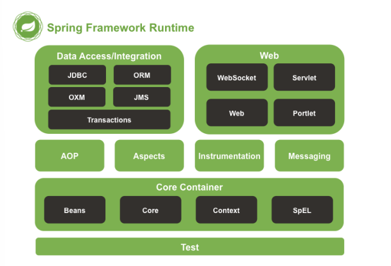
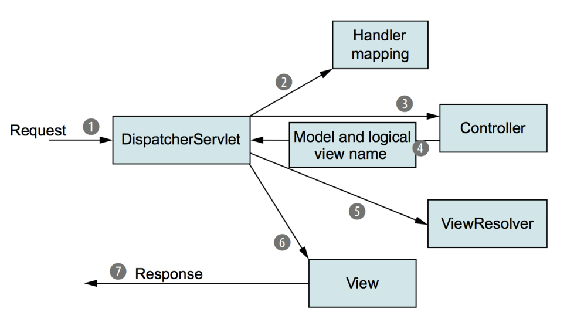

# Spring의 MVC 패턴 적용 사례

> Spring = 자바 기반으로 애플리케이션 개발을 할 때 많은 기능들을 제공하는 프레임워크

- 스프링의 아키텍처
  - 이 중에서 MVC 패턴이 적용된 Web모듈의 Spring Web MVC를 살펴보자
    

### 1. 디스패처 서블릿의 요청 처리 과정

> Spring Web MVC의 MVC 패턴은 디스패처 서블릿의 사용자 요청 처리과정을 통해 알 수 있음



1. 클라이언트가 요청을 했을 때, 가장 먼저 디스패처 서블릿이 이를 받음 (프론트 컨트롤러 역할)
   이 때, url이나 form data 등 여러 개의 데이터를 받아서 이를 기반으로 '어떤 컨트롤러에게 이를 처리하게 할지' 결정하는 공장의 반장과 같은 역할 수행. 보통 클래스 이름, url, xml의 설정을 통해 어떤 컨트롤러에게 시킬지 결정할 수 있지만, 보통 `@requestMapping`을 이용해서 지정 한다.

```java
@RequestMapping(value = "/ex/foos", method = POST)
@ResponseBody
public String postFoos() {
    return "Post some Foos";
}
```

2. 하나 이상의 handler mapping을 참조해서 적절한 컨트롤러를 설정. 이후, 컨트롤러로 요청을 보냄

3. 컨트롤러는 레포지토리를 통해 데이터베이스에 접근하여 데이터를 가져오는 등 "비지니스 로직을 수행"

4. 그렇게 해서 사용자에게 전달해야 할 정보인 모델(상수, 변수, .. ) 을 생성

5. 그 다음 뷰를 구현하기 위한 view resolver를 참고

6. 해당 정보를 기반으로 뷰(모델과 뷰 resolver를 사용해서 만들어짐)를 렌더링

7. 응답 데이터를 사용자에게 보냄

=> 컨트롤러가 중앙에서 모델과 뷰의 다리 역할 수행
