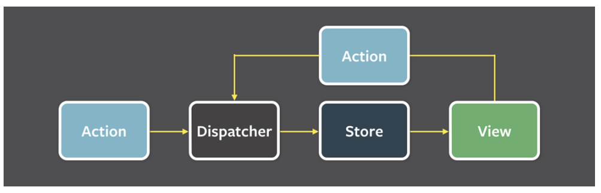
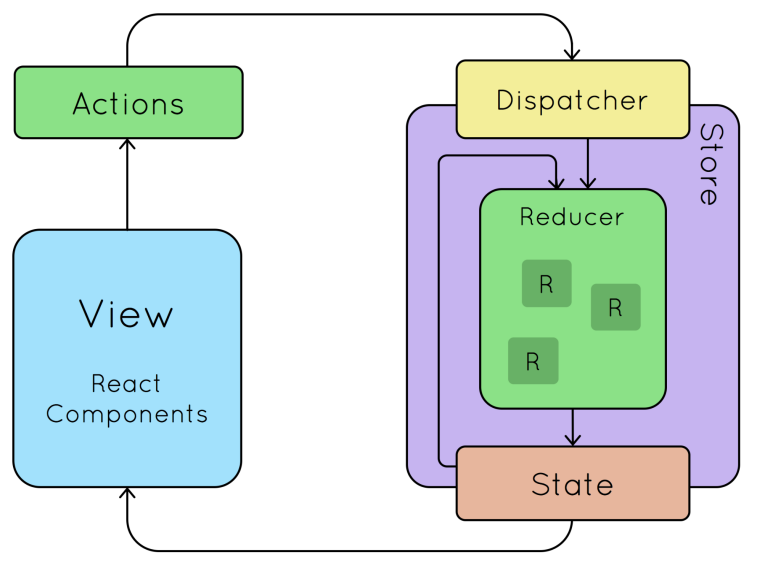

# flux 패턴

> 단방향으로 데이터 흐름을 관리하는 디자인 패턴

ex) 페이스북은 '읽음 표시'(mark seen)에 대한 기능 장애를 겪음. 어떤 페이지에서 메시지를 읽었는데 다른 페이지에서는 메세지를 안읽었다고 뜨는 현상. 이는 모델과 뷰의 관계가 복잡해지니, 버그를 수정하기도, 데이터의 흐름을 알아보기도 어려워서 발생한 현상
즉, 뷰에서 일어난 것이 모델에 영향을 끼치기도, 그 반대도 영향을 미치는 로직이 있는 상황이 발생하여 데이터를 일관성 있게 공유하기가 어려워짐

=> 이를 해결하기 위한 해결 방법으로 데이터가 한 방향으로만 흐르게 flux 디자인 패턴이 등장. 데이터를 일관적으로 공유하기가 쉬워짐
cf) MVC 패턴의 경우 모델과 View가 양방향적

### 1. flux 패턴의 구조

> flux 패턴은 action, dispatcher, store, view 라는 계층으로 구성
> 

#### Action

- 사용자의 이벤트를 담당. 마우스 클릭이나, 글을 쓴다거나 등을 의미하며 해당 이벤트에 대한 객체를 만들어 내, dispatcher에게 전달

#### Dispatcher

- 들어오는 action 정보를 기반으로 어떠한 행위를 할것인가를 결정. 보통 action 객체의 type을 기반으로 미리 만들어 놓은 로직을 수행하고, 이를 store에 전달 (switch 사용)

#### Store

- 애플리케이션의 상태를 관리하고 저장하는 계층. 도메인의 상태, 사용자의 인터페이스 등의 상태를 모두 저장

#### View

- 데이터를 기반으로 표출이 되는 사용자 인터페이스

### 2. flux 패턴의 장점

- 데이터 일관성의 증대
- 버그를 찾기가 쉬워짐
- 단위 테스팅이 쉬워짐

### 3. flux 패턴이 적용된 redux 라이브러리



- 액션의 타입에 따라서 dispatcher 가 로직을 수행하고 이를 stord에 전달

```js
const initialState = {
  visibilityFilter: "SHOW_ALL",
  todos: [],
};
function appReducer(state = initialState, action) {
  switch (action.type) {
    case "SET_VISIBILITY_FILTER": {
      return Object.assign({}, state, {
        visibilityFilter: action.filter,
      });
    }
    case "ADD_TODO": {
      return Object.assign({}, state, {
        todos: state.todos.concat({
          id: action.id,
          text: action.text,
          completed: false,
        }),
      });
    }
    case "TOGGLE_TODO": {
      return Object.assign({}, state, {
        todos: state.todos.map((todo) => {
          if (todo.id !== action.id) {
            return todo;
          }
          return Object.assign({}, todo, {
            completed: !todo.completed,
          });
        }),
      });
    }
    case "EDIT_TODO": {
      return Object.assign({}, state, {
        todos: state.todos.map((todo) => {
          if (todo.id !== action.id) {
            return todo;
          }
          return Object.assign({}, todo, {
            text: action.text,
          });
        }),
      });
    }
    default:
      return state;
  }
}
```
