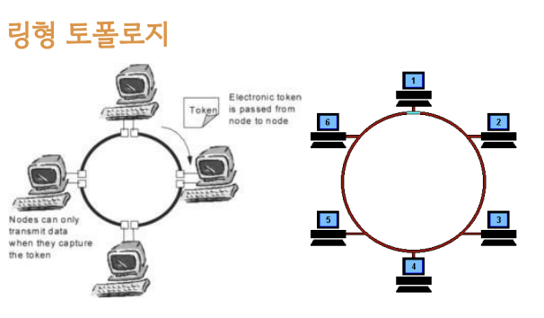
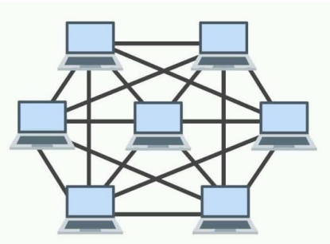

# 네트워크의 기초 - 네트워크 토폴로지 : 링, 메시

### 1. 링형 토폴로지

#### 특징

- 고리(반지) 형태
- 노드 추가, 삭제가 쉬움

#### 장점

- 노드 수가 많아져도 (중간에 지나쳐야 할 노드의 수가 많아져도)데이터 손실이 없음
- 토큰을 기반으로 연속적으로 노드를 거치며, 통신권한 여부를 따지고 해당 권한이 없는 노드는 데이터를 전달받지 않음

#### 단점

- 링크 또는 노드가 하나만 에러 발생해도 전체 네트워크에 영향
- 토큰이 없는 노드는 통신에 참여를 못하며 데이터 공유가 안됨

### 2. 메시 토폴로지

> 종류

- full 메시 토폴로지: 모든 노드들끼리 링크로 연결되어 있음
- partially 메시 토폴로지: 일부 노드들끼리 링크로 연결되어 있음

#### 특징

- 그물망 형태
- 노드 추가, 삭제 어려움! (노드 하나 지울 때 지워야 하는 링크(=회선)가 너무 많음)
- 풀(full) 메시 토폴로지의 경우 n \* (n - 1) / 2의 회선이 필요함

#### 장점

- 안정성이 높음. 한 노드가 장애가 나도, 다른 노드에 영향을 미치지 않음 (회선으로 다 연결되어 있기 때문)
- 트래픽을 분산할 수 있음 (한 노드에 지나친 트래픽 발생 시 연결된 회선을 통해 다른 노선으로 트래픽 분산 가능)

#### 단점

- 회선이 비효율적으로 많기 때문에 구축 비용이 고가 (회선 = 비용)
