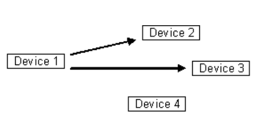
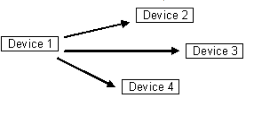

# 네트워크의 기초 - 유니캐스트, 멀티캐스트, 브로드캐스트

### 1. 유니캐스트

> 1:1 통신. 대표적으로 HTTP 통신이 있음. 가장 일반적인 네트워크 전송 형태

### 2. 멀티캐스트

> 1:N 통신. N이지만 모든 노드들에게 데이터를 전달하지는 않고, 특정 그룹에게만 데이터를 전달
> 

### 3. 브로드캐스트

> 1:N 통신. 그룹이 아닌, 연결 되어 있는 모든 노드에게 데이터를 전달. ex) ARP
> 

#### 브로드캐스트 실습

express 모듈을 사용해서 서버 생성

- 127.0.0.1 = 자기 pc를 상징하는 루프백 IP. 컴퓨터 자체를 가리킴 = localhost
- 127.0.0.1:3000 여러 개 띄워서 하나에만 input 값을 입력해도 연결되어 있는 모든 노드에 데이터가 전달된다.
