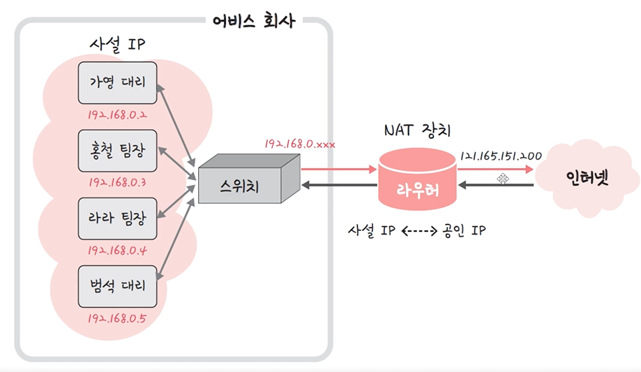

# 네트워크의 분류: LAN, MAN, WAN

> 네트워크는 LAN, MAN, WAN 순으로 분류된다. LAN이 가장 작은 단위, WAN이 가장 큰 단위이며 보통은 반경, 속도의 크기를 기반으로 분류
> cf) 반경이나 속도는 기술의 발전에 따라 바뀌므로 개념적으로 이해해서 분류하는 것이 중요

### 1. LAN

> Local Area network, 근거리 통신망

- MAN, WAN보다 높은 안정성, 속도를 가짐
- 소규모 네트워크(집 사무실) - 보통 허브나 스위치로 연결된 네트워크를 말함
  
- 하나의 논리적 구조인 IP를 기반으로 여러 개의 물리적 주소인 MAC 주소로 구별하는 네트워크
  - IP 주소: 각 컴퓨터의 주소. 논리적 주소- v4, v6가 존재 (버전 4, 버전 6). 변하는 값. 스벅 와이파이에서 부여받은 IP와 투썸 와이파이 IP는 다르다
  - MAC 주소: 물리적 주소 기기의 고유 번호. 불변한다

- IP는 121.165.151.200 하나만 회사에 부여됨
- `NAT 기술` - 하나의 IP 주소로 여러개의 IP인 척 하는 기술
  - 가상의 사설 IP를 부여
- 내부적 (사내 컴퓨터끼리는) MAC 주소를 기반으로 구별
- 어비스 회사 네모 박스 = LAN

### 2. MAN

> metropolitan area network, 대도시 통신망

- 도시와 도시의 통신망을 뜻하며 2개 이상의 LAN이 연결되어 구성
- 라우터, 브리지 등으로 연결되는 것이 특징
  - 브리지: 2개 이상의 LAN을 연결하는 장치

ex) 옷 매장 사례

- 서울의 나이키 매장과 대전의 나이키 매장 서로 제품 남아 있는지 확인
- 도시와 도시를 잇는 통신망 덕분에 가능
  

### 3. WAN

> wide area network, 광역 통신망

- 국가와 국가와의 통신망을 의미. 인터넷이라고도 함
- 수많은 라우터를 거쳐 다른 국가와도 연결되는 범위를 뜻함
- 미국에 있는 사람과 한국에서 보이스톡
