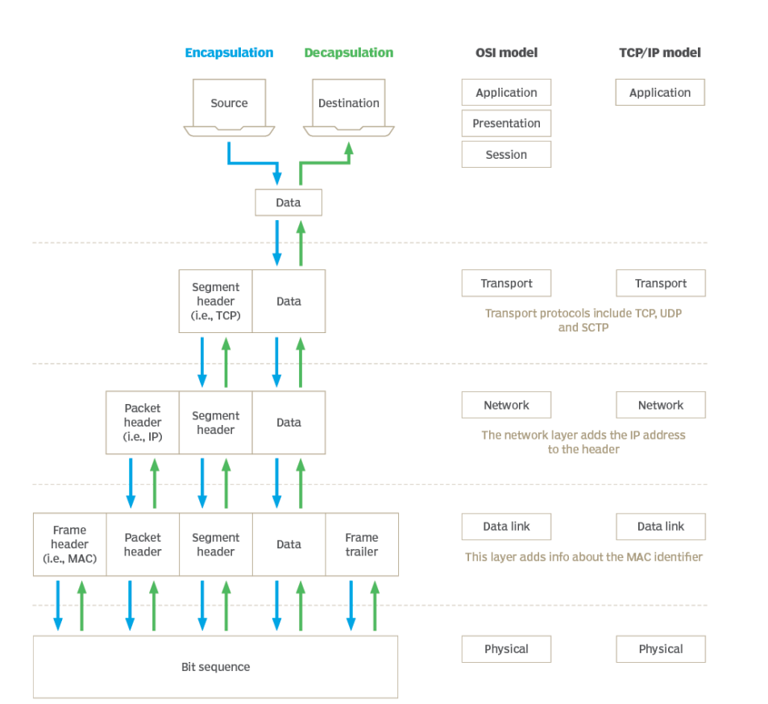
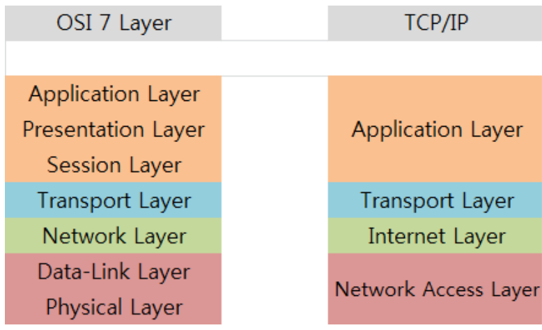

# TCP/IP 4계층 - 개념, 캡슐화, 비캡슐화, PDU, OSI 7계층

> TCP/IP 4계층 ?
> 장치들이 인터넷 상에서 데이터를 주고받을 때 쓰는 독립적인 프로토콜의 집합
> TCP = Transmission Control Protocol
> IP = Internet Protocol

- 4개의 계층은 독립적으로 동작

### 1. TCP/IP 4계층

#### 어플리케이션 계층 (Application)

- HTTP, SMTP, SSH, FTP가 대표적이며 웹 서비스, 이메일 등 서비스를 실질적으로 사람들에게 제공하는 층

#### 전송 계층 (Transport)

- TCP, UDP가 대표적이며 애플리케이션층에서 받은 메시지를 기반으로 세그먼트 또는 데이터그램으로 데이터를 **쪼개고**, 데이터가 **오류** 없이 순서대로 전달되도록 도움을 주는 층

#### 인터넷 계층 (Internet)

- IP, ICMP, ARP가 대표적이며 한 노드에서 다른 노드로 전송 계층에서 받은 세그먼트 또는 데이터그램을 **패킷화**하여 목적지(주소)로 전송하는 역할을 담당

#### 링크 계층 (link) = 네크워크 접속 계층

- 전선, 광섬유, 무선 등으로 데이터가 네트워크를 통해 물리적으로 전송되는 방식을 정의
- 데이터링크 계층과 물리 계층을 합친 계층

### 2. 캡슐화와 비캡슐화

> 캡슐화 = encapsulation,
> 비캡슐화 = Decapsulation

- 네크워크에서 캡슐화란 송신자가 수신자에게 데이터를 보낼 때, 데이터가 각 계층을 지나며 각 **계층의 특징들이 담긴 헤더(또는 Trailer)**들이 붙여지는 과정을 의미

- ex) 전송 계층에서는 TCP 헤더가 추가되고, 네트워크 계층에서는 IP 주소 헤더가 추가된다.

- 비캡슣롸는 이 과정의 역과정. 수신자 측에서는 이렇게 캡슐화된 데이터를 역순으로 제거하면서 어플리케이션 계층까지 도달함

### 3. PDU

> PDU = Protocol Data Unit

- TCP/IP 계층을 기반으로 설명 시 각 계층의 **데이터 단위**

| 애플리케이션 계층 | 메시지                                    |
| ----------------- | ----------------------------------------- |
| 전송 계층         | 세그먼트 (TCP), 다이어그램 (UDP)          |
| 인터넷 계층       | 패킷                                      |
| 링크 계층         | 프레임(데이터 링크 계층), 비트(물리 계층) |

- 세그먼트: 적절한 크기로 쪼갠 조각 (세그먼트와 데이터그램의 의미는 동일)
- 패킷: 세그먼트에 SP(송신자의 32비트 IP주소)와 DP(수신자의 32비트 IP 주소)가 포함된 IP 헤더가 붙은 형태의 조각
- 프레임: MAC 주소 헤더와 CRC/체크섬 트레일러가 붙은 조각

#### CRC/체크섬 트레일러

- 데이터의 오류 감지를 위한 수학적 함수가 적용된 값들이 있는 필드
- 링크의 오류 (과도한 트래픽 등)로 인한 데이터 손상을 감지하는 역할
- CRC와 체크섬 2가지의 과정을 기반으로 데이터 전송 오류 및 데이터 무결성 방지
  - CRC: CRC-1, CRC-16 등의 알고리즘으로 나온 값을 통해 데이터 전송 오류 감지를 수행
  - 체크섬: MD5, SHA-256 등의 알고리즘으로 나온 값을 통해 데이터 무결성을 방지

### 4. OSI 7 계층 ⭐

> TCP/IP 4계층은 OSI 7계층 모델로 설명된다

- OSI 계층은 애플리케이션 계층을 3단계로 쪼개고, 링크 계층을 데이터 링크 계층, 물리 계층으로 나눠서 표현하는 것이 다르며, 인터넷 계층을 네트워크 계층으로 부른다는 점도 다르다

