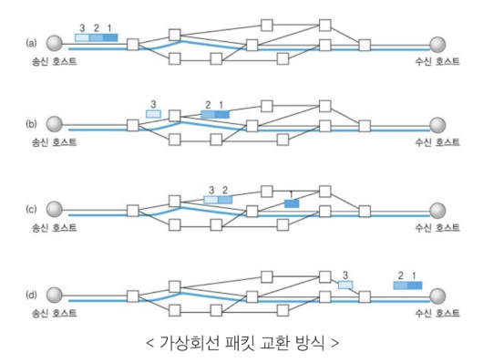
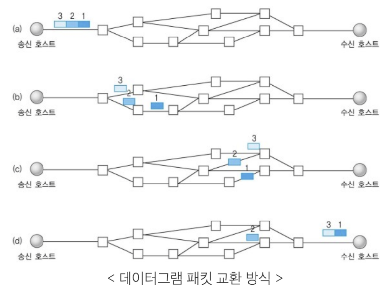

# TCP/IP 4계층 - 전송 계층과 인터넷 계층

## 전송 계층 (transport)

> TCP, UDP가 대표적

- 애플리케이션 계층에서 받은 메시지를 기반으로 세그먼트(TCP) 혹은 데이터그램(UDP)으로 데이터를 쪼개고, 데이터가 오류 없이 순서대로 전달되도록 도움을 주는 층

### 1. TCP

> Transmission Control Protocol

- header 20-60 bytes

#### 가상회선패킷교환방식

- 회선을 기반으로 순서대로 전달



#### 오류 검사 메커니즘

1. 재전송: 시간 초과 기간이 지나면 서버는 전달되지 않은 데이터에 대해 재전송을 시도
2. 체크섬: 체크섬을 통해 무결성(데이터가 올바르게 왔는지)을 평가. 즉 송신된 데이터의 체크섬과 수신된 데이터의 체크섬 값을 비교해서 올바르게 왔는지를 확인

### 2. UDP

- header 8 byte (= 32 bit) 고정 길이

#### 데이터그램패킷교환방식

- 순서 보장 X
  

#### 오류검사는 단순한 체크섬만 지원

### 3. TCP VS UDP ⭐⭐

|                   | 전송 제어 프로토콜 (TCP)                                                                     | 데이터그램 프로토콜 (UDP)                                                            |
| ----------------- | -------------------------------------------------------------------------------------------- | ------------------------------------------------------------------------------------ |
| 패킷 교환 방식    | 가상회선패킷교환방식                                                                         | 데이터그램패킷교환방식                                                               |
| 신뢰성            | O                                                                                            | X                                                                                    |
| 오류 검사         | 재전송, 체크섬                                                                               | 체크섬                                                                               |
| 패킷의 순서 보장  | O                                                                                            | X                                                                                    |
| 헤더 길이         | 20 ~ 60 byte 가변 길이                                                                       | 8 바이트 고정 길이                                                                   |
| 연결 보장         | 연결을 보장함. 3웨이 핸드셰이크로 연결을 맺고 4웨이 핸드셰이크로 연결을 해제하는 작업이 필요 | 연결을 보장하지 않음 그냥 데이터를 보냄. 연결을 유지하고 해제하는데 드는 비용이 없음 |
| 브로드캐스트 지원 | X                                                                                            | O                                                                                    |
| 속도              | 느림                                                                                         | 빠름                                                                                 |

## 인터넷 계층

> IP, ICMP, ARP가 대표적이며 한 노드에서 다른 노드로 전송 계층에서 받은 세그먼트 또는 데이터그램을 패킷화하여 전송

### 1. ICMP

> Internet Control Message Protocol

- 노드와 노드 사이에서 통신이 잘되나를 **확인**할 때 사용하는 프로토콜
- 데이터를 교환하는데 사용되는 것이 아니라 **테스팅**에 사용된다
- IP와는 달리 TCP 또는 UDP와 같은 전송 계층 프로토콜과 연관되지 않고, 독립적인 비연결형 프로토콜. (ICMP는 비연결형 프로토콜을 기반으로 구축된다. )

ex) ping

```
ping www.google.com
```
