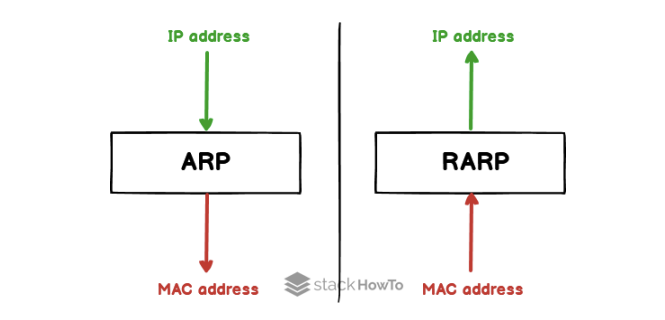

# IP 주소, MAC 주소, ARP, RARP

### 1. IP주소

> IP = Internet Protocol Address

- **논리적**(변하는) 주소. 컴퓨터 네트워크에서 장치들이 서로를 인식하고 통신을 하기 위해 사용하는 특수한 번호

### 2. MAC주소

> = Media Access Control Address

- 물리적 주소 `ipconfig/all`
- 네트워크 인터페이스에 할당된 고유 식별자. 보통 장치의 NIC(Network Interface card, 랜 카드) 에 할당된다
- 48비트로 이루어져 있으며 24 비트의 OUI와 24 비트의 UAA로 구성
  - OUI: IEEE에서 할당한 제조사 코드
  - UAA: 제조사에서 구별되는 코드
    ex) 04 - 42 - 1A는 OUI / 0E - 17 - 85는 UAA
- MAC 주소는 보통은 유일하지만, 유일하지 않을 수도 있음. 실수 또는 의도적으로 UAA가 중복되게 만들 수 있음. 이 때 동일 네트워크에서만 중복되지 않으면 문제가 없다
- NIC에 고정된 MAC 주소를 변경할 수 있으나, 하지 않는 것을 권장

- cf) IEEE: Institute of Electrical and Electronics Engineers - 전기 전자 전산 분야의 국제 기구 및 학회

### 3. ARP와 RARP

- MAC 주소는 ARP를 통해 파악이 가능
- ARP를 사용해 논리적 주소인 IP 주소를 물리적 주소인 MAC 주소로 변환
- 이와는 반대로, RARP (Reverse ARP)를 사용해 물리적 주소인 MAC 주소를 논리적 주소인 IP로 변환하기도 한다.
  

#### ARP의 과정

1. 해당 IP주소에 맞는 MAC 주소를 찾기 위해 해당 데이터를 브로드캐스팅을 통해 연결된 네트워크에 있는 장치에게 모두 보냄
2. 맞는 장치가 있다면 해당 장치는 보낸 장치에게 유니캐스트로 데이터를 전달해 주소를 찾게 된다

