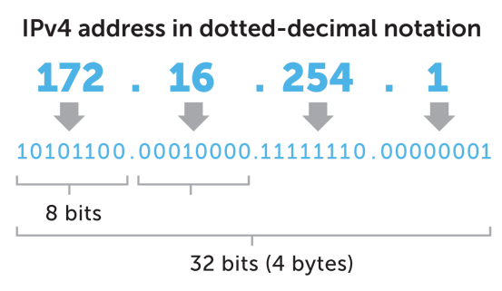
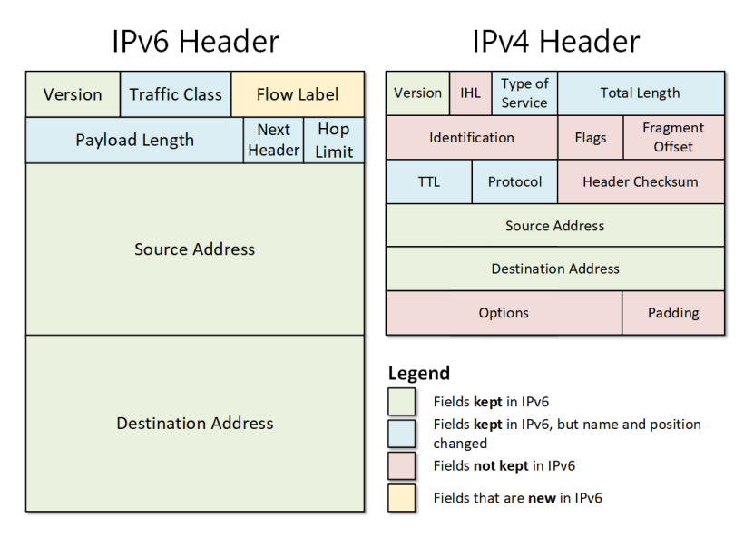
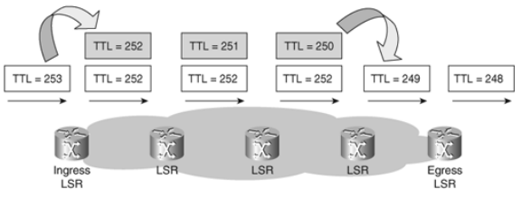

# IP 주소 체계 - IPv4와 IPv6

> IP 주소 = 인터넷 주소로 IPv4와 IPv6로 나누어진다

### 1. IPv4

- 32비트로 표현되는 주소 체계. 2^32개의 주소 (41억 9천만 주소)를 표현할 수 있음
- 8비트 단위로 점을 찍어 4개로 구분해서 표현 (8비트의 단위 = 옥텟)
- 보통 8비트를 10진수로 표현해서 말함
- 이 주소체계 만으로는 부족하기 때문에 NAT, 서브네팅 등 여러개의 부수적인 기술이 생겨남

cf) 세계 인구 50억이 넘음 -> 한 사람당 Ipad, 핸드폰 , ... 주소가 많이 부족

### 2. IPv6

- 128비트, 2^128개의 주소 표현(많은 주소 처리가 가능하며 NAT, 서브네팅이 필요하지 않음)
- 16비트씩 8개로 구분
- 16비트는 16진수(0~F)로 변환되어 `콜론(:)`으로 구분하여 표시하며, 앞의 연속되는 0은 생략할 수 있음

- 앞 64비트: 네트워크 주소, 뒤 64비트: 인터페이스 주소(=host 주소)
- IPSec이 내장됨
  - IPSec = 데이터 패킷을 암호화하는 보안 네트워크 프로토콜 제품군
- 단순해진 header 포맷
  - IPv4 헤더의 불필요한 field를 제거하여 보다 빠른 처리 가능

- IPv4는 체크섬이 있지만 IPv6는 체크섬이 없음

  - IPv4에는 CRC(순환중복검사)를 통해 손상된 패킷을 확인하고 폐기하는데 쓰는 체크섬 필드가 존재(Header Checksum 필드) 하지만 IPv6에는 존재하지 않음
    - 이유: 상위 프로토콜(TCP, UDP)에 체크섬 필드가 있기 때문에 헤더의 효울화를 위해 버전이 업그레이드되면서 사라짐

- TCP, UDP에서 체크섬 필드를 사용하지 않고 싶다면 해당 필드의 값을 모두 0으로 만들면 된다. 하지만 IPv6 + UDP로 사용할 경우 IPv6의 헤더 내의 체크섬 필드가 없기 때문에 무조건 UDP 헤더의 체크섬 필드를 사용한다고 설정해야 한다

- IPv4 헤더는 가변길이이지만, IPv6는 고정길이 (40Byte) 라서 "인터넷 헤더길이"에 대한 정보가 없다

> CRC (순환중복검사)란?
> 네트워크 상에서 데이터에 오류가 있는지 확인하는 방식
> 데이터를 전송하기 전에 주어진 데이터의 값에 따라 CRC 값을 계산하여 데이터에 붙여 전송하고, 데이터 전송이 끝난 후 받은 데이터의 값으로 다시 CRC 값을 계산하여 두 값을 비교하고, 이 두 값이 다르면 데이터 전송 과정에서 잡음 등에 의해 오류가 덧붙여 전송된 것임을 알 수 있음

- IPv4의 `TTL`이 IPv6에서는 `HOP Limit`으로 대체됨

  - TTL = IPv4에서 패킷이 네트워크에서 무환순환하지 않도록 하는 변수
  - 패킷이 네트워크에서 라우터를 거칠 때마다 TTL 값이 1씩 감소 값이 0이 되면 패킷이 폐기된다. 이러한 변수가 HOP Limit 이라는 이름으로 명칭이 변경됨

    

### 3. IPv4 VS IPv6

- IPv6는 IPv4보다 많은 주소를 표현할 수 있음
- IPv4보다 불필요한 헤더가 없기 때문에 빠르고 기본적으로 IPsec이라는 네트워크 보안제품군이 포함되었기 때문에 보안 측면에서도 뛰어나다
- 보통은 IPv6를 사용하는 것이 IPv4를 사용하는 것보다 빠르지만 (IPv6에서 사용하는 더 큰 패킷 사이즈로 인해) 일부 사용사례에서는 속도가 느린 경우도 존재
