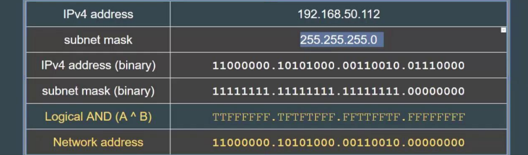
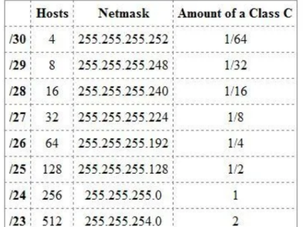

# IP 주소체계 - 클래스리스와 서브넷마스크, 서브네팅

> 클래스풀의 단점을 해결하기 위해 클래스리스의 등장

- 클래스로 나누는 것이 아니라, 서브넷 마스크를 중심으로 어디까지가 네트워크 주소이고 어디까지가 호스트 주소인지를 나눈다

- 서브네팅 = 네트워크를 나눈다는 의미
- 서브넷 = 서브 네트워크, 쪼개진 네트워크
- 서브넷마스크 = 서브 네크워크를 위한 비트 마스크

cf) 현대 주소체계는 클래스리스를 사용

### 1. 서브넷 마스크

> 네트워크 주소 부분만 모두 1, 호스트 주소 부분은 0으로 설정해서 나눔
> 

- 192로 시작하니까 class C에 해당 앞에 8비트 3개는 네트워크 주소, 뒤 1개는 호스트 주소를 의미
  => 컴퓨터가 이를 인식하게 하기 위해 네트워크 주소는 1, 호스트 주소는 0으로 표현한 서브넷마스크 사용 (255.255.255.0)

  - AND 연산자 사용하면 192.168.50.0 (AND는 둘 다 true일 때만 true)

- classA의 서브넷 마스크 = 255.0.0.0
- class B의 서브넷 마스크 = 255.255.0.0
- class C의 서브넷 마스크 = 255.255.255.0

**그렇다면 클래스리스는?**

- 서브넷 마스크

- /25
  255.255.255.128 = 11111111.11111111.11111111.1000000
  (8 \* 3 + 1 개 까지 더 네트워크 주소)
  (호스트 주소의 개수 2^7)

- /26
  255.255.255.192 = 11111111.11111111.11111111.1100000
  (8 \* 3 + 2 개 까지 더 네트워크 주소)
  (호스트 주소의 개수 2^6)

=> 네트워크 주소와 호스트 주소 개수의 구분이 ⭐세분화⭐

Q. 사무실이 10개가 있으며, 사무실 당 12개의 장치를 연결해야 한다면?

A. 호스트 주소 개수 16개인 11111111.11111111.11111111.11110000 사용해야 한다
사용해야 할 서브넷 마스크 = 255.255.255.240 사용 필요
16 - 2 = 14개의 장치 확보 가능하다
