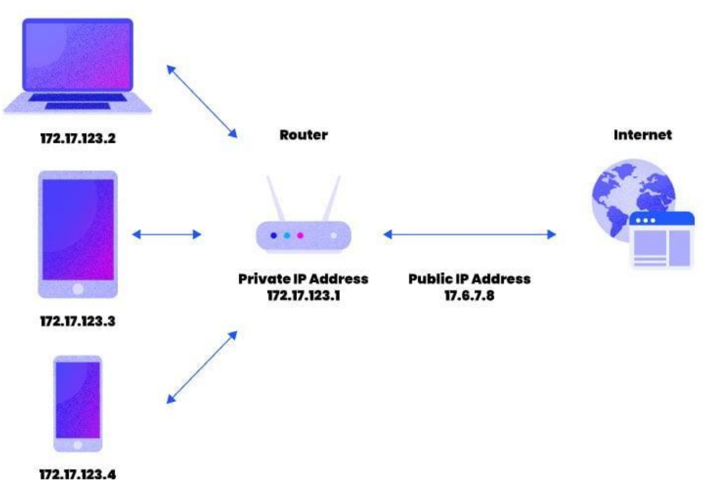

# IP 주소 체계 - 공인 IP와 사설 IP와 NAT

> 공인 IP = public IP
> 사설 IP = private IP
> NAT = Network Address Translation

- IP 주소 부족 문제를 공인 IP와 사설 IP로 나누고, 중간에 NAT라는 기술을 통해 해결

### 1. NAT

- 패킷이 트래픽 라우팅 장치를 통해 전송되는 동안 패킷의 IP 주소를 변경, IP 주소를 다른 IP 주소로 매핑하는 방법
- 사설 IP <-> 공인 IP
- 내부 네트워크 IP가 노출되지 않는 장점이 존재

### 2. 공유기와 NAT

- 실생활에서 인터넷 회선 하나를 개통하고 보통 공유기를 써서 wifi를 만들곤 하는데 이 때 여러 대의 호스트가 하나의 공인 IP 주소를 사용하여 인터넷에 접속 = NAT 기술의 적용
