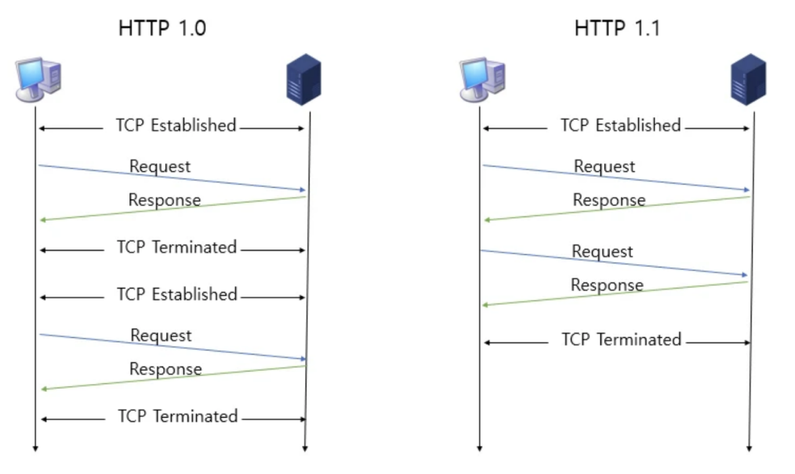
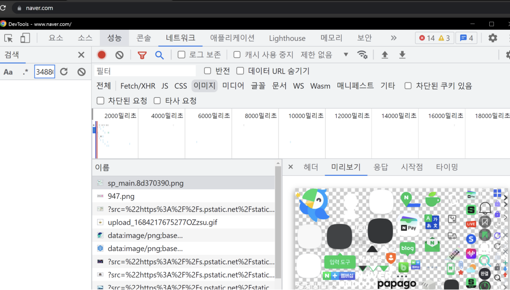
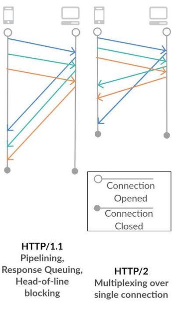

# HTTP/1.0과 HTTP/1.1의 차이, keep-alive, HOL

> HTTP 요청은 1.0부터 시작해 3까지 많은 발전을 거듭함. 발전 과정을 살펴보자

### 1. HTTP/1.0

- 수명이 짧은 연결
- 각 HTTP 요청 당 TCP 핸드셰이크가 발생되며 기본적으로 한 연결당 하나의 요청을 처리하도록 설계
- 한 번 연결할 때마다 TCP 연결을 계속 해야 하니 RTT가 늘어나는 문제점 존재
- 리소스 당 TCP 연결을 해야 다운로드를 받을 수 있음
  - 만약 html, js, css 3가지 리소스를 요청 시 3번 TCP 연결이 필요
  - keep-alive 옵션을 설정해야지만 연결이 유지

### 2. HTTP/1.1

- HTTP/1.0의 단점을 보완한 프로토콜. 크게 3가지의 차이점 존재

**1. keep-alive default**

- 매번 데이터를 요청할 때마다 TCP 연결을 하는 것이 아니라, 한 번 연결 해놓고 계속해서 데이터를 받을 수 있도록 만듦
  => keep-alive를 기본 옵션으로 하면서 가능해짐

> keep-alive header
> TCP 연결을 유지하는 것을 알려주는 헤더로 연결 유지 시간인 timeout과 최대 요청 수 max를 정할 수 있음

**2. 호스트헤더**

- HTTP/1.0은 서버가 하나의 호스트만 가진다고 가정하기 때문에 HTTP/1.0은 헤더에 호스트를 포함하지 않았음 -> HTTP/1.0은 하나의 IP에 하나의 호스트만 가질 수 있었음
- 하지만 사실 서버는 여러 개의 호스트를 가질 수 있으며, 이런 유연성을 위해 HTTP/1.1은 헤더에 특정 호스트를 포함할 수 있게 변경. 항상 호스트를 포함하여 요청하도록 변경되었다

**3. 대역폭 최적화**

- HTTP/1.0의 경우 어떠한 파일을 다운로드 받다가 연결이 끊기면, 다시 다운로드 받는 것은 불가능했지만, HTTP/1.1 부터는 가능

ex) HTTP/1.0에서 10KB 파일을 다운로드 받는다고 했을 때 5KB까지만 받고 다시 다운로드 받는 게 불가능했지만, HTTP/1.0 부터는 `Range:bytes=5000-` 이라는 헤더를 추가해서 다운로드 재개 요청을 할 수 있게 바뀜

### 3. 요청을 줄이기 위한 기술

- HTTP/1.0으로 발전했음에도 불구하고, 서버 요청 시마다 RTT는 계속 증가하기 때문에, 요청을 줄이기 위한 여러가지 기술들이 존재
- 대표적으로 이미지 스프라이트 (image sprite), 코드 압축, Base64 인코딩 기술을 같이 쓰게 되었다 (HTTP 1.1 보다도 버전 올라간 뒤에도 이런 기술들을 같이 쓰곤 한다)

#### 이미지 스프라이트

- 수많은 이미지를 하나의 이미지로 만들어 하나의 이미지만 다운받아놓고 이를 통해 수많은 이미지를 다운받는 듯한 효과를 내는 것
  

#### 코드 압축

- 코드를 압축해서 서빙 (띄어쓰기, 개행문자 등을 줄여가며 압축)

#### 이미지 Base64 인코딩

- 이미지 파일을 64진법으로 이루어진 문자열로 인코딩해서 이미지 서버에 대한 HTTP 요청을 할 필요가 없이 만드는 것
- 단, Base64 인코딩을 할 경우 파일 크기가 37퍼센트 더 커지는 단점 존재

### 4. HTTP/1.1의 고질적인 문제 : HOL

- HOL과 무거운 헤더(header)를 가지는 문제점을 해결하지 못함
- HOL = Head of Line Blocking
  - 네트워크에서 같은 큐에 있는 패킷이 그 첫번째 패킷에 의해 지연될 때 발생하는 성능 저하 현상 (첫 번째 패킷의 크기가 커서 다운 받는데 시간 오래 걸릴 경우 그 뒤의 패킷의 지연 시간이 커짐)

