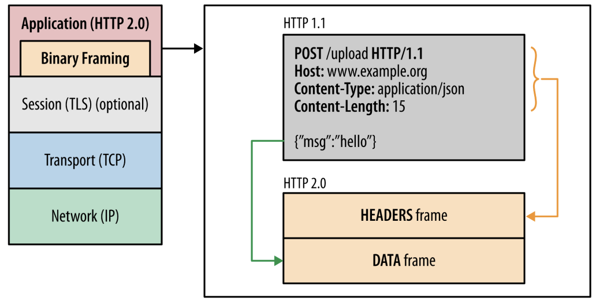
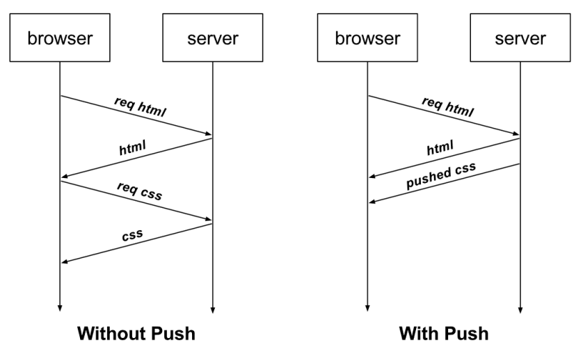

# HTTP/2와 HTTP/3의 차이

### 1. HTTP/2

- 2009년 구글은 HTTP/1.1의 한계를 극복하기 위해 SPDY 프로토콜을 개발
- 이후, 2015년 SPDY를 기반으로 하는 HTTP/2 프로토콜을 생성

#### 바이너리 포맷 계층

> 애플리케이션 계층과 전송 계층 사이에 바이너리 포맷 계층을 추가

- HTTP 1.0은 일반 텍스트 메시지를 전송하고 줄바꿈으로 데이터를 나눴다면, HTTP 2.0은 0과 1로 이루어진 바이너리 데이터로 변경되고 더 작은 메시지가 프레임으로 캡슐화되어 전송됨

#### 멀티 플랙싱

- 단일 TCP 연결의 여러 스트림에서 여러 HTTP 요청과 응답을 비동기적으로 보낼 수 있어 HOL 문제를 해결
- HTTP1.1에서는 병렬 요청을 하려면 다중 TCP 연결을 통해서 하고 일반적으로는 TCP 연결 하나당 병렬 요청은 불가
- 이를 HTTP/2.0에서는 리소스를 작은 프레임으로 나누고 이를 스트림으로 프레임을 전달
  - 각각의 프레임은 스트림 ID, 해당 청크(payload)의 크기를 나타내는 프레임이 추가되었기 때문에 작게 나눠서 다운로드가 되더라도 결과적으로 응답 데이터에서는 올바른 순서로 재조립 가능
    => 병렬적으로 빠르게 데이터 다운로드 가능

#### 서버 푸시

- 서버가 리소스를 클라이언트에 푸시 가능
- 요청된 html 파일과 함께 다른 객체를 별도로 보낼 수 있음
- 만약 요청한 html에 css가 포함되어 있다면 별도 요청 없이 css를 같이 보낼 수 있음 (클라이언트가 css요청하지 않았는데도 불구하고 서버가 css를 제공해 줄 수 있음)

#### 헤더 압축

- HTTP 1.1에는 무거운 헤더가 있었으나, 이를 허프만 인코딩 압축 방법 등으로 압축시킴
- 똑같은 서버에서 2개의 이미지를 준다고 했을 때, 중복되는 헤더는 제외한 채 보내고, 해당 공통 필드로 헤더를 재구성하며 중복되지 않은 헤더 값은 허프만 인코딩 압축 방법으로 압축해 전송

cf) 허프만 인코딩

- 문자열을 문자 단위로 쪼개 빈도 수를 세어 빈도가 높은 정보는 적은 비트수를 사용해 표현하고, 빈도가 낮은 정보는 비트 수를 많이 사용하여 전체 데이터 표현에 필요한 비트의 양을 줄이는 알고리즘

#### 우선 순위

- 서버에서 원하는 순서대로 우선순위를 정해 리소스 전달 가능

### 2. HTTP 3

> HTTP2의 경우 여전히 TCP를 사용하기 때문에 초기 연결 (3 way 핸드셰이크)에 대한 RTT로 인한 지연 시간이라는 문제 존재 -> 이런 문제 해결한 버전인 HTTP 3 등장

- `QUIC` (Quick UDP Internet Connections)이라는 계층 위에서 돌아가며, TCP 기반이 아닌 UDP 기반으로 돌아가며, HTTP/2에서 장점이었던 멀티 플렉싱 등을 가지고 있으며 초기 연결 설정 시 지연 시간 감소라는 대표적 특성을 가지고 있음

- HTTP2의 경우 클라이언트와 서버 간의 연결을 맺어 세션을 만드는 데 필요한 핸드셰이크, 암호화 통신을 구축하기 위한 TLS 핸드셰이크가 각각 필요했음, 이에 반해, HTTP 3는 TLS로 암호화 통신을 구축할 때의 단 한번의 핸드셰이크를 활용해 클라이언트와 서버 간의 연결, 암호화 통신 모두 다 구축을 함 이를 통해 1회 RTT만에 모든 연결을 성립할 수 있음 (cf HTTP2 는 3 RTT 필요)

- HTTP 3는 전송된 패킷이 손상되었다면 수신 측에서 에러를 검출하고 수정하는 방식이며 열약한 네트워크 환경에서도 낮은 패킷 손실률을 자랑하는 순방향 오류 수정 매커니즘(FEC, Foward Error Correction)이라는 특징을 가짐
