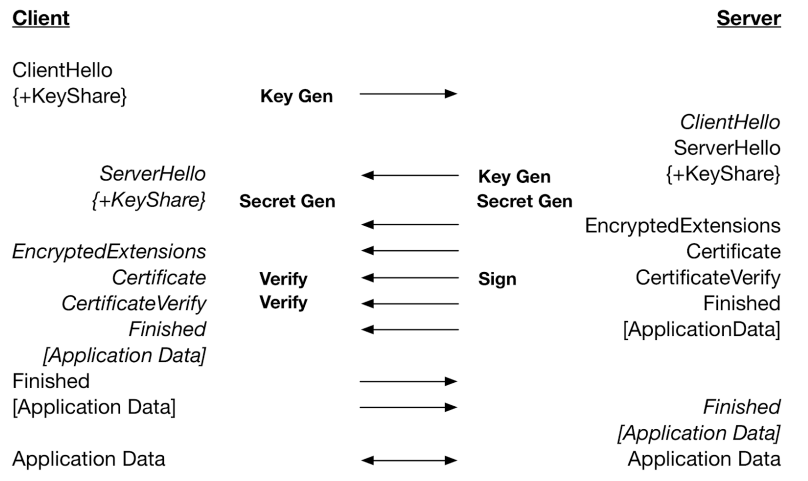
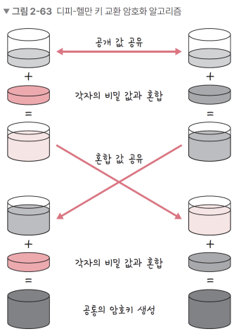
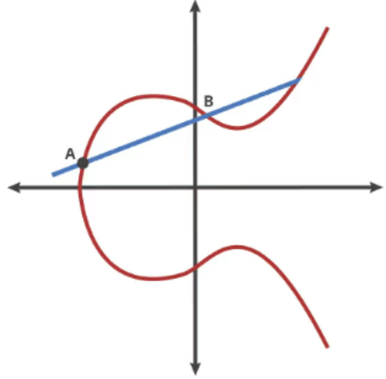

# HTTP와 TLS - TLS 핸드셰이크

**용어정리**

- SSL(Secure Socket Layer)은 TLS와 거의 동일한 개념
- SSL 1.0 -> 2.0 -> 3.0 -> TLS(TransportLayer Security Protocol) 1.0으로 명칭 변경 -> .. -> TLS 1.3

### 1. TLS

> 전송 계층에서 보안을 제공하는 프로토콜. 클라이언트와 서버가 통신할 때 TLS를 통해 제 3자가 메시지를 도청하거나 변조하지 못하도록 한다

- 사용할 TLS 버전을 정하고, 사이퍼 슈트, 서버의 공개키, SSL 인증서를 기반으로 인증 작업을 수행 - 1 RTT(비대칭암호화) 그 후 , 대칭 암호화를 위해 세션키를 생성

#### 1 > Client Hello

- 클라이언트는 TLS 버전, 사이버 슈트와 클라이언트 랜덤값(무작위 문자열), 임시 DH 매개변수를 서버에게 보냄

#### 2 > Server Hello, EncryptedExtensions, Certificate, CertificateVerify

- 서버는 클라이언트로부터 받은 옵션을 확인하고 서버와 클라이언트 모두에서 지원하는 가장 높은 TLS 버전을 식별하며 결정, 사이버슈트 지원 여부를 확인
- 공개키가 포함된 SSL 인증서, 서버 랜덤값, 임시 DH 변수를 보냄
- 클라이언트와 서버 각각 서로 교환한 DH 매개변수를 사용하여 임시 암호 키 (세션키)를 생성

#### 3 > finished

- 클라이언트와 서버가 세션키를 기반으로 대칭 암호화된 통신이 시작 (=보안 세션의 시작)

#### 키 교환 알고리즘

- 키 교환 알고리즘으로는 대표적으로 RSA와 Dh가 있음. TLS 1.3 버전의 경우 RSA에는 취약점이 있기 때문에 공식적으로 지원하지 않음. (TLS 1.3에서는 DH 중에서도 타원 곡선 DH를 사용)

### 2. DH 매개변수

- DH = Diffie- (디피헬만)
- Diffie-Helman 알고리즘은 서로 공개값 공유, 비밀값과 혼합, 혼합값과 공유, 각자의 비밀값과 혼합해서 공통의 암호키를 만드는 알고리즘

  

- DH는 그냥 디피헬만을 사용하는 DHE와 타원 곡선 암호화 방법과 DH를 섞은 ECDHE가 있고 보통 ECDHE를 사용
  - 타원 곡선 암호화 방법 = 곡선을 사용하여 개인 키 보유자만 알 수 있는 타원 곡선을 그리고 이를 기반으로 교차점을 생성, 이 교차점을 기반으로 암호를 설정(조금 더 보안성이 높은 알고리즘이라고 생각)

### 3. 사이퍼슈트

- 사이퍼 슈트는 프로토콜, AEAD 사이퍼 모드, 해싱 알고리즘이 나열된 규약 = 암호제품군

ex) TLS1.3버전의 사이퍼슈트
• TLS_AES_128_GCM_SHA256
• TLS_AES_256_GCM_SHA384
• TLS_CHACHA20_POLY1305_SHA256
• TLS_AES_128_CCM_SHA256
• TLS_AES_128_CCM_8_SHA256

#### AEAD 사이퍼 모드

> Authenticated Encryption with Associated Data

- 데이터 암호화 알고리즘
  ex) AES_128_GCM : 128 비트의 키를 사용하는 표준 블록암호화 기술과 병렬 계산에 용이한 암호화 알고리즘 GCM이 결합된 알고리즘

#### 해싱 알고리즘

- 데이터를 추정하기 힘든 더 작고, 섞여 있는 조각으로 만드는 알고리즘
- SSL(=TLS)는 해싱 알고리즘으로 SHA-256 알고리즘과 SHA-384 알고리즘을 쓰는데 그 중 SHA-256 알고리즘을 더 많이 사용.
  - SHA-256 알고리즘 = 해시 함수의 결과값이 256 비트인 알고리즘. 비트 코인을 비롯한 많은 블록체인 시스템에서도 사용

Q. 해싱 알고리즘은 TLS에서 어떻게 쓰이나요?

- 인증서가 올바른 인증서인지 확인할 때 전자 서명을 이용하는데 이때 해싱 알고리즘이 쓰인다

1. 인증 생성작업 : 전자 서명을 만드는데 서명되는 메시지를 해싱
2. 인증 확인작업: 메세지를 복호화해서 해시를 서로 비교해 올바른 메시지인지 확인

#### 전자서명

- 송신자가 자신의 신원을 증명하는 절차 혹은 정보
  ex) 네이버에서 다운로드한 프로그램이 악성인지 정말로 네이버에서 공식적으로 다운로드한 프로그램인지 확인하려면 프로그램 안에 제작자 표시를 할 수 있음 = 전자서명
- 전자서명을 통해 인증서에 적힌 주체가 '서비스제공자'인지를 확인하고 인증서에 기록된 전자서명을 기반으로 CA의 공개키로 복호화해서 지문을 얻고 인증서에 기록된 정보들을 해시 함수에 입력하여 해시를 얻어내서 두 해시의 일치 여부를 확인 -> 인증서의 유효성 검증
  = 요약하자면, 인증서가 변조되지 않았고 인증서가 '서비스제공자' 것임을 확인하는 절차

### 4. 인증서

- 인증서는 1. 주체 (인증서 발급한 CA, 도메인, 웹사이트 소유자, 인증서 소유자)
  2, 공개키 (공개키, 공개키암호화방법)
  을 포함하는 단순한 데이터 파일
- 자신의 웹사이트 안에서 SSL 인증서를 만들 수도 있으나, 보통은 인증기관인 CA에서 발급한 SSL 인증서를 기반으로 인증 작업을 수행
- 주체는 클라이언트가 접속한 서버가 클라이언트가 의도한 서버가 맞는지 확인할 때 쓰이고, 공개키는 처음 인증 작업을 수행할 때 쓰임

### 5. CA

- 인증서의 역할은 클라이언트가 접속한 서버가 클라이언트가 의도한 서버가 맞는지를 보장하는 역할. 이러한 인증서를 발급하는 기업들을 CA ( = Certificate Authority)
- 참고로 서비스가 CA로부터 인증서를 구입할 때 서비스의 도메인, 공개키와 같은 정보를 제공해야 한다

#### 인증서의 종류

- 단일 도메인 : 단 하나의 도메인에 적용되는 인증서
- 와일드카드 : 도메인의 하위 도메인도 포함하는 인증서
- 멀티 도메인 : 서로 관련되지 않은 다수 도메인에 적용될 수 있는 인증서

### 6. RSA의 취약점

- RHA의 경우 클라이언트가 생성한 임시 암호값을 서버로 전송하지만, DH의 경우 클라이언트와 서버가 서로 교환한 DH 매개변수를 사용해 개인키를 만들기 때문에 RHA는 클라이언트에서 생성한 임시 암호값이 탈취당할 경우 해킹의 위험이 있음.

### 6. 0-RTT

- TLS 1.3의 특징이자 장점
- 세션키가 생성된 이후 다시 그 사이트에 방문한다면 미리 만들어 놓은 세션키 (pre-shared key , PSK)를 기반으로 연결을 생성하기 때문에 이 때 인증에 드는 비용이 없다

#### 왜 네트워크 상 보안을 해야 할까? = 왜 HTTPS 를 사용해야 할까?

- 신용카드 등 민감한 금융정보를 다루는데 이점이 있고, HTTP/2를 구현할 수 있다
