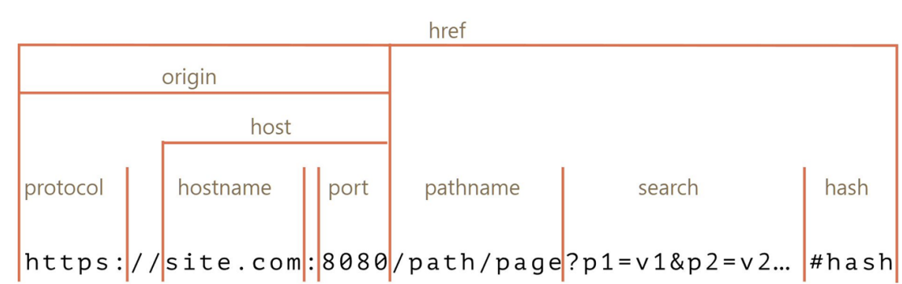

# 웹 브라우저의 캐시 - 로컬 스토리지와 오리진

## 로컬 스토리지

### 1. 정의

- 웹 스토리지 객체로 브라우저(ex 크롬) 내에 `{key:value}` 형태로 오리진에 종속되어 저장되는 데이터
  - 오리진이 같은 브라우저 내에서 공유
  - 하나의 키에 오로지 하나의 값만 저장됨
  - 데이터는 사용자가 브라우저에서 수동으로 삭제하지 않는 한 평생 동안 로컬 저장소에 저장되며 만료 날짜가 없음
    - **사용자가 창이나 탭을 닫아도, 컴퓨터를 종료해도 만료되지 않음**
  - 최대 저장용량 5MB
  - 보통 사용자의 행위를 기억할 때- 원티드 사용자가 설정한 필터링 조건 유지, 검색 기록, 로그인을 유지하기 위한 값 등으로 사용되며, 로컬 스토리지 데이터는 자동으로 서버로 전송되지 않음 (cf 쿠키는 자동 전송됨)

### 2. 사용법

- 설정 : `localStorage.setItem(key, value)`
- key에 해당하는 value가져오기 : `localStorage.getItem(key)`
- 제거 : `localStorage.removeItem(key)`
- 전체제거 : `localStorage.clear()`

## 로컬 스토리지와 오리진

### 1. 오리진 (origin)

> 오리진: 프로토콜 + 호스트이름 + port
> 

- ⭐ 오리진이 같으면 로컬 스토리지가 공유가 된다!

- cf) 네이버의 오리진 https://www.naver.com:443

[참조]

- http의 기본 포트: 80
- https의 기본 포트: 443
