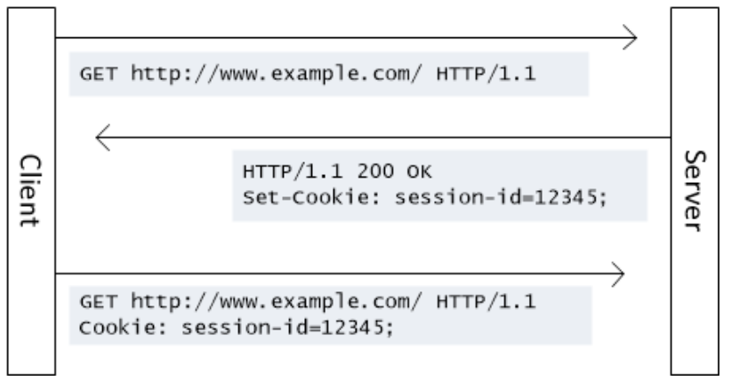
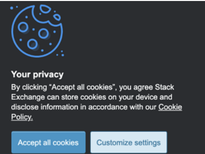

# 웹 브라우저의 캐시 - 쿠키 (Cookie)

### 1. 개념

- 브라우저에 저장된 데이터 조각
- 클라이언트에서 먼저 설정할 수도 있고, 서버에서 먼저 설정할 수도 있으나, 보통은 서버에서 먼저 설정해서 쿠키를 만드는게 일반적

- 서버에서 응답 헤더로 `Set-Cookie`를 설정해서 쿠키를 보내면, 그 때부터 클라이언트에서 요청 헤더 `Cookie`에 설정되어 자동으로 서버에 전달되게 되고, 브라우저에도 저장되게 된다



- 쿠키는 클라이언트와 서버 둘 다에서 조작이 가능하지만, 보통 서버에서 만료기한 등을 설정 및 컨트롤. 저장 용량은 최대 4kb까지 가능

- 보통 로그인, 장바구니, 사용자 커스터마이징, 사용자 행동분석(주로 개인화된 광고에 활용되는 것들)에 사용된다.

#### 클라이언트에서도 설정 가능한 쿠키

- 클라이언트에서 자바스크립트 - document.cookie를 통해 쿠키를 설정할 수 있고, 요청을 보낼 때에도 header- Cookie에 값을 정해서 보낼 수도 있지만, 권장하지는 않는다

```javascript
axios.get(url, {
    headers: {
    Cookie: "cookie1=value; cookie2=value;
    cookie3=value;"
    }
}).then
```

- 클라이언트에서 쿠키를 설정한다면 쿠키에 대한 제어권을 클라이언트에 두게 되는데, 쿠키에는 보통 민감한 정보들이 담길 수도 있기 때문에 이 제어권에 관한 것을 클라이언트가 아닌 서버가 두게 만들어야 한다

#### 세션 쿠키

- Expires 또는 Max-Age 속성을 지정하지 않은 것. 브라우저 종료 시 쿠키도 사라짐

#### 영구 쿠키

- Expires 또는 Max-Age 속성을 지정해서 특정날짜 또는 일정 기간이 지나면 삭제되게 만든 쿠키. 브라우저를 닫을 때 만료되지 않음

### 2. 문법

```
Set-Cookie: <cookie-name>=<cookie-value>
Set-Cookie: <cookie-name>=<cookie-value>; Expires=<date>
Set-Cookie: <cookie-name>=<cookie-value>; Max-Age=<non-zero-digit>
Set-Cookie: <cookie-name>=<cookie-value>; Domain=<domain-value>
Set-Cookie: <cookie-name>=<cookie-value>; Path=<path-value>
Set-Cookie: <cookie-name>=<cookie-value>; Secure
Set-Cookie: <cookie-name>=<cookie-value>; HttpOnly
Set-Cookie: <cookie-name>=<cookie-value>; SameSite=Strict
```

- Secure: 쿠키에 이 옵션을 추가하면 HTTPS로만 쿠키를 주고 받을 수 있게 하는 옵션
  하지만 Chrome v89 이상 또는 firefox v75 이상부터는 localhost에서 이 옵션을 **무시** (hTTP로 쿠키를 주고받을 수있음)

- httponly : 공격자가 자바스크립트로 쿠키를 빼낼 수 없게 만듦 (document.cookie로 접근 불가)

- samesite : 요청이 동일한 도메인에서 시작된 경우에만 쿠키가 어플리케이션으로 전송되도록 허용

### 3. 쿠키의 시큐어 코딩

> 쿠키-세션으로 로그인을 처리한다면 다음과 같은 시큐어 코딩을 지켜야 한다

- cookie에 세션 id를 담을 때 이 세션 id를 기반으로 클라이언트의 개인 정보를 유추할 수 없게 해야 한다
- 자바스크립트로는 파악할 수 없게 httponly 옵션을 걸어야 한다
- 일정 시간의 세션 타임아웃을 걸어야 한다

### 4. 쿠키 허용 관련 알림창

- 서비스 운용시 쿠키를 사용한다면 쿠키 허용 관련 알림창을 만들어야 한다. 방문 기록을 추적할 때 쿠키가 사용되기 때문. 이는 사용자의 데이터 간접 수집에 해당하며 거기에 해당하는 KISA(한국인터넷진흥원) 지침을 준수해야 한다.


