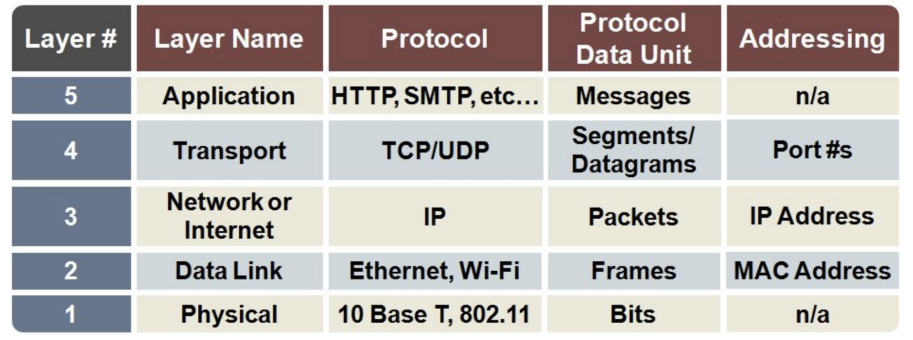
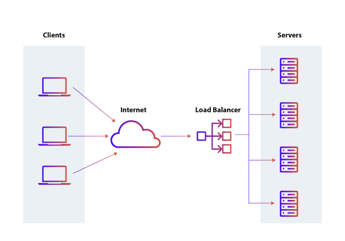
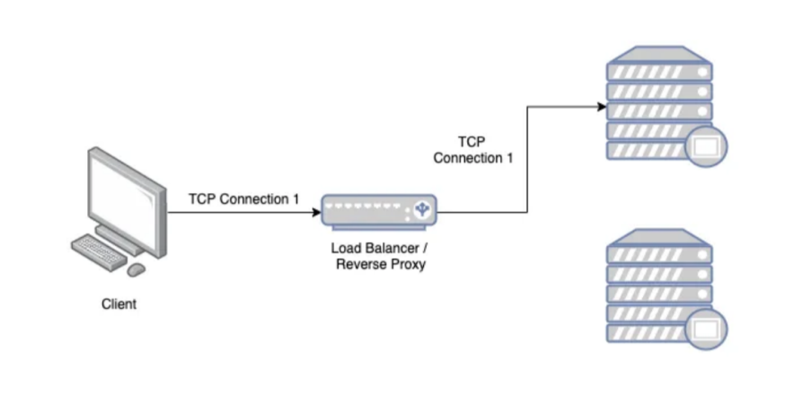
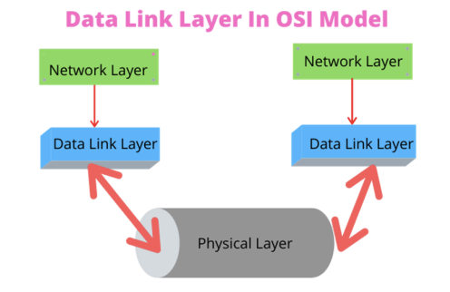
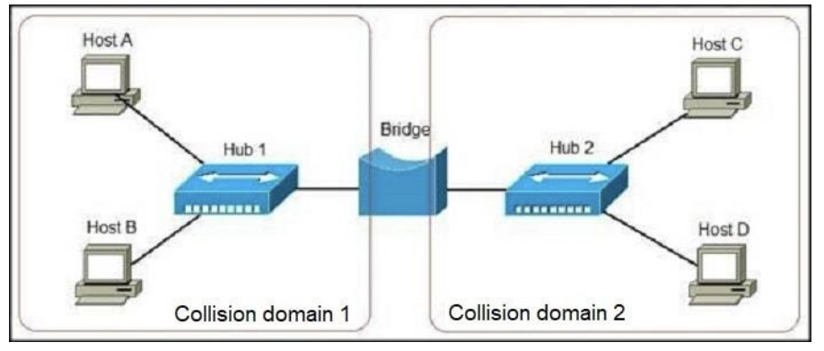
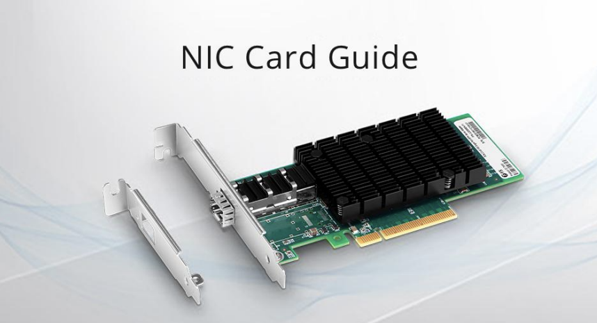

# 네트위크를 이루는 장치의 이해

- 네크워크 기기는 계층별로 나눌 수 있음
- 상위 계층을 처리하는 기기는 하위계층을 처리할 수 있지만, 그 반대는 불가
  - 예를 들어 애플리케이션 계층을 담당하는 로드밸런서는 네트워크 분산 처리도 가능하지만, 물리계층의 하나인 NIC는 이를 수행하지 못함

### 레이어별 프로토콜, PDU 정리

### 레이어별 네트워크 장치

- 애플리케이션 계층: L7 스위치
- 전송 계층: L4 스위치
- 인터넷 계층(네트워크계층): 라우터, L3 스위치
- 데이터 링크 계층: L2 스위치, 브리지
- 물리계층: NIC, 리피터, AP

### 1. 애플리케이션 계층

#### L7 스위치

> 로드밸런서라고도 하며, 서버의 부하를 분산하는 기기

- 서버 이중화, 보안에 강점이 있는 장치
- IP, Port 뿐만 아니라 url, 헤더, 쿠키 등을 기반으로 트래픽을 분산
- 헬스 체크를 통해 장애가 발생한 서버를 확인하고 해당 서버로 트래픽을 보내지 못하게 하는 역할 수행

#### 헬스 체크

- 전송 주기와 재전송 횟수 등을 설정한 이후 반복적으로 서버에 요청을 보내는 것
- L4 스위치 또는 L7 스위치 모두 헬스 체크를 통해 정상적인 서버 또는 비정상적인 서버를 판별.
- 서버에 주기적으로 TCP 3 way handshake 요청 보내 서버가 살아있는지 확인
- 사용자는 장애 발생과 무관하게 서비스 이용 가능
- 참고: AWS에서 L7 스위치를 이용한 로그밸런싱은 ALB라는 컴포넌트를 통해서 하며, L4 스위치를 이용한 로드밸런싱은 NLB 컴포넌트를 통하여 구축

### 2. 전송 계층

- 전송 계층의 대표적인 네트워크 장치로는 L4 스위치가 존재

#### L4 스위치

- 로드 밸런서의 특징인 트래픽 분산 가능
- 패킷의 IP 주소와 port 번호를 참고해서 적절히 트래픽 분산
- 전송계층의 TCP, UDP 등의 헤더를 기반으로 우선순위를 판단해서 분산이 가능
- L7 스위치와 똑같이 헬스체크 가능

### 3. 인터넷 계층

#### 라우터

- 라우팅 = 하나 이상의 네트워크에서 경로를 선택하는 프로세스. 이때 라우팅을 하는 장비가 라우터
- 다른 네트워크에 존재하는 장치끼리 서로 데이터를 주고받을 때 "패킷소모 최소화", "경로 최적화"하는 장비

#### L3 스위치

- L2 스위치의 기능 + 라우팅을 하는 장비
- 라우팅 테이블을 참조해서 IP 패킷에 IP 주소를 담아 보낸다

### 4. 데이터링크계층

- TCP 계층에서 데이터 링크 계층과 물리 계층을 합쳐서 링크 계층이라고 함

- 데이터 링크 계층은 '이더넷 프레임'을 통해 에러 확인, 흐름 제어, 접근 제어를 담당하는 계층
- 물리 계층은 무선 LAN(와이파이)과 유선 LAN을 통해 0과 1로 이루어진 데이터를 보내는 계층
- 이 중 데이터 링크 계층 담당 장비 2가지부터 알아보자

#### L2 스위치

- 장치들의 MAC 주소를 MAC 주소 테이블을 통해 관리
- 해당 테이블과 인터넷 계층에서 받은 패킷을 기반으로 이더넷 프레임을 만들어 목적지 MAC 주소로 패킷을 보내주는 역할

#### 브릿지

- 두 개의 근거리 통신망 (LAN)을 상호 접속할 수 있도록 하는 통신망 연결 장치
- 통신망의 범위를 확장하고 서로 다른 LAN을 기반으로 하나의 통신망을 구축할 때 쓰임

### 5. 물리계층

#### NIC

- LAN 카드라고 하는 네트워크 인터페이스 카드 (NIC, Network Interface Card)는 네트워크에 연결하기 위해 PC에 설치된 회로기판
- 이 장치에는 PC의 고유 식별 번호인 MAC 주소 존재

  

#### 리피터

- repeater, 들어오는 약해진 신호 정도를 증폭하여 다른 쪽으로 전달하는 장치

#### AP

- access point 는 패킷을 복사하는 장치. AP에 유선 LAN을 연결한 후, 무선 LAN 기술을 기반으로 무선 네트워크망을 구축할 수 있음
