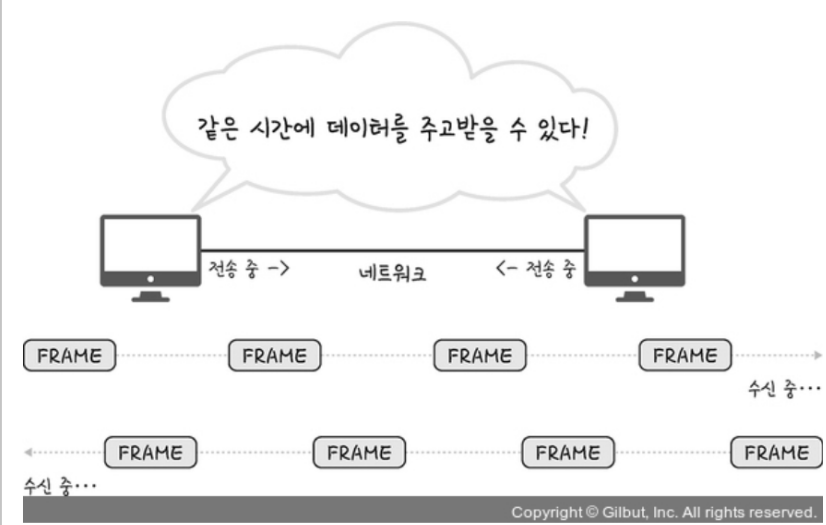
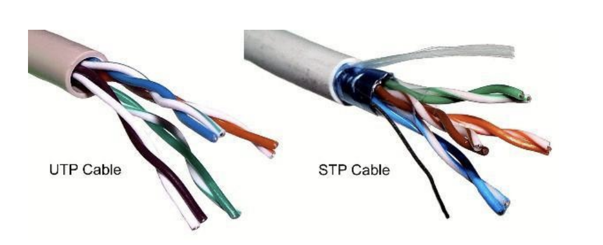
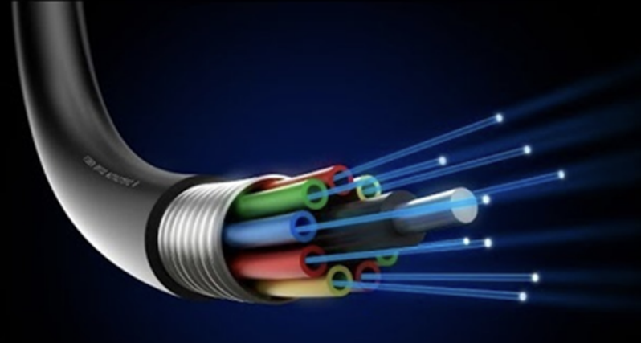
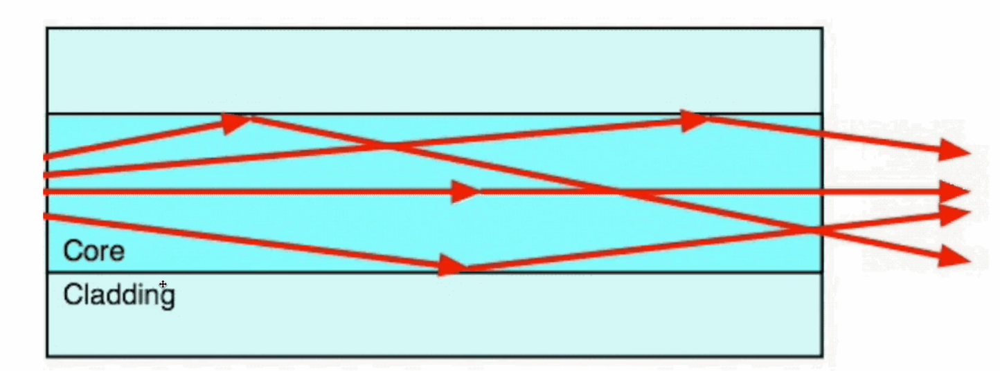

# 유선 LAN

### 1. 전이중화 통신, CSMA/CD

- 전이중화 (full duplex) 통신은 양쪽 장치가 동시에 송수신할 수 있는 방식. 현재 방식.
- 동축 케이블, 광캐이블 등을 기반으로 만들어진 유선 LAN을 이루는 이더넷은 IEEE802.3 프로토콜을 기반으로 전이중화 통신을 사용

#### IEEE802.3 프로토콜

- 이더넷 프레임은 어떤 구조를 기반으로 할것인지, 케이블의 최대 전송량, 어떤 케이블만이 가능하도록 할것인지 등을 정한 규칙

#### 전이중화통신

- 양쪽 장치가 동시에 송수신할 수 있는 방식. 송신로와 수신로를 나눠서 데이터를 주고받을 수 있음
  

#### CSMA/CD

- 예전에는 유선 LAN에 반이중화 통신 중 하나인 CSMA/CD(continued) 방식 사용
- 회선을 사용하는지를 파악한 뒤 사용하지 않는다면 데이터를 보내고 충돌이 발생한다면 일정 시간 이후 재전송하는 방식

### 2. 케이블

#### 트위스트 페어 케이블

- 2종류 존재. 실드 처리한게 STP, 안한게 UTP
  

#### LAN 케이블

- 유선 LAN을 구축할 때 사용하는 LAN 케이블은 UTP 케이블 타입.
- LAN 케이블을 꽂을 수 있는 커넥터가 RJ45 커넥터

#### 광섬유 케이블

- 레이저를 이용해 통신하며 보통 100Gbps 이상의 데이터를 전송하는 케이블
- 빛의 굴절률이 높은 부분을 코어, 낮은 부분을 클래딩이라고 부름
- 다른 밀도를 가지는 유리나 플라스틱 섬유를 기반으로 제작
- 한 번 들어간 빛이 내부에서 계속해서 반사하며 전진하여 반대편 끝까지 가는 원리를 이용

# 무선 LAN

### 1. 반이중화통신, CSMA/CA, 와이파이

### 2. 주파수와 2.4GHz vs 5GHz의 차이
