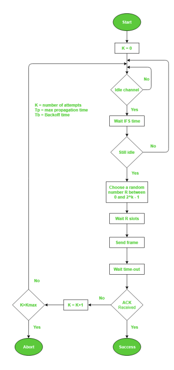
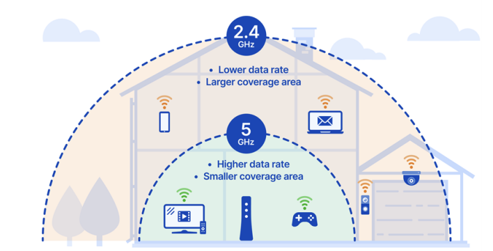

# 유선 LAN

### 1. 전이중화 통신, CSMA/CD

- 전이중화 (full duplex) 통신은 양쪽 장치가 동시에 송수신할 수 있는 방식. 현재 방식.
- 동축 케이블, 광캐이블 등을 기반으로 만들어진 유선 LAN을 이루는 이더넷은 IEEE802.3 프로토콜을 기반으로 전이중화 통신을 사용

#### IEEE802.3 프로토콜

- 이더넷 프레임은 어떤 구조를 기반으로 할것인지, 케이블의 최대 전송량, 어떤 케이블만이 가능하도록 할것인지 등을 정한 규칙

#### 전이중화통신

- 양쪽 장치가 동시에 송수신할 수 있는 방식. 송신로와 수신로를 나눠서 데이터를 주고받을 수 있음
  

#### CSMA/CD

- 예전에는 유선 LAN에 반이중화 통신 중 하나인 CSMA/CD(continued) 방식 사용
- 회선을 사용하는지를 파악한 뒤 사용하지 않는다면 데이터를 보내고 충돌이 발생한다면 일정 시간 이후 재전송하는 방식

### 2. 케이블

#### 트위스트 페어 케이블

- 2종류 존재. 실드 처리한게 STP, 안한게 UTP
  

#### LAN 케이블

- 유선 LAN을 구축할 때 사용하는 LAN 케이블은 UTP 케이블 타입.
- LAN 케이블을 꽂을 수 있는 커넥터가 RJ45 커넥터

#### 광섬유 케이블

- 레이저를 이용해 통신하며 보통 100Gbps 이상의 데이터를 전송하는 케이블
- 빛의 굴절률이 높은 부분을 코어, 낮은 부분을 클래딩이라고 부름
- 다른 밀도를 가지는 유리나 플라스틱 섬유를 기반으로 제작
- 한 번 들어간 빛이 내부에서 계속해서 반사하며 전진하여 반대편 끝까지 가는 원리를 이용

# 무선 LAN

- IEEE802.11 표준 규격을 따르며, 반이중화 통신을 사용

### 1. 반이중화통신, CSMA/CA, 와이파이

#### 반이중화 통신

- half duplex는 양쪽 장치는 서로 통신할 수 있지만, 동시에는 통신할 수 없으며 한 번에 한 방향만 통신할 수 있는 방식

#### CSMA/CA

- 반이중화 통신 중 하나로 하나의 장치에서 데이터를 보내기 전에 일련의 과정을 기반으로 사전에 가능한 한 충돌을 방지하는 방식

> CSMA/CA로 프레임을 보낼 때 다음과 같은 과정 발생

- 사용중인 채널이 있다면 다른 채널을 감지하다 유후 상태인 채널 발견
- 프레임 간 공간 시간인 IFS(Interframe Space)시간 만큼 기다림. IFS는 프레임의 우선순위를 정의할 때도 사용됨 IFS가 낮으면 우선순위가 높음
- 프레임을 보내기 전 0~2^k-1 사이의 랜덤 상수를 기반으로 결정된 시간만큼 기다린 뒤 프레임을 보냄. 프레임을 보낸 뒤 제대로 송신이 되었고, ACK 세크먼트를 받았다면 마침. 받지 못했다면 k = k+1 을 하며 반복. 반복하다 k가 kMax 보다 커진다면 해당 프레임 전송은 버림

#### 와이파이

- 무선 LAN의 대표적인 기술
- 전자기기들이 무선 LAN 신호에 연결할 수 있게하는 기술
- 유선 LAN을 AP 또는 공유기에 꽂아서 무선 LAN 신호를 만들어 구축

### 2. 주파수와 2.4GHz vs 5GHz의 차이

- 무선 LAN(WLAN, wireless local area network) 은 무선 신호 전달 방식을 이용하여 2대 이상의 장치를 연결하는 기술
- 비유도 매체인 공기에 주파수를 쏘아 무선 통신망을 구축하는데, 주파수 대역은 2.4GHz 대역 또는 5GHz 대역 중 하나를 사용하여 구축

#### 2.4GHz

- 장애물에 강하나 속도가 더 느림
- 호환성이 좋음 (오래된 노트북, 휴대폰 가능)
- 커버리지 범위가 높음

#### 5GHz

- 장애물이 있을 때 연결이 끊기기도 하나, 속도가 더 빠름
- 호환성이 낮음
- 커버리지가 작음
