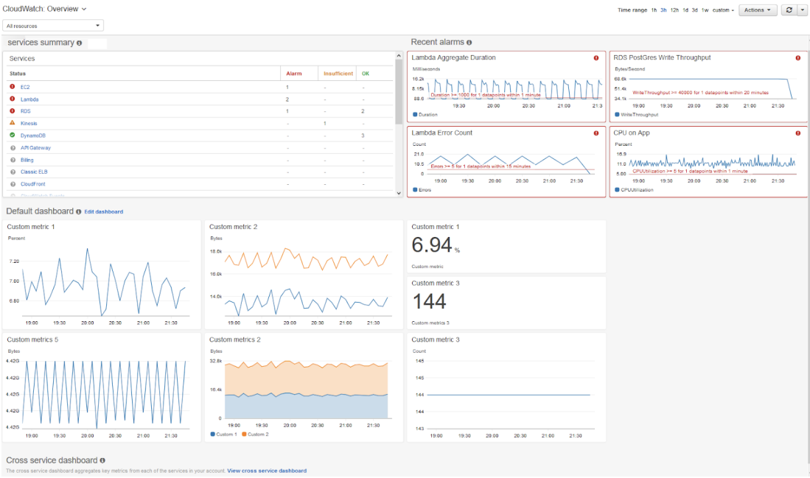

# 대규모 트래픽으로 인한 서버 과부하 해결 방법

#### 서버 과부하의 의미

- 서버가 리소스를 소진하여 들어오는 요청을 처리하지 못함
- 서버는 사용자의 web 요청을 처리하지 못해 응답 없음이 뜨게 된다

## 1. 모니터링을 통한 자원 할당

- 서버 과부하로 서버가 응답없음이 뜨는 데에는 여러가지 이유가 있지만, 그 중 하나가 바로 "자원의 한계점 도달"
- 보통 서버의 CPU 사용량이 80-90%에 도달하거나 메모리가 부족해 계속해서 스와핑이 발생하면 과부하 상태

- 이를 **모니터링을 통한 자원의 적당한 할당**으로 해결.
  - 여기서 자원은 CPU, 메모리, 대역폭을 포함

### AWS 오토 스케일링

- 서비스 이용 불가능 상태 발생 이전에 cloud watch가 계속해서 모니터링하여 서버 대수를 늘려주는 방법
- 애플리케이션을 자동으로 모니터링하고 자원의 용량을 자동으로 조절



### netdata를 이용한 모니터링

- AWS를 사용하지 않을 때 무료 모니터링 서비스도 존재

- https://github.com/netdata/netdata
- 이를 기반으로 지속적인 모니터링과 자원할당을 통해 서버 과부하 해결 가능


- 이러한 모니터링 대시보드를 slack과 연동해서 설정한 임계치(threshold)를 기반으로 알림 서비스 구축 가능

#### 모니터링을 왜할까?

- 서버 과부하로 인한 서버 중지에 대한 대처 가능
- 어떤 페이지에 어떤 트래픽이 얼마나 발생했는지, 어떤 네트워크에서 병목현상이 일어났는지 등을 알 수 있음
- 활용도가 높은/낮은 페이지 파악할 수 있어 서비스 개선에도 도움
- 일부 서비스는 모니터링한 결과물을 알려주면서 서비스의 중단 등의 여부를 사용자에게 알려주기도 한다 (cloudflare)

- 즉, 해결하기 위한 문제점을 파악하기 위해 모니터링은 필수적

### 로드밸런서

- AWS 오토 스케일링은 빠르긴 하지만 구성에 시간이 걸리기 때문에 앞단에 로드밸런서를 통해 트래픽을 분산해야 한다


- 또한 로드 밸런서는 한 서버에 장애가 발생하면 트래픽을 다른 기능 서버로 리다이렉션 하여 시스템 중단을 방지할 수 있음

### 블랙스완 프로토콜

- 블랙스완이란? 예측할 수 없는 사고가 일어난 것
- 사후에는 이 사고의 원인을 분석할 수 있지만 사전에는 이 사고를 예측할 수 없는 것

- 참조: 구글은 블랙스완 발생 시 다음과 같은 수칙 따름

```
1. 영향을 받은 시스템과 각 시스템의 상대적 위험 수준을 확인
2. 잠재적으로 영향받을 수있는 내부의 모든 팀에 연락
3. 최대한 빨리 취약점에 영향을 받는 모든 시스템을 업데이트
4. 복원 계획을 포함한 대응 과정을 파트너와 고객 등 외부에 전달

```
