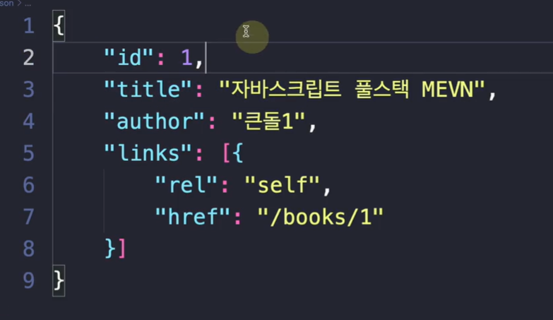

# REST API

> RESTful한 API, 일련의 특징과 규칙을 지키는 API

## REST API의 특징

### 1. Uniform-Interface

- API에서 자원들은 각각의 독립적인 인터페이스를 가지며, 각각의 자원들이 url 자원 식별, 표현을 통한 자원 조작, self-descriptive message, HATEOAS 구조를 가지는 것을 말한다

- 독립적인 인터페이스: 서로 종속적이지 않은 인터페이스
  - ex) 웹 페이지를 변경했다고 웹 브라우저를 업데이트하는 일은 없어야 하고 HTTP 명세나 HTML 명세가 변경되어도 웹 페이지는 잘 동작해야 한다

#### url 자원 식별

- identification or resources 를 말한다. 자원은 url로 식별되어야 한다
- ex) /product/1201 -> 1201 상품 조회

#### 표현을 통한 자원 조작

- manipulation of resources through representations
- url과 GET, DELETE 등 HTTP 표준 메서드 등을 통해 자원을 조회, 삭제 등 작업을 설명할 수 있는 정보가 담겨야 한다

#### self descriptive message

- HTTP 헤더에 타입을 명시하고, 각 자원들은 MIME types에 맞춰 표현되어야 한다
  - MIME types는 문서 파일 등의 특성과 형식을 나타내는 표준
    - application/json, font/ttf, text/plain

#### HATEOAS 구조

- Hypermedia as the Engine of Application State
- 하이퍼링크에 따라 다른 페이지를 보여줘야 하며, 데이터마다 어떤 URL에서 원했는지 명시해주어야 한다

- 보통은 link, href, links, url 속성 중 하나에 해당 데이터의 url을 담아서 표기



- id 1인 데이터는 /books/1에서 원했음을 명시

### 2. Stateless

- HTTP 자체가 Stateless 하기 때문에 HTTP를 이용하는 것만으로도 만족된다
- REST API를 제공해주는 서버는 세션 (session)을 해당 서버 쪽에 유지하지 않는다
- 서버는 클라이언트가 요청한 기록을 가지고 있지 않는다
  - cf) 만약 세션 기반 로그인 방식을 구축한다면 , 해당 서버는 RESTful하지 않는다

### 3. Cacheable

- HTTP는 원래 캐싱이 된다. 아무런 로직을 구현하지 않더라도 자동적으로 캐싱이 됨. 새로고침을 하면 304가 뜨면서 원래 있던 js와 css 이미지 등을 불러온다
- 이는 HTTP 메서드 중 GET에 한정된다

### 4. Client-Server 구조

- 클라이언트와 서버가 서로 독립적인 구조를 가져야한다
- 이는 HTTP를 통해 가능한 구조
- 서버에서 HTTP 표준만 지킨다면, 웹에서는 그에 따른 화면이 잘 나타나게 된다
- 서버는 그저 API를 제공하고 그 API에 맞는 비지니스 로직만 처리. 클라이언트는 HTTP로 받는 로직만 잘 처리

### 5. Layered Sytstem

- 계층 구조로 나눠져 있는 아키텍처를 뜻함

## REST API의 URI 규칙

- 자원을 표기하는 URI는 아래의 6가지 규칙을 적용해야 한다

#### 1. 동작은 HTTP 메소드로만 해야 하고, url에 해당 내용이 들어가 면 안된다

#### 2. .jpg/.png등 확장자는 표시하지 말아야 한다

#### 3. 동사가 아닌 명사로만 표기해야 한다

- ex) /유저/유저아이디/inclusion/책/책아이디

#### 4. 계층적인 내용을 담고 있어야 한다

- ex) /집/아파트/전세

#### 5. 대문자가 아닌 소문자를 쓰고 \_ 대신 - 사용

#### 6. HTTP 응답 상태 코드를 적재적소에 활용

- 성공 200, 리다이렉트 301,...

### EX1 > 도서관 시스템

```js
app.get("/books");
// 모든 책을 조회합니다.
app.post("/books/:booksid");
// 책을 생성합니다.
app.put("/books/:booksid");
// 책을 수정합니다.
app.get("/books/:booksid");
// 특정 책을 조회합니다.
app.put("/users/:userid/books/:booksid");
// 어떤 유저가 특정 책을 빌립니다.
app.patch("/users/:userid/books/:booksid");
// 어떤 유저가 특정 책을 빌립니다.
```

### EX2 > 쿼리 스트링과 혼합한 URI

- 검색, 페이지네이션, 정렬 등 매개변수가 많거나 복잡할 때 쿼리스트링을 사용
- 참조: API를 설정할 때 /v1/v2 로 버전을 명시해 두면 현재 버전을 사용하다가 새 버전이 안정되면 자체적으로 마이그레이션 가능

- 바벨이 필요한 운동정보를 가져온다

```
/api/v1/workouts?equipment=barbell
```

- 모든 운동정보를 생성날짜 기준으로 내림차순으로 가져온다

```
/api/v1/workouts?sort=-createdAt
```
