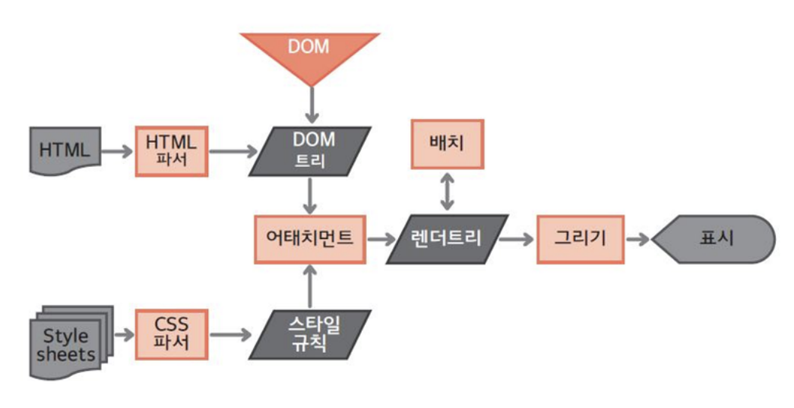
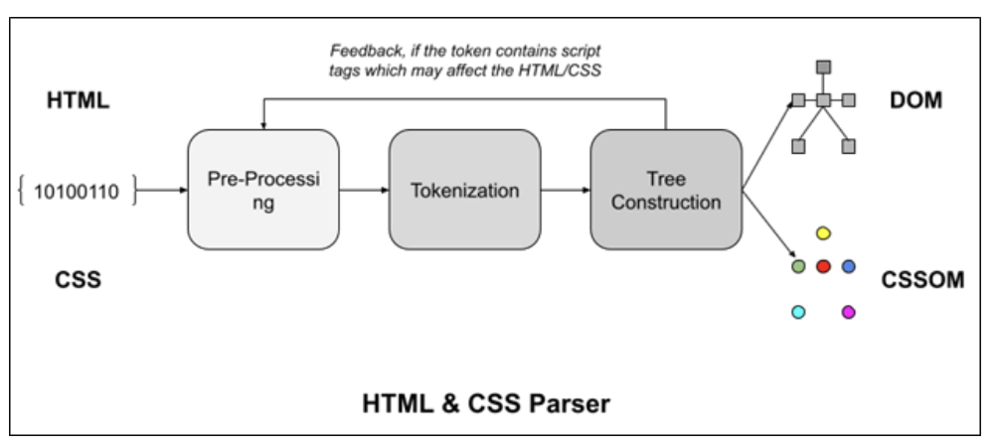
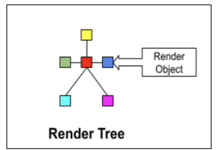
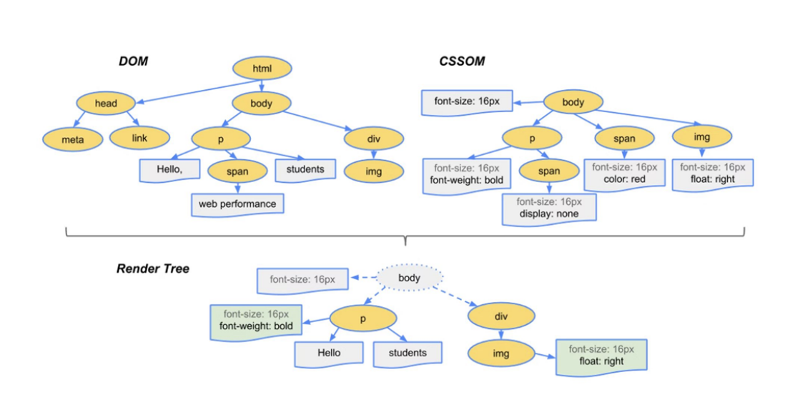
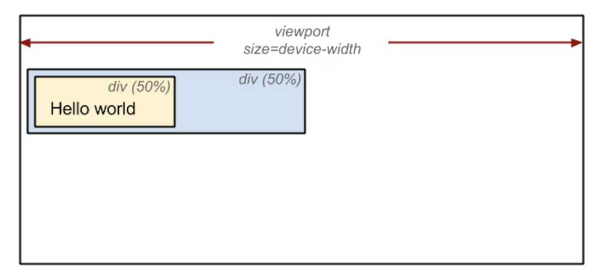

# 브라우저 렌더링 과정 (Browser Rendering)

- 브라우저는 브라우저 엔진, 렌더링 엔진, 네트워크 통신부, 자바스크립트 해석기, UI 백엔드, 자료 저장소로 이루어져 있음
  

- 이 중 렌더링 엔진이 브라우저 렌더링을 담당

> 브라우저 렌더링 = DOM 트리, CSS 파서 등을 기반으로 렌더 트리를 구축해, 결과적으로 우리가 보는 화면을 구축하는 과정

### 1. DOM 트리와 CSSOM 트리 구축

#### DOM 트리 구축

- 하나의 html페이지는 div, span 등의 요소를 가짐. 이러한 요소들이 HTML 파서에 의해 '구문분석'
- 그리고 요소는 하나하나가 Node로 설정이 되어 트리 형태로 저장 -> DOM 트리
  - ex div> span,span 이라는 요소가 있다면 div라는 부모노드 밑에 span 자식 노드 2개가 생김

#### CSSOM 트리 구축

- 발음 (씨에스에스옴트리)

- 각 노드는 CSS 파서에 의해 정해진 스타일 규칙이 적용되어 있음
  - ex span.color ="red" 노드색이 빨간색이다
  - 이런 것을 기반으로 CSSOM 이라는 트리가 DOM 트리 구축과 "동시에" 발생

### 2. 렌더 트리와 렌더 레이어 생성

- DOM 트리와 CSSOM 트리가 합쳐져 렌더 객체(Render Object)가 생성. 그리고 렌더 객체가 모여 병렬적인 렌더 트리가 생성

- 이 때 `display:none`이 포함된 노드는 지워지고, font-size등 상속적인 스타일은 부모노드에만 위치하도록 설게하는 등의 최적화를 거져 **렌더 레이어**가 완성

- `display:none`은 렌더트리에서 삭제되지만, `visibility:hidden`은 요소를 보이지않게 하지만 요소는 여전히 레이아웃에서 공간을 차지

- 렌더 레이어가 완성될 때 GPU에서 처리하는 테그들은(video&canvas, filter, animation) 등이 있다면, 이 요소들은 강제적으로 그래픽 레이어 (Graphic Layer)로 분리되어 처리된다 (reflow, repaint 방지)

### 3. 렌더 레이어를 대상으로 Layout 설정

- 이때 좌표는 보통 부모를 기준으로 설정됨. Global Layout은 브라우저 사이즈가 증가하거나 폰트 사이즈가 커지면 변경됨

  

### 4. 렌더 레이어를 대상으로 칠하기(paint)

- 픽셀마다 점을 찍듯 칠함
- 이를 레스터화라고도 한다

### 5. 레이어 합치기(composite layer) 및 표기

- 각각의 레이어(그래픽 레이어, 렌더링 레이어..) 로부터 비트맵이 생성되고 GPU에 텍스처로 업로드
- 그 다음 텍스쳐들은 서로 합쳐져 하나의 이미지로 렌더링되며 화면으로 출력

#### 렌더트리와 DOM 트리는 1:1 대응?

> 아님. DOM트리 > 렌더 객체 > 렌더 트리가 되는 과정에서 display:none 으로 사라지는 객체 (노드)들이 존재할 수 있기 때문에 1:1 대응이 아님
