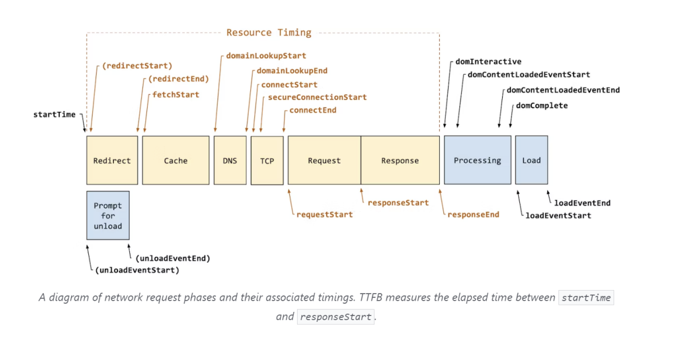
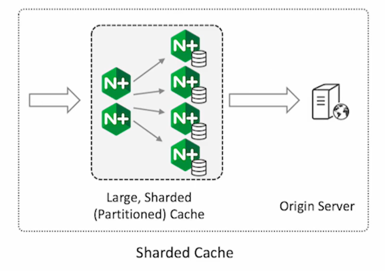
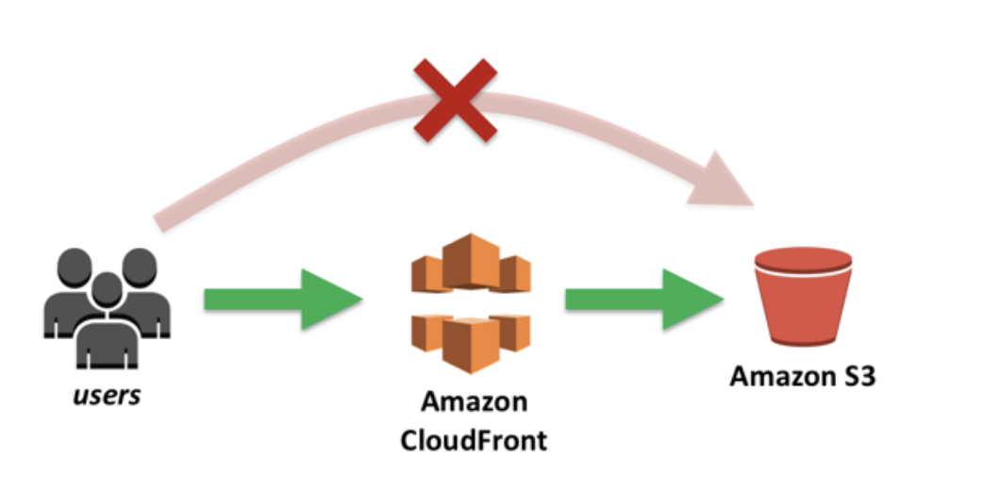
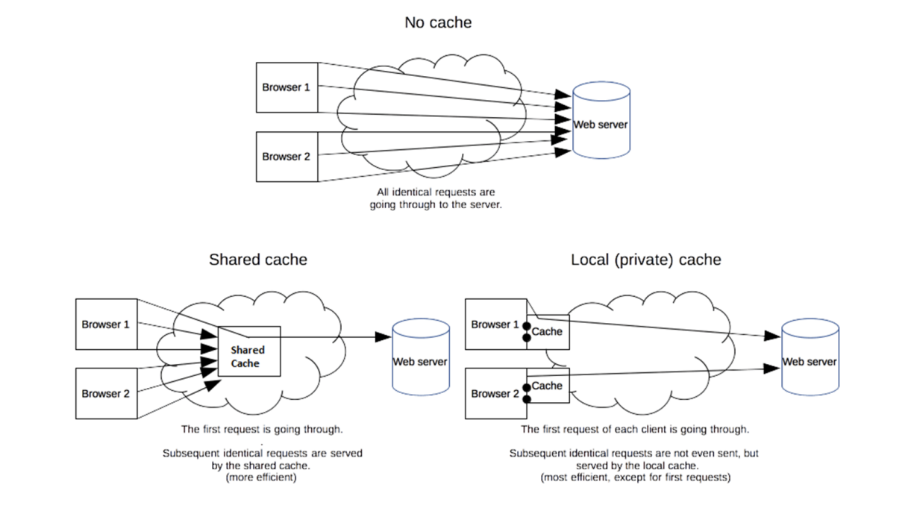
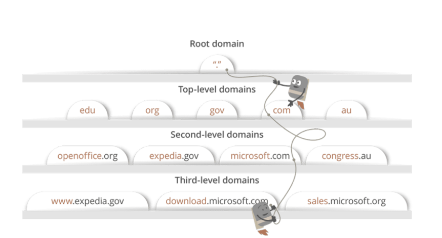
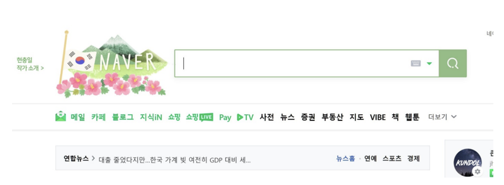

# www.naver.com 검색 시 생기는 과정, DNS

> 리다이렉트, 캐싱, DNS, IP 라우팅 & ARP, TCP 연결 구축을 거쳐 요청, 응답이 일어나는 TTFB(Time to First Byte)가 시작되고, 이후 컨텐츠를 다운받게 되고 이후에 브라우저 렌더링과정을 거쳐 네이버라는 화면이 나타나게 된다

### 1. 리다이렉트

- 리다이렉트가 있다면 리다이렉트를 진행하고, 없다면 그대로 해당 요청에 대한 과정이 진행

### 2. 캐싱

- 해당 요청이 캐싱이 가능한지 아닌지를 먼저 파악. 캐싱이 이미 된 요청이라면 캐싱된 값을 반환하며, 캐싱이 되지 않은 새로운 요청이라면 그 다음 단계로 넘어감

- 캐싱은 요청된 값의 결과값을 저장하고 그 값을 다시 요청하면 다시 제공하는 기술
- `브라우저 캐시`와 `공유 캐시`로 나누어짐

#### 브라우저 캐시

- 쿠키, 로컬 스토리지 등을 포함한 캐시, 개인 캐시 (private cache)라고도 함
- 브라우저 자체가 사용자가 HTTP를 통해 다운로드하는 모든 문서를 보유하는 것을 의미
  - 특정 사이트 재방문시 굉장히 빠르게 컨텐츠가 나타나는 것
  - 인터넷 사용기록 삭제 원할때 쿠키 및 기타 데이터 삭제하는 것이 바로 이부분

#### 공유 캐시

- 클라이언트와 서버 사이에 있으며 사용자간에 공유할 수 있는 응답을 저장

- 대표적인 예로 요청한 서버 앞단에 프록시 서버가 캐싱을 하는 것. 리버스 프록시 서버를 둬서 내부 서버로 포워드한다 라고도 말함

  - Node.js로 서버 구축 시 앞단의 프록시 서버로 nginx 서버를 둬서 이 서버를 캐싱 서버로 사용 가능
    
  - AWS cloundfront, cloudflare과 같은 콘텐츠 전송 네트워크 (CDN)을 둬서 캐싱 가능
    

- 정리하자면 아래 그림과 같이 캐시가 없다면 계속해서 요청이 생기지만, 공유캐시, 브라우저 캐시를 통해 요청을 줄일 수 있음

### 3. DNS

- Domain Name System
- 캐싱을 거쳐서 요청해야 함이 분명해졌다면 실제 서버에 요청할 단계
- 브라우저가 요청한 FQDN(Fully Qualified Domain Name)인 `www.naver.com`등의 이름을 인터넷 프로토콜인 IP로 바꿔주는 시스템

  - FQDN: 호스트(www)와 도매인(naver.com)이 합쳐진 완전한 도메인 이름

- 구성

  - 리졸버: DNS 관련 요청을 네임서버로 전달하고 해당 응답값을 클라이언트에게 전달
  - 네임서버: 도메인을 IP로 변환

- 예시

  - www.naver.com에 DNS 쿼리가 오면 오른쪽부터 역순으로 [Root DNS]→ [.com DNS] → [.naver DNS] → [.www DNS] 과정을 거쳐 완벽한 주소를 찾아 IP 주소를 매핑

  

#### DNS 캐싱

- 미리 해당 도메인 이름을 요청했다면, 로컬 PC에 자동적으로 저장된다. 브라우저 캐싱과 OS 캐싱이 존재

  - 브라우저 캐싱 : chrome://net-internals/#dns
  - OS 캐싱 : ipconfig/displaydns

### 4. IP 라우팅

- 해당 IP를 기반으로 IP 라우팅이 일어나고 ARP 과정을 거쳐 실제 서버를 찾음

### 5. TCP 연결 구축

- 브라우저가 TCP 3웨이 -핸드셰이크 및 SSL 연결 등을 통해 연결을 설정
- 요청을 보낸 뒤 드디어 해당 요청한 서버(ex 네이버서버)로부터 응답을 받음
- TCP 연결은 HTTP/2까지만 일어남. HTTP/3 는 QUIC를 통해 연결하고 데이터를 주고받음

### 6. 콘텐츠 다운로드

- 브라우저는 요청한 컨텐츠를 서버로부터 다운받음
- 다운로드 받기 시작할 시점을 **TTFB: Time to First Byte** 라고 한다

### 7. 브라우저 렌더링

- 받은 데이터를 바탕으로 브라우저 엔진이 브라우저 렌더링 과정을 거쳐 화면을 만듦

