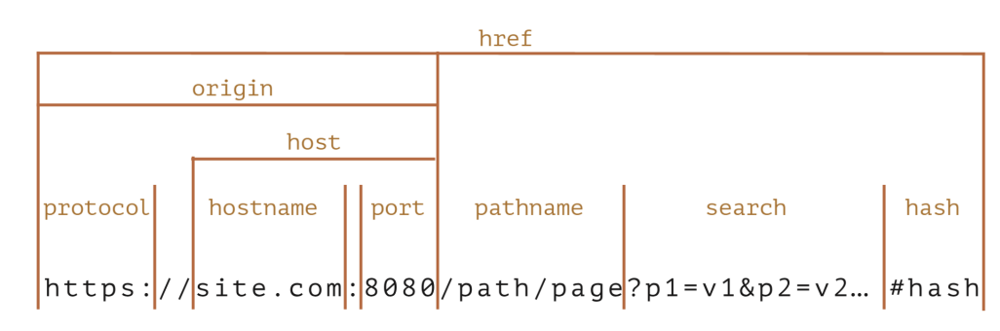
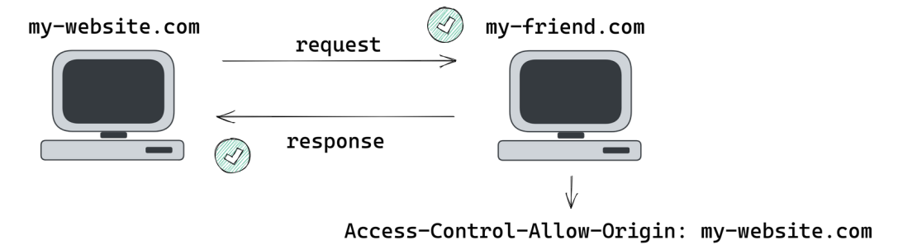

# CORS

### 오리진과 SOP

#### 오리진

- Origin = 프로토콜 + 호스트이름 + 포트

#### SOP

> Same-Origin Policy

- 브라우저 상에서 오로지 같은 오리진끼리만 요청을 허가하는 보안정책

- 왜 같은 오리진끼리만 요청을 허용해야 하는가?

  - 악성 스크립트가 다른 오리진의 서버에 요청을 보내고 사용자의 리소스에 임의적으로 접근하는 것 방지 (1차 방어선)

- 하지만 다른 오리진끼리 요청해야 하는 순간도 존재
- ex Open API, front-backend 간의 소통

> SOP를 브라우저 상에서 조금 더 유연하게 바꿔서 어떠한 경우에는 다른 오리진끼리도 요청 및 응답할 수 있게 만든 메커니즘이 CORS

### CORS의 의미

> Cross Origin Resource Sharing

- HTTP 헤더(Access-Controll-\*)를 기반으로 브라우저가 다른 오리진에 대한 리소스 로드를 허용할지 말지에 대한 메커니즘 (여기서 리소스: 이미지, CSS, JS, 비디오 등)

#### preflight request와 simple request

1. preflight request

- 서버에 실제 요청을 보내기 전에 해당 요청이 안전한지 서버에 미리 확인하는 용도. 도메인이나 포트가 다른 서버로의 요청에서 사용
- 브라우저가 simple request의 기준을 벗어나는 HTTP 요청을 감지할 때, 자동으로 preflight request를 보냄(ex HTTP 메소드가 GET,HEAD, POST 이외의 것을 사용, 특정 HTTP 헤더를 사용)
- OPTIONS 메소드를 사용하여 서버에 요청을 보냄 -> 서버가 이를 허용하는지를 확인
- 서버는 preflight request에 대해 허용 또는 비허용(CORS 에러)을 나타내는 응답을 보냄. 서버가 허용한다면 브라우저는 실제 요청을 보냄

2. simple request

- 별도의 사전 확인 없이 서버에 직접 요청
- HTTP 메소드가 GET,POST,HEAD 중 하나이고 안전한 헤더만 사용하는 경우
  - 안전한 헤더: Content-type이 application/x-www-form-urlencoded, multipart/form-data, text/plain인 경우, Accept 헤더, Accept-Language 헤더 등
- 서버는 요청을 처리하고 정상적인 HTTP 응답을 반환. CORS 정책을 준수하는 서버의 경우 Access-Control-Allow-Origin 헤더를 포함시켜 요청을 허용했음을 나타냄
