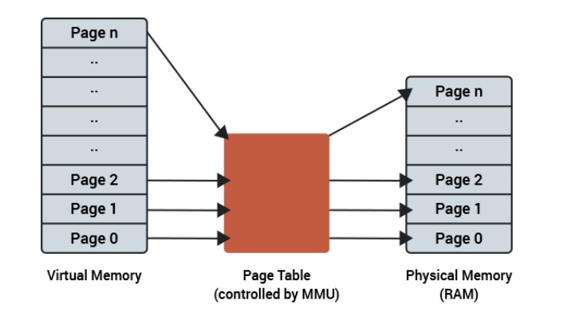
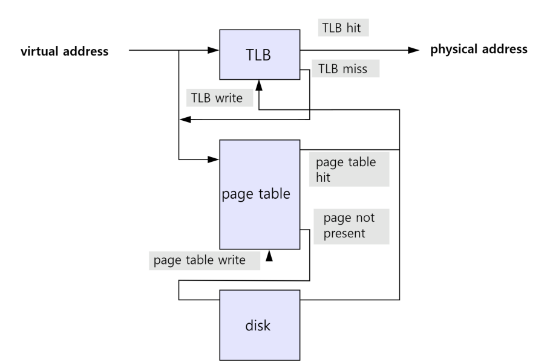
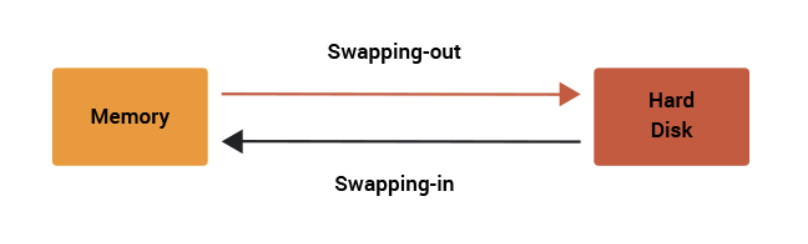
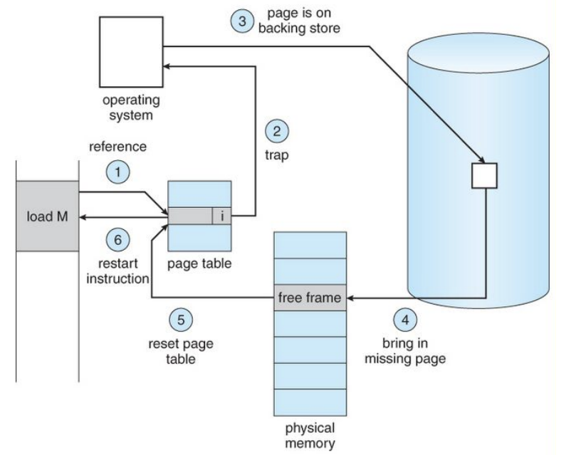
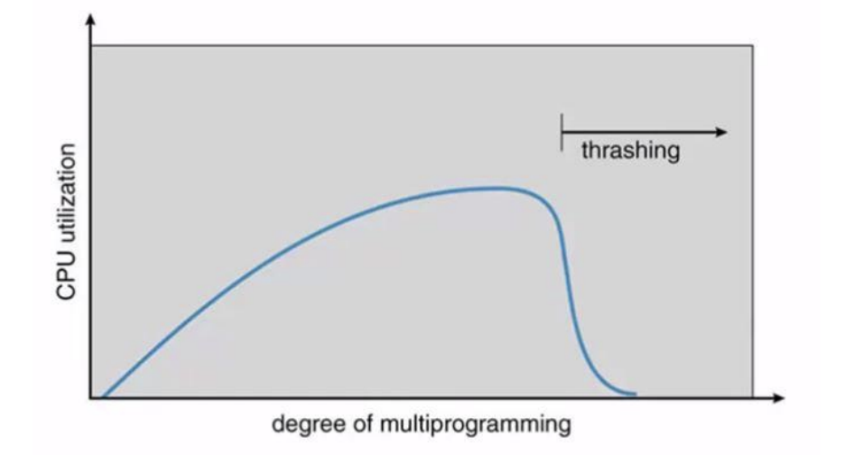
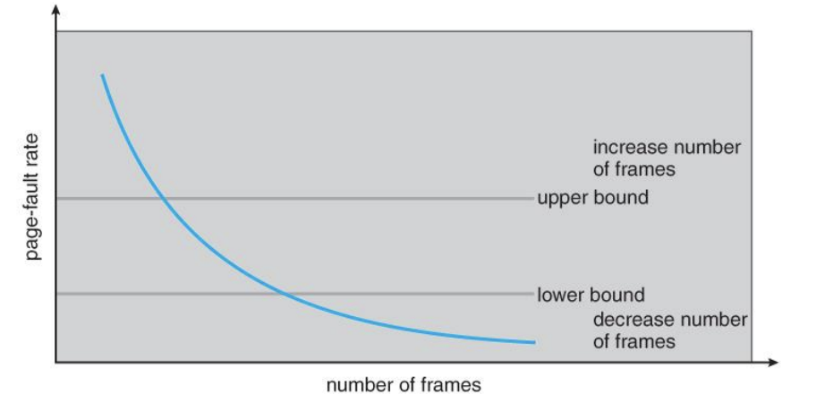

# 가상 메모리와 스와핑, 페이지폴트, 스레싱

> 가상 메모리(Virtual Memory)는 OS에서 사용되는 메모리 관리 기법 중 하나로, 컴퓨터가 실제로 이용 가능한 메모리 자원(실제 주소, physical address)를 추상화하여 이를 사용하는 사용자들에게 아주 큰 메모리로 보이게 만드는 것

#### 참조

- 가상 주소는 MMU와 페이지 테이블(page table)에 의해 실제 주소로 변환됨
  - 페이지: 가상 메모리를 사용하는 최소 크기 단위
  - 프레임: 실제 디스크나 메모리를 사용하는 최소 크기 단위

### 1. 페이지 테이블

- 가상 메모리는 가상 주소와 실제 주소가 매핑되어있는 페이지 테이블로 관리되며, 이 때 속도 향상을 위해 캐싱 계층인 TLB를 사용
- 가상 주소에서 바로 페이지 테이블을 가는 것이 아니라, TLB에서 있는지를 확인하고, 만약 없다면 page table로 가서 실제 주소를 가져옴

### 2. 페이지 폴트와 스와핑

- 가상 메모리는 작은 메모리를 매우 큰 메모리로 보이게끔 하는 것이기 때문에 참조하려는 메모리 영역이 실제에는 없을 수도 있다

- 즉, 가상 메모리에는 존재하지만, 실제 메모리인 RAM에는 현재 없는 데이터가 코드에 접근하는 경우가 있으며 이 때 페이지 폴트가 발생

- 이 때, 메모리의 당장 사용하지 않는 영역을 하드디스크로 옮기고, 하드 디스크의 일부분을 마치 메모리처럼 불러와 쓰는 것을 `스와핑`이라고 한다

### 3. 페이지 폴트의 과정

1.2. 어떤 명령어가 유효한 가상주소에 접근했으나, 해당 페이지가 만약 없다면, 트랩이 발생되어 운영 체제에 알리게 된다 3. 운영체제는 실제 디스크로부터 사용하지 않은 프레임을 찾음 4. 해당 프레임을 실제 메모리에 가지고 와서 페이지 교체 알고리즘을 기반으로 특정 페이지와 교체 (이때 스와핑이 발생)
5.6. 페이지 테이블을 갱신시킨 뒤, 해당 명령어를 다시 시작

### 4. 스레싱

> 메모리의 페이지 폴트율이 높은 것을 의미

- 스레싱은 메모리에 너무 많은 프로세스가 동시에 올라게게 되면, 스와핑이 많이 일어나서 발생. 페이지 폴트가 일어나면 CPU 이용률이 낮아지고, CPU 이용률이 낮아지게 되면 운영체제는 CPU의 가용성을 높이기 위해 더 많은 프로세스들을 메모리에 올려 악순환이 반복되어 스레싱 발생

#### 하드웨어적 해결

- 메모리를 늘리기
- HDD를 사용한다면 SSD로 바꾸기

#### 운영체제에서 해결

##### 작업세트

- working set은 프로세스의 과거 사용 이력을 기반으로 많이 사용하는 페이지 집합을 만들어 한꺼번에 미리 메모리에 로드

##### PFF

- page fault frequency는 페이지 폴트 빈도를 조절하는 방식으로 상한선과 하한선을 만들고 상한선에 도달한다면 프레임을 늘리고, 하한선에 도달한다면 프레임을 줄이는 방법

### 5. 가상 메모리의 필요성

#### 주기억장치의 효율적 관리(스와핑)

- 하드디스크를 주기억장치에 대한 캐시로 설정하여, 당장 사용하는 영역만 유지하고 쓰지 않는 데이터는 하드 디스크로 옮긴 뒤, 필요할 때만 데이터를 불러와 올리고 다시 사용하지 않으면 하드디스크로 내림으로써 램을 효과적으로 관리

#### 메모리 관리의 단순화

- 각 프로세스마다 가상 메모리의 통일된 주소 공간을 배정할 수 있으므로 메모리 관리가 단순

#### 메모리 용량 안정성 보장

- 한정된 공간의 램이 아닌, 거의 무한한 가상 메모리 공간을 배정함으로써 프로세스들끼리 메모리 침법이 일어날 여지를 크게 줄임
