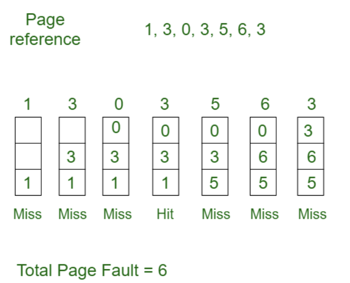
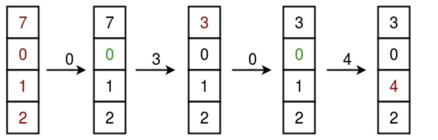
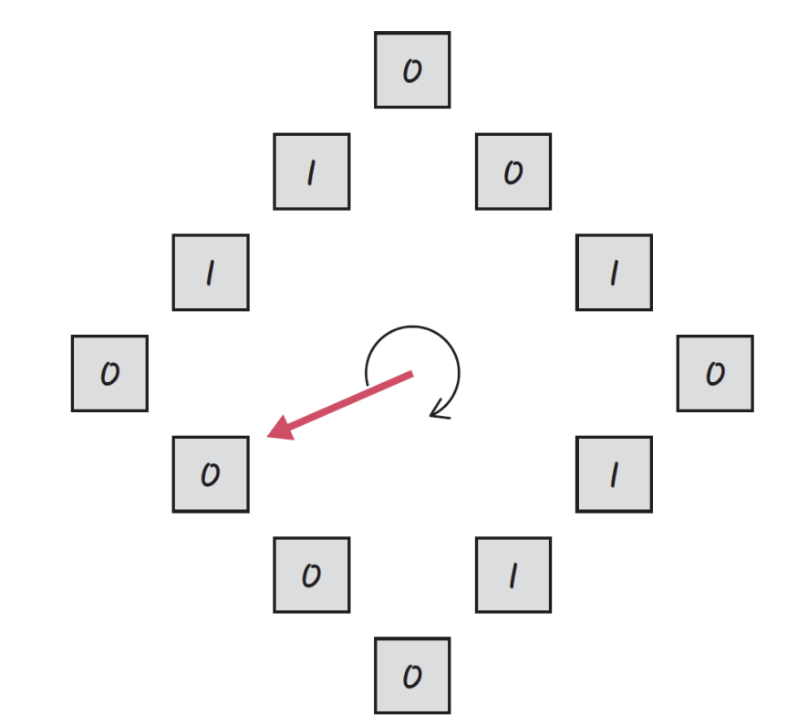
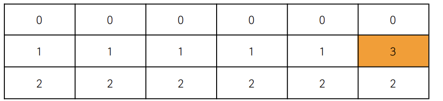

# 페이지 교체 알고리즘 - FIFO, LRU, NUR, LFU

> 스와핑이 일어날 때 페이지 교체 알고리즘에 의해 페이지가 교체되게 된다

### 오프라인 알고리즘 (LFD, Longest Foward Distance)

- 가장 좋은(가장 스와핑이 적게 일어나는) 알고리즘이라고 일컫는 알고리즘이며, 가장 먼 미래에 참조되는 페이지와 현재의 페이지를 바꾸는 알고리즘

- 하지만 미래에 사용되는 프로세스를 알 수 없기 때문에, 사용할 수 없지만 다른 알고리즘과의 성능 비교에 대한 상한선을 제공

### FIFO

> First In First Out, 가장 먼저 온 페이지부터 교체

### LRU

> Least Recently Used, 최근에 사용되지 않은 페이지를 교체

- 즉, 참조가 오래된 페이지를 바꿈. 이를 위해서 각 페이지마다 최근에 사용한 횟수를 나타내는 자료구조를 따로 만들어야 할 수도 있다

- ex) 7 0 1 2 0 3 0 4

### NUR

> Not Used Recently 또는 NRU (Not Recently Used)라고도 불림. LRU에서 발전

- 페이지마다 0과 1을 가진 비트를 둔다.
- 1은 최근에 참조되었고, 0은 참조되지 않았음을 뜻함
- 한바퀴 도는 동안 참조되지 않으면 0이 된다
- 시계 방향으로 돌면서 0을 찾고, 0을 찾은 순간 해당 페이지를 교체하고, 해당 부분을 1로 바꾸는 알고리즘

### LFU

> Least Frequently Used, 가장 참조 횟수가 적은 페이지를 교체하는 알고리즘

- ex) 0, 1, 2, 0, 0, 1, 2, 3

- 0,1,2 중 가장 참조 횟수가 적은 1, 2중에 하나인 1이랑 3을 스와핑
