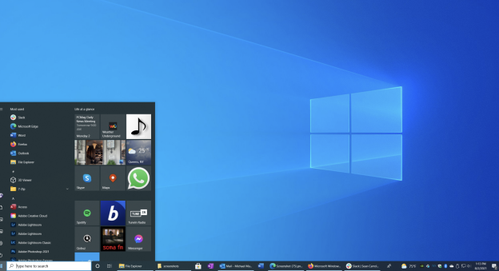
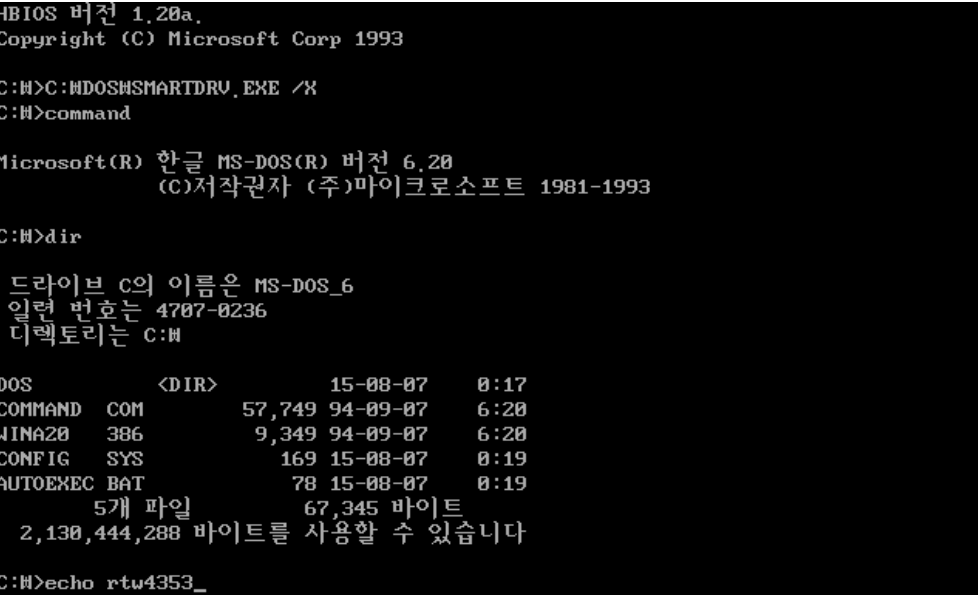
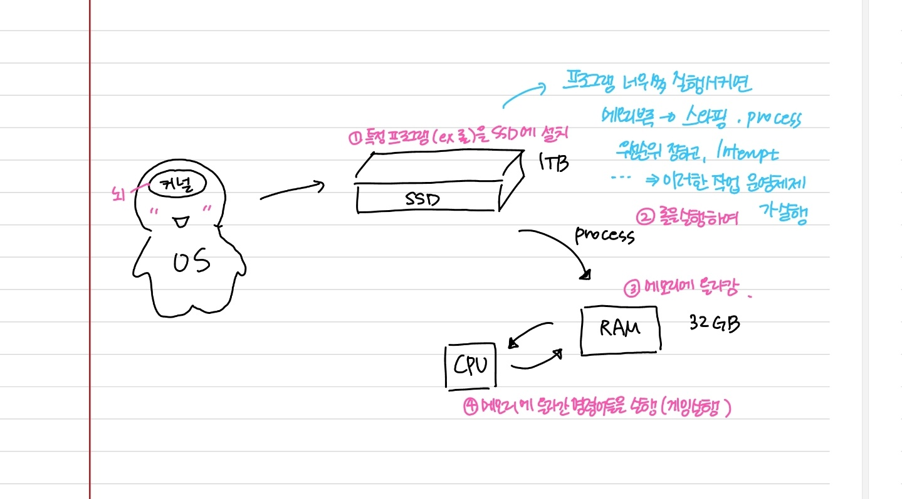

# 운영 체제와 컴퓨터 시스템의 구조

### 1. 운영 체제의 종류

> 앞단에 어떤 인터페이스를 두느냐에 따라 GUI와 CUI로 나눌 수 있다

#### GUI

- Graphical User Interface
- 그래픽을 사용하여 컴퓨터와 상호작용하는 인터페이스
- windowOS, macOS 등 현대의 OS가 이를 대표한다

  

#### CUI

- Character User Interface
- 사용자가 키보드만을 사용하여 문자를 기반으로 컴퓨터와 상호작용하는 인터페이스
- 예전 OS인 MS-DOS가 대표적. 1994년 단종됨

  

- chatGPT 또한 CUI라고 볼 수 있음

### 2. 운영체제의 역할

> 운영체제의 커널이 담당하는 역할

- CPU 스케쥴링과 프로세스 상태 관리
- 메모리관리 (스와핑 등)
- 디스크 파일 관리 (프로그램 설치하면 SSD에 저장되는데 이런 것들 관리)
- I/O 디바이스 관리 (키보드, 마우스 드라이버 설치하여 컨트롤, 드라이버를 기반으로 키보드와 같은 하드웨어와 통신 가능)

### 3. 운영체제의 구조

> 동그라미 친 부분만 운영체제

- ❌유저프로그램
- ⭕인터페이스 (GUI 또는 CUI)
- ⭕시스템콜(system call)
- ⭕커널 (I/O 드라이버, 파일 시스템 등)
- ❌하드웨어(hardware)

### 4. 컴퓨터 시스템의 구조

- CPU: 인터럽트에 의해 메모리에 존재하는 명령어를 해석해서 실행하는 일꾼
- DMA 컨트롤러: CPU의 일을 보조하는 일꾼
- 메모리: 전자회로에서의 데이터, 상태 등을 기록하는 장치(일을 하는 공간), RAM. 메모리는 단순한 공간이고 메모리에 있는 명령어 (instruction)을 실행하는 것이 CPU
- 타이머: 특정 프로그램에 시간을 다는 역할(무한루프에 빠지는 프로그램을 막아주는 역할)
- 디바이스 컨트롤러: I/O 디바이스들의 작은 CPU
- 로컬 버퍼: 디바이스에 달려있는 작은 메모리

### 5. CPU (중앙 처리 장치)

> 산술논리연산장치(ALU), 제어장치(CU), 레지스터로 구성. **인터럽트**에 의해 메모리에 존재하는 명령어를 해석해서 실행하는 일꾼

#### 산술논리연산장치(ALU)

- 덧셈, 뺄셈, 곱셈, 나눗셈 등 산술 연산과, 논리 연산을 하는 회로 장치

#### 제어장치(CU, Controll Unit)

- 프로세스의 조작을 지시하며 명령어들을 읽고 해석하고 데이터 처리를 위한 순서를 결정. 다른 하드웨어 구성 요소에 지시를 내림
- CPU의 다른 유닛들이 어떻게 상호작용해야 하는지를 결정

#### 레지스터

- CPU 안에 있는 매우 빠른 임시기억장치

#### CPU의 동작 순서

1. Fetch

- 제어장치가 메모리로부터 다음에 실행할 명령어를 가져옴
- 가져온 명령어는 명령어 레지스터에 저장됨

2. Decode

- 제어장치는 명령어 레지스터에 저장된 명령어를 해석
- 해석한 명령어에 따라 필요한 데이터를 레지스터나 메모리로부터 가져옴

3. Execute

- ALU는 해석한 명령어에 따라 산술, 논리 연산을 수행
- 연산의 결과는 레지스터에 저장되거나 메모리에 쓰여짐

4. 저장

- 연산 결과를 레지스터나 메모리에 저장
