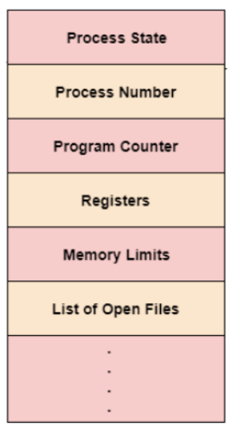
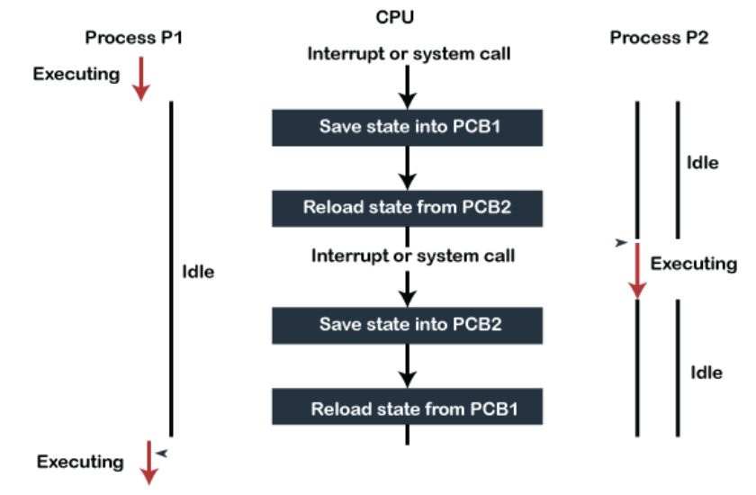

# PCB와 컨텍스트 스위칭

> PCB(Process Control Block) 은 운영체제에서 관리하는 메타데이터를 저장한 데이터 블록. 커널 스택에 저장되며, 각 프로세스가 생성될 때마다 고유의 PCB가 생성이 되고, 프로세스가 종료되면 PCB는 제거된다

## PCB

### 1. 용어

#### 커널 스택

- 가상 메모리는 사용자공간과 커널 공간으로 구분되며, 이 두가지의 공간 모두 스택 자료구조를 기반으로 관리된다고 하여 사용자 스택, 커널 스택이라고도 불린다.
- 이 때 커널 스택은 가상 메모리 주소의 윗부분을 말한다(가장 처음 시작하는 주솟값)
- 이 커널 스택은 "커널 모드"에서만 접근이 가능하며 반대로 사용자 스택은 "유저 모드"에서만 접근이 가능

#### 메타 데이터

데이터에 관한 구조화된 데이터이자, 데이터를 설명하는 작은 데이터. 대량의 정보 가운데에서 찾고 있는 정보를 효율적으로 찾아내서 이용하기 위해 일정한 규칙에 따라 콘텐츠에 부여되는 데이터

### 2. PCB의 구조

- 프로세스의 상태: 대기중, 실행중 등 프로세스의 상태
- 프로세스 번호(=PID): 각 프로세스의 고유 식변 번호 (프로세스 ID)
- 프로그램 카운터(PC): 프로세스에 대해 실행될 다음 명령어 주소에 대한 포인터
- 레지스터: 레지스터 관련 정보
- 메모리 제한: 프로세스의 메모리 관련 정보
- 열린 파일 정보: 프로세스를 위해 열린 파일 목록들

## 컨텍스트 스위칭

> 컨텍스트 스위칭(context switching)은 PCB를 기반으로 프로세스의 상태를 저장하고 다시 복원시키는 과정. 프로세스가 종료되거나 인터럽트에 의해 발생됨 (프로세스 뿐만 아니라 스레드 역시 컨텍스트 스위칭 가능)

### 1. 컨텍스트 스위칭의 비용

#### 유후시간의 발생

- 컨텍스트 스위칭을 할 때마다 유후시간(사용하지 않는 시간 = IDLE 시간) 이 생겨서 CPU의 가용성이 떨어지는 비용 발생

#### 캐시미스

- 프로세스가 가지고 있는 메모리 주소가 그대로 있으면 잘못된 주소 변환이 생기므로 TLB 캐시 클리어 과정이 무조건 일어나게 되고 이 때문에 캐시 미스가 발생

### 2. 스레드에서의 컨텍스트 스위칭

- 스레드는 스택 영역을 제외한 모든 메모릐를 공유하기 때문에, 비용이 더 적고 시간도 더 적게 걸린다
