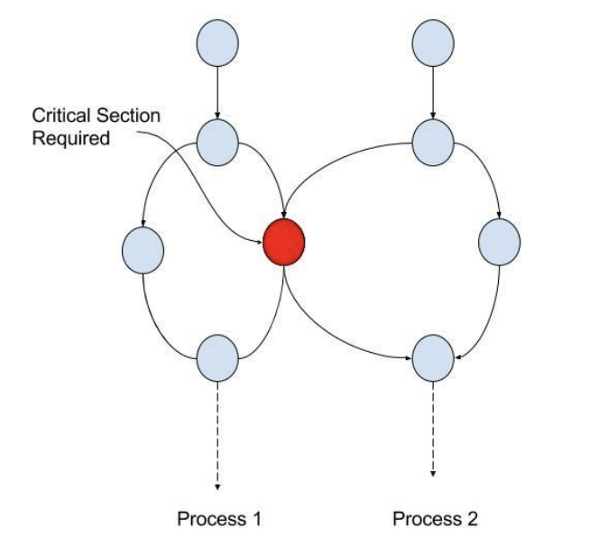

# 공유자원과 경쟁 상태 그리고 임게 영역

### 1.공유자원

- 공유자원 (shared resource)란 시스템 안에서 각 프로세스, 스레드가 함께 접근할 수 있는 모니터, 프린터, 메모리, 파일, 데이터 등의 자원이나 변수를 의미

### 2.경쟁 상태

- 경쟁상태(race condition)은 이 공유 자원을 둘 이상의 프로세스 또는 스레드가 동시에 읽거나 쓰는 상황
- 동시에 접근을 시도할 때의 타이밍에 따라 결과 값이 달라질 수 있는 상태를 의미

### 3.임계 영역

- 임계 영역(critical section)은 둘 이상의 프로세스 또는 스레드가 공유자원에 접근 할 때 순서 등의 이유로 결과가 달라지는 코드 영역. 이 영역은 한 번에 둘 이상의 프로세스나 스레드가 들어갈 수 없게 설계된다

#### 4. 경쟁 상태 관리의 중요성

> 경쟁 상태를 잘 해결하지 못하면 데이터 정합성, 데이터 무결성을 지키지 못할 수 있다

#### 데이터 정합성

- 시스템 내 모든 데이터가 서로 일관되게 유지되는 것. 데이터가 여러 곳에 중복되어 저장되어 있을 때, 모든 곳에서 데이터가 동일한 정보를 반영하고 있어야 한다

- 예시: 온라인 쇼핑몰 주문 관리 시스템에서 고객이 주문을 하면 주문 정보가 주문 db뿐만 아니라 재고 관리 db에도 업데이트되어야 하고 주문 정보와 재고 정보가 서로 일치해야 한다

#### 데이터 무결성

> data integrity

- 정확하고 일관된 데이터
- 데이터의 정확성, 일관성 및 신뢰성을 유지하는 것. 데이터가 올바르게 저장되고, 변경되며 유지되어야 한다. 데이터의 어떠한 규칙을 위반하면 안되는 것

- 예시: db에 고객 번호 저장할 때 전화번호 필드에 대해 무결성 제약 조건을 설정하면, 무효한 형식 (문자 포함 등)의 전화번호를 입력하려고 하면 dbms가 이를 거부하여 데이터의 무결성을 유지
