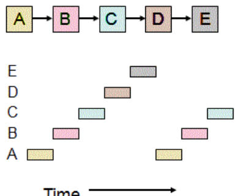
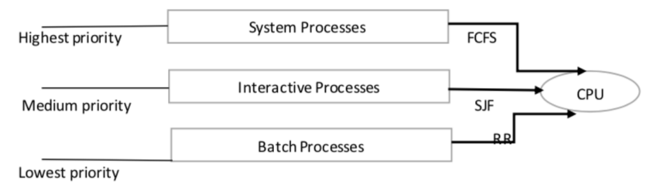

# CPU 스케줄링 알고리즘 - 선점형 (라운드로빈, SRF, 다단계큐)

> 선점형(preemptive)은 현대 운영체제가 쓰는 방식으로, 지금 사용하고 있는 프로세스를 알고리즘에 의해 중단시켜 버리고, 강제로 다른 프로세스에 CPU 소유권을 할당할 수도 있는 방식

### 라운드 로빈

> RR, Round Robin 은 현대 컴퓨터가 쓰는 스케줄링 방법이며 단순한 선점형 알고리즘. 각 프로세스는 동일한 할당 시간을 주고, 그 시간 안에 끝나지 않으면 다시 준비 큐(ready queue)의 뒤로 가는 알고리즘

- 예를 들어 q만큼의 할당 시간이 부여되었고, N개의 프로세스가 운영된다고 하면, `(N-1)\*q` 시간이 지나면 자기 차례가 오게 된다
  
- 할당 시간이 너무 크면 FCFS가 되고 짧으면 컨텍스트 스위칭이 잦아져서 오버헤드, 즉 비용이 너무 커짐

- 일반적으로 전체 작업 시간은 길어지지만, 평균 응답 시간은 짧아진다는 특징이 있음
- 로그 밸런서에서 트래픽 분산 알고리즘으로도 쓰임

### SRF

> SRTF 라고도 함 . Shortest Remaining Time First

- SJF의 경우 중간에 실행 시간이 더 짧은 작업이 들어와도 기존 실행 중이던 프로세스를 모두 실행하고 그 다음에 짧은 프로세스를 실행시키는데, SRF는 중간에 더 짧은 작업이 들어오면 수행하던 프로세스를 중지하고 들어온 프로세스를 수행한다

### 다단계큐

- 우선 순위에 따른 준비 큐를 여러 개 사용하고, 큐마다 라운드 로빈이나 FCFS 등 다른 스케줄링 알고리즘을 적용. 큐 간 프로세스 이동이 안되므로 스케줄링 부담이 적지만 유연성이 떨어지는 특징.

- 우선순위가 높은 큐부터 처리되기 때문에 낮은 큐의 프로세스 처리가 안되는 기아현상 (starvation)이 발생할 수도 있다

