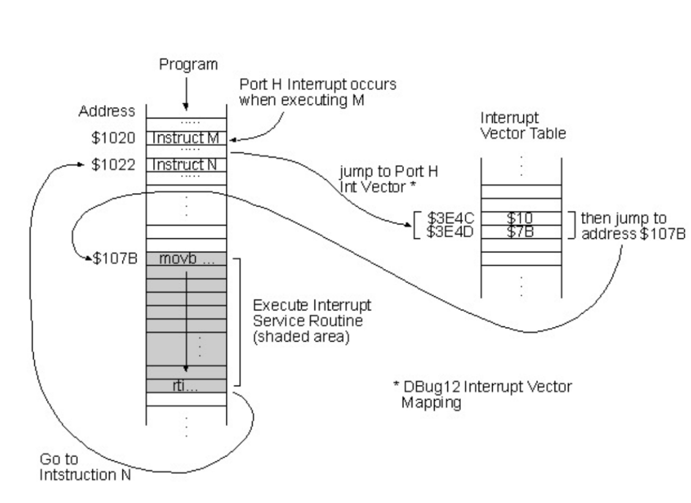

# 인터럽트 (Interrupt)

### 1. 정의

> 어떤 신호가 들어왔을 때, CPU를 잠시 정지시키는 것을 의미

- 0으로 숫자를 나누는 산술 연산 오류, 프로세스 오류 등으로 발생
- 또한 오류 뿐만 아니라, 키보드, 마우스 등 I/O 디바이스를 사용할 때 또는 우선 순위가 높은 프로세스의 발생 등으로 발생한다

- CPU는 메모리에 있는 명령어(instruction)을 순차적으로 실행하는데, 인터럽트가 발생되면 점프해서 인터럽트 핸들러 함수가 모여있는 인터럽트 백터로 가서 인터럽트 핸들러 함수 (인터럽트 서비스 루틴, ISR이라고도 함)가 실행되며 특정 명령어를 실행. 이후 인터럽트가 종료되면 다시 순차적으로 명령어들을 실행

### 2. 인터럽트의 종류

> 인터럽트는 하드웨어 인터럽트, 소프트웨어 인터럽트 2종류로 나뉨

#### 하드웨어 인터럽트

- I/O 디바이스 등 하드웨어에서 발생하는 인터럽트.
- 마우스를 기반으로 버튼을 클릭할 때
- 디스크에서 파일쓰기, 읽기 작업이 완료되었을 때

#### 소프트웨어 인터럽트

- = 트랩(trap)이라고도 함
- 프로세스 오류, 프로세스의 종료, 시작 등을 기반으로 프로세스에서 발생하는 인터럽트.
- 하드웨어 인터럽트보다 우선순위가 높음
