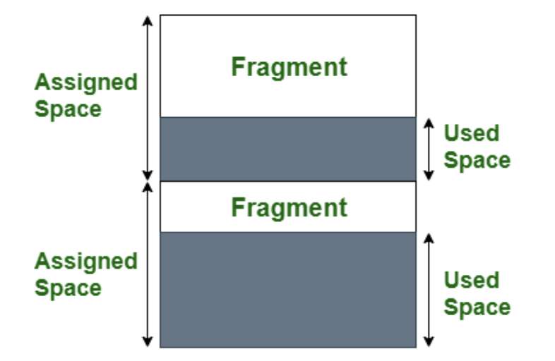
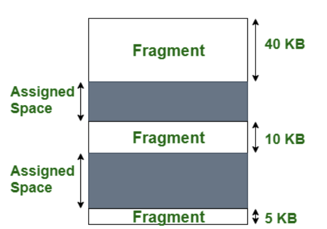
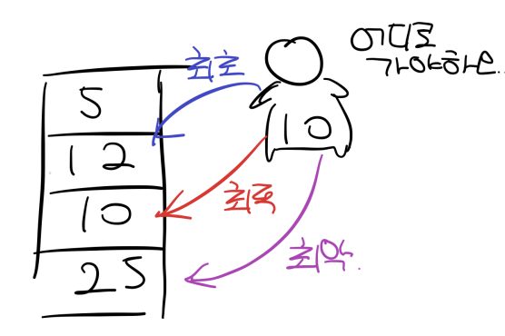

# 메모리 할당 - 연속할당: 고정분할과 가변분할

- 프로그램에 필요한 메모리를 할당할 때, 시작 메모리 위치, 메모리 할당 크기를 기반으로 할당하는데 이는 연속 할당과 불연속 할당으로 나뉜다

### 연속 할당 (continguous memory allocation)

> 메모리에 '연속적으로' 공간을 할당하는 것

- 사용 가능한 모든 메모리의 공간이 같은 위치에 함께 존재
- 메모리 파티션이 전체 메모리 공간에서 여기저기 분산되어 있지 않음
- 종류 : 고정 분할 방식, 가변 분할 방식

### 1. 고정분할 방식 (fixed partition allocation)

> 메모리를 같은 크기로 미리 분할해서 할당하는 방식. 내부단편화 (internal fragmentation)이 발생

#### 내부단편화

- 프로그램이 필요한 공간보다 더 많은 메모리가 할당되어 내부적으로 조각이 많이 생기는 것. 이를 통해 추후에 프로그램에 필요한 메모리를 할당하지 못하는 현상 발생

### 2. 가변분할방식 (variable partition allocation)

> 프로그램에 필요한 만큼 동적으로 메모리를 할당.

- 내부 단편화가 발생하지 않고 대신 외부 단편화 현상이 발생 가능

#### 외부 단편화

- 동적으로 할당하다 보면 동적으로 할당한 외부에 작은 조각들이 생기는데
  이 조각들을 합하면 50kb짜리 프로그램을 충족시킬 수 있지만, 외부의 조각들이 되어있기 때문에 50kb와 같은 큰 프로그램이 들어왔을 때 메모리를 할당하지 못하는 현상 발생 가능. (프로그램을 쪼개서 메모리 할당 불가능. 연속 할당이기 때문)

#### 가변분할 방식 종류

- 최초적합(first fit): 위쪽이나 아래쪽부터 시작해 홀을 찾으면 바로 할당
- 최적접합(best fit): 필요한 메모리 크기 이상인 공간 중 가장 작은 홀부터 할당
- 최악적합(worst fit): 프로세스의 크기와 가장 많이 차이가 나는 홀에 할당
  - 홀: 할당할 수 있는 비어있는 메모리 공간

