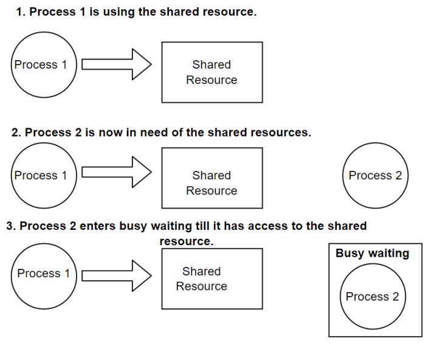

# 기타

## Convoy Effect와 starvation의 차이

### Convoy Effect

> 몇 개의 시간이 오래걸리는 프로세스로 인해 다른 프로세스의 실행이 느려지고, 평균 대기 시간이 길어지며, 결과적으로 전체적인 프로세스의 성능을 저하시키는 현상
> FCFS (first come first serve)알고리즘 사용시 발생

#### 예시

```
p1: 100ms
p2: 5ms
p3: 5ms
```

1. p1 -> p2 -> p3

- 평균 대기 시간: (0 + 100 + 105) / 3 = 68ms

2. p2 -> p3 -> p1

- 평균 대기 시간 (0 + 5 + 10) / 3 = 5ms

### starvation(기아)

> 어떤 프로세스가 "무기한으로" 대기하여 CPU 소유권을 얻을 수 없음을 의미
> SJF (Shortest Job First) 알고리즘 사용 시 발생 가능 (우선순위가 자꾸 밀려져서 해당 프로세스가 아예 실행되지 않음) => 이를 극복하기 위해서는 aging을 통해 우선순위를 높여야 한다. 실행되지 않은 프로세스라면 시간이 지나면서 우선순위를 높여서 실행되게 만드는 것

## Busy Wait의 정의

> 프로세스, 스레드가 어떠한 일을 실행하기 이전에 만족하는 조건을 지속적으로 확인하는 동기화 기술



- busy wait는 운영체제에서 프로세스가 공유자원에 동시에 접근하는 것을 방지하는 `상호배제`를 달성하는데 사용된다

- busy_wait 상태에서는 우선순위에 따라 작업을 바꿀 수 없기 때문에 우선 순위가 높은 작업을 완료해야 할 때 비효율적이며 대기시간이 많이 걸릴 경우 계속해서 기다리는데 CPU 자원을 쓰기 때문에 자원 낭비가 심하다

```py
while True:
    if complete_state():
        break
```

## 운영체제와 펌웨어의 차이

- 보통 펌웨어는 ROM이라고 불리는 비휘발성 메모리 하나를 쓰는 반면, 운영체제는 휘발성, 비휘발성 메모리를 계층화하여 사용

- 펌웨어는 자유롭게 프로그램을 설치할 수 없으며, 미리 설치해놓은 프로그램을 기반으로 업데이트가 발생> ROM에 해당 소프트웨어를 지우고 덮어쓰고 하면서 업데이트가 일어남. 운영체제는 정기적으로 업데이트가 되며 운영체제 위에 프로그램을 자유롭게 설치 가능

- 펌웨어의 종류: 키보드, 세탁기 안에 들어가있는 소프트웨어
- 운영체제의 종류: macOS, windowOS
