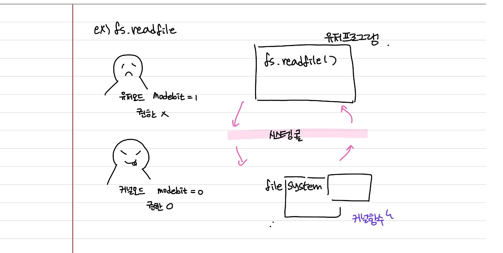

# 시스템콜(System Call)과 modebit

### 1. 시스템콜

> 운영 체제가 커널에 접근하기 위한 인터페이스

- 유저 프로그램이 운영체제의 서비스를 받기 위해 커널 함수를 호출할 때 이를 거쳐서 호출하도록 설계되어 있음
- 프로세스 관리(생성, 삭제), 파일 관리, 디바이스 관리, 시간 및 날짜 관련 시스템, 프로세스 간 통신 때 이를 통해 커널 함수를 호출
- 예를 들어, 프로세스를 종료하는 kill() 이라는 함수가 있는데, 이 함수를 발동시키면 시스템콜을 거쳐서 커널함수가 호출됨

### 2. 시스템콜의 과정

만약 유저 프로그램이 I/O 요청을 위한 트랩을 발동시켰다고 하면 다음과 같은 과정이 발생

1. 유저 프로그램이 I/O 요청 트랩 발동
2. 올바른 I/O 요청인지 확인
3. 유저 모드가 시스템 콜을 통해 커널 모드로 변환
4. 이후 커널 함수를 실행

#### 커널 함수

- 커널 안에 있는 여러 개의 함수 (= native function)

#### 커널

- 운영체제의 핵심 부분이자 시스템콜을 제공하며, 보안, 메모리, 프로세스, 파일 시스템, I/O 디바이스, I/O 요청 관리 등 운영체제의 중추적인 역할

#### 유저모드

- 유저가 접근할 수 있는 영역을 제한적으로 두며 컴퓨터 자원에 함부로 침범하지 못하는 모드

#### 커널 모드

- 모든 컴퓨터 자원에 접근할 수 있는 모드

#### modebit

- 시스템콜이 작동될 때 modeibt을 기반으로 유저모드와 커널 모드를 구분
- 0 또는 1의 값을 가지는 플래그 변수이며 1은 유저모드, 0은 커널모드를 가리킴

### 3. 시스템 콜의 장점

- 유저 프로그램은 시스템콜을 기반으로 커널과 분리가 되게 된다. 즉, 유저 프로그램은 복잡한 파일 시스템과 프로세스 생성 등에 대한 내부동작을 신경 쓸 필요가 없다. 또한, **운영체제의 관리 하에 프로그램이 운영되므로 시스템의 안정성과 보안이 강화**

- 예를 들어 공격자가 만든 카메라 앱 프로그램이 그냥 아무런 제약(시스템 콜) 없이 커널에 접근할 수 있다고 했을 때, 카메라에 관련한 메모리 등이 오염될 수 있고, 카메라는 내 의지와 관계없이 켜지게 되어 사생활이 노출될 수도 있다. 이러한 것을 방지하기 위해 유저 모드에서 시스템 콜로만 커널 모드에 진입할 수 있는 단 하나의 통로를 만든 것
