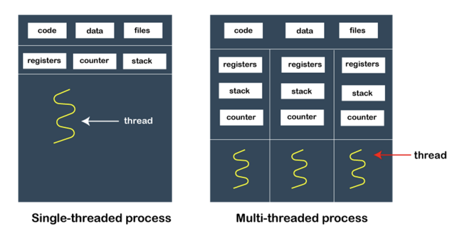

# 프로세스와 스레드의 차이

### 1. 프로세스 (process)

> 컴퓨터의 메모리에 올라와 실행되고 있는 프로그램, task와 같은 의미로 쓰인다

- 하나의 스레드로 이루어진 싱글 스레드 프로세스, 여러 개의 스레드로 이루어진 멀티 스레드 프로세스로 나뉜다

### 2. 스레드

프로세스 내 작업의 흐름을 지칭

### 3. 프로세스와 스레드의 차이

- 프로세스는 코드, 데이터, 스택, 힙 메모리 영역을 기반으로 작업하는 반면, 스레드는 프로세스 내의 `스택` 메모리를 제외한 다른 메모리 영역을 프로세스 내의 다른 스레드들과 공유하기 때문에 메모리적 이점이 있다

- 프로세스는 다른 프로세스와 격리되어 있기 때문에 서로 통신을 하기 위해서는 IPC를 사용해야 하지만, 스레드는 다른 스레드와 서로 격리되어 있지 않으므로 그냥 통신할 수 있어 프로세스보다 더 빠르다

- 프로세스는 한 프로세스에 문제가 생겨도 다른 프로세스에 영향을 끼치지 않지만, 스레드는 격리가 되어있지 않아 한 스레드에 문제가 생기면 다른 스레드에도 영향을 끼쳐 스레드로 이루어져 있는 프로세스에 영향을 줄 수 있음

- 프로세스는 생성과 종료에 더 많은 시간이 들며, 스레드는 더 적은 시간이 든다
