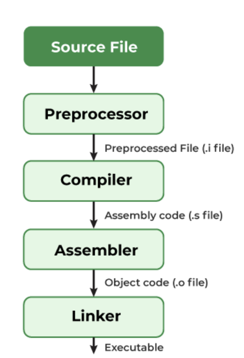

# 프로그램의 컴파일 과정

> 프로그램 = 컴파일러가 컴파일 과정을 거쳐 컴퓨터가 이해할 수 있는 기계어로 번역되어 실행할 수 있는 파일이 된 것을 의미

### 1. 전처리

- 소스코드의 주석 제거, #include 등 헤더 파일을 병합하고 매크로를 치환

### 2. 컴파일러

- 오류처리, 코드최적화 작업을 하여 어셈블리어로 변환

### 3. 어셈블러

- 어셈블리어는 목적 코드(object code)로 변환된다. 이 때 확장자는 운영체제마다 다르다

### 4. 링커

- 프로그램 내에 있는 라이브러리 함수 등과 결합해 실행 파일이 만들어짐. 이는 .exe, .out이라는 확장자를 가지게 된다
