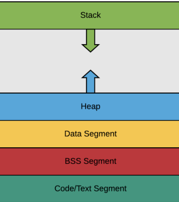
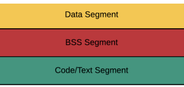
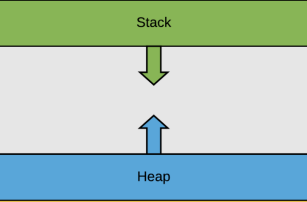

# 프로세스의 메모리 구조

- 운영체제는 프로세스에 적절한 메모리를 할당하는데, 다음과 같은 구조를 기반으로 할당한다:

- 위에서부터 스택, 힙, 데이터영역(Data Segment, BSS Segment), 코드 영역(Code Segment)
- 스택은 위 주소부터 할당되고, 힙은 아래 주소부터 할당된다

#### 스택

- 지역변수, 매개변수, 함수가 저장되고 컴파일 시 크기가 결정된다. 그러나 함수가 함수를 호출 하는 등에 따라 런타임시에도 크기가 변경된다 (동적인 특징)

#### 힙

- 힙은 동적 할당할 때 사용되며 런타임 시 크기가 결정된다 (동적인 특징)

#### 데이터 영역

- Data 영역과 BSS 영역으로 나뉘고 정적할당에 관한 부분을 담당 (정적인 특징)

#### 코드 영역

- 소스 코드 들어감(정적인 특징)

### 1. 정적할당

> 컴파일 단계에서 메모리를 할당하는 것

- Data segment, BSS segment, text segment로 나뉘어서 저장된다

  

| Data Segment      | 전역변수, static, const로 선언되어있는 변수 중, 0이 아닌 값으로 초기화된 변수가 이 메모리 영역에 할당         |
| ----------------- | ------------------------------------------------------------------------------------------------------------- |
| BSS Segemnt       | 전역 변수, static, const로 선언되어 있는 변수 중 0으로 초기화 또는 초기화 안된 변수들이 이 메모리 영역에 할당 |
| code/text Segment | 프로그램의 코드가 들어간다                                                                                    |

### 2. 동적 할당

> 런타임 단계에서 메모리를 할당받는 것. Stack과 힙으로 나뉘어진다

#### Stack

- 지역변수, 매개변수, 실행되는 함수에 의해 늘어나거나 줄어드는 메모리 영역. 함수가 호출될 때마다 호출될 때의 환경 등 특정 정보가 stack에 계속해서 저장됨

#### Heap

- 동적으로 할당되는 변수들. malloc(), free() 함수를 통해 관리할 수 있으며, 동적으로 관리되는 자료구조의 경우 heap 영역을 사용
- 예를들어 vector는 내부적으로 heap 영역 사용
