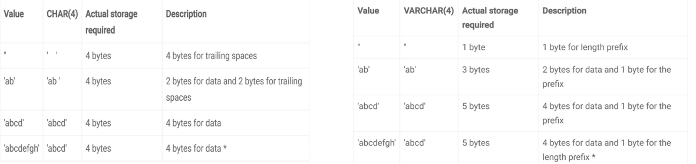

# 데이터베이스의 기본 - 필드와 레코드, 타입

### 필드 타입

#### 숫자

- int : 4바이트, -21억 ~ 21억

#### 날짜 타입

- DATE : 날짜만, 시간x, 3바이트
- DATETIME : 날짜 + 시간 / 8바이트 ex) 2023-12-31 23:59:59
- TIMESTAMP : 날짜 + 시간 / 4바이트 / ex) 1970-01-01 00:00:01의 카운트값.

#### 문자 타입 - CHAR, VARCHAR

- CHAR는 테이블을 생성할 때 선언한 길이로 고정되며 길이는 0에서 255 사이의 값, 레코드를 저장할 때 무조건 선언한 길이 값으로 ‘고정’해서 저장됨.
- VARCHAR는 가변 길이 문자열, 길이는 0에서 65,535 사이의 값.입력된 데이터에 따라 용량을 가변시켜 저장

#### CHAR과 VARCHAR의 차이

- char은 고정 길이의 데이터, varchar는 유동적인 데이터 저장 시 유용

#### Text와 Blob

- 큰 데이터 저장 시 쓰는 타입. text는 큰 문자열 저장에 주로 쓰며 주로 게시판의 본문을 저장할 때 사용
- blob은 이미지, 동영상 등 큰 데이터 저장에 사용
  - 하지만 보통은 아마존의 이미지 호스팅 서비스인 S3를 이용하는 등 서버에 파일을 올리고 파일에 대한 경로를 varchar로 저장 CDN(content delivery network) 사용

#### enum 과 set

- 문자열을 열거한 타입
- ENUM은 ENUM('x-small', 'small')형태로 쓰이며 이중에서 하나만 선택 가능.(단일 선택) 요소들이 0,1로 매핑되어 메모리를 적게 사용하는 이점을 얻음

- SET은 ENUM과 비슷하지만 여러개의 데이터를 선택할 수 있고 비트 단위 연산을 할 수 있으며 최대 64개의 요소를 집어넣을 수 있다
- 공간적으로 이점을 볼 수 있지만, 애플리케이션의 수정에 따라 데이터베이스의 ENUM이나 SET에서 정의한 목록을 수정해야 한다는 단점 존재
