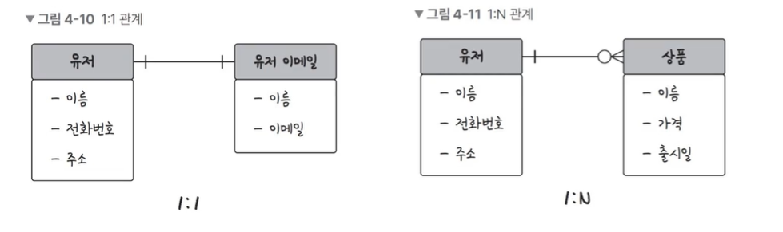
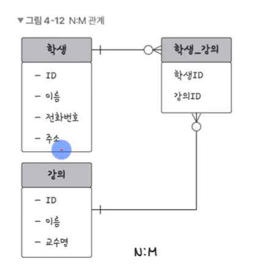

# 데이터베이스의 기본 - 관계, 키

## 관계

> 데이터베이스에 테이블은 하나만 있는 것이 아님. 여러 개의 테이블이 있고 이러한 테이블은 서로의 관계가 정의되어 있음. 이런 관계를 관계 화살표로 나타낸다

#### 1:1 관계

- 유저당 유저 이메일은 1개

#### 1:N 관계

- 쇼핑물 운영시 한 유저 당 0개 또는 1개 이상의 상품을 장바구니에 넣을 수 있음

#### N:M 관계

- 학생과 강의의 관계. 학생도 강의를 많이 들을 수 있고, 강의도 여러명의 학생을 포함할 수 있음
- 중간 테이블이 필요 학생\_강의 테이블
- 1:N, 1:M이라는 관계를 갖는 테이블 2개로 나눠서 설정

## 키

> 테이블 간의 관계를 조금 더 명확하게 하고 테이블 자체의 인덱스를 위해 설정된 장치 - 종류: 기본키, 외래키, 후보키, 슈퍼키, 대체키

- 기본키(Primary Key) : 유일성(중복되는 값이 없음)과 최소성(필드를 조합하지 않고 최소 필드만 써서 키를 형성 가능)을 만족함.
- 자연키 : 중복되는 것을 제외하고 자연스럽게 뽑아 결정하는 기본키, 가변값
- 인조키 : MySQL의 auto increment 등 인조적으로 유일성을 확보하는 키. 기본키는 보통 인조키로 설정. 불변값
- 외래키(Foreign Key) : 다른 테이블의 기본키를 그대로 참조하는 값
- 후보키 : 기본키가 될 수 있는 후보들이며 유일성과 최소성을 동시에 만족하는 키
- 대체키 : 후보키가 두 개 이상일 경우 어느 하나를 기본키로 지정하고 남은 후보키들
- 슈퍼키 : 각 레코드를 유일하게 식별할 수 있는 유일성을 갖춘 키

