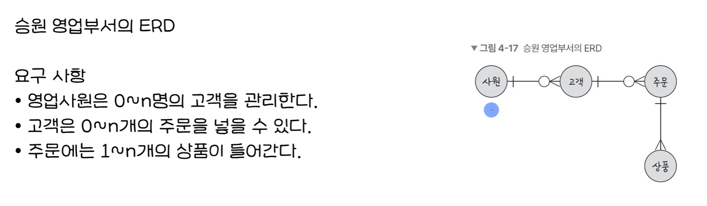

# ERD

> Entity Relation Diagram

- 데이터베이스를 구출학 때 가장 기초적인 뼈대 역할
- 릴레이션 간의 관계를 정의할 것
- 시스템의 요구사항을 기반으로 작성되며, 이 ERD를 기반으로 데이터베이스를 구축

- decimal(10,2) : 소수 부분 2자리를 포함한 총 10자리 수 실수

  - 8자리.2자리

- 복합키: 유일성과 최소성을 만족시키기 위해 2개의 key를 결합해야 할 때도 존재한다
